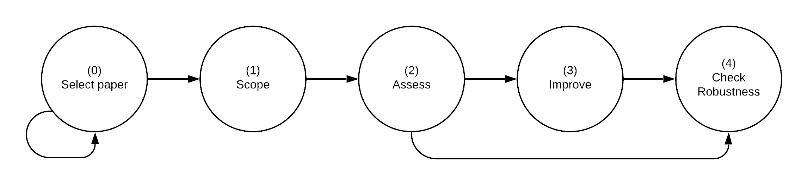

```{r setup-intro, echo = FALSE, warning=FALSE, message=FALSE}
library(tidyverse)
library(knitr)
library(kableExtra)
```

# Introduction {-#intro}

In 2019, the [American Economic Association](https://www.aeaweb.org/journals/policies/data-code/) updated its Data and Code Availability Policy to require that the AEA Data Editor verify the reproducibility of all papers before they are accepted by an AEA journal. In addition to the requirements laid out in the policy, several [specific recommendations](https://aeadataeditor.github.io/aea-de-guidance/) were produced to facilitate compliance. This change in policy is expected to improve the computational reproducibility of all published research going forward, after several studies showed that rates of *computational reproducibility* in economics at large range from somewhat low to  alarmingly low [@galiani2018make; @chang2015economics; @kingi2018reproducibility].

*Replication*, or the process by which a study’s hypotheses and findings are re-examined using different data or different methods (or both) [@King95] is an essential part of the scientific process that allows science to be “self-correcting.” *Computational reproducibility*, or the ability to reproduce the results, tables, and other figures of a paper using the available data, code, and materials, is a necessary condition for replication. Computational reproducibility is assessed through the process of *reproduction*. At the center of this process is the *reproducer* (you!), a party rarely involved in the production of the original paper. Reproductions sometimes involve the *original author* (whom we refer to as “the author”) in cases where additional guidance and materials are needed to execute the process.

This exercise is designed for reproductions performed in economics graduate courses or undergraduate theses, with the goal of providing a common approach, terminology, and standards for conducting reproductions. The goal of reproduction, in general, is to assess and improve the computational reproducibility of published research in a way that facilitates further robustness checks, extensions, collaborations, and replication.

This exercise is part of the Accelerating Computational Reproducibility in Economics [(ACRE)](https://www.bitss.org/ecosystem/acre/) project, which aims to assess, enable, and improve the computational reproducibility of published economics research. The ACRE project is led by the Berkeley Initiative for Transparency in the Social Sciences [(BITSS)](https://bitss.org)—an initiative of the Center for Effective Global Action [(CEGA)](https://cega.berkeley.edu/)—and Dr. Lars Vilhuber, Data Editor for the journals of the American Economic Association (AEA). This project is supported by the Laura and John Arnold Foundation.

## Beyond binary judgments {-}

Assessments of reproducibility can easily gravitate towards binary judgements that declare an entire paper "reproducible" or "non-reproducible." These guidelines suggest a more nuanced approach by highlighting two realities that make binary judgments less relevant. 

First, a paper may contain several scientific claims (or major hypotheses) that may vary in computational reproducibility. Each claim is tested using different methodologies, presenting results in one or more display items (outputs like tables and figures). Each display item will itself contain several specifications. Figure \@ref(fig:diagram) illustrates this idea. 

```{r diagram, eval=TRUE, echo=FALSE,out.width = '100%', fig.cap="One paper has multiple components to reproduce. <br> DI: Display Item, S: Specification "}
library(DiagrammeR)

knitr::include_graphics("paper-claims.png") 

if (FALSE) {
grViz("
digraph a_nice_graph {

graph [layout = neato, rankdir= TB, overlap=true]  ## layout = [neato|twopi, etc]
#https://rich-iannone.github.io/DiagrammeR/graphviz_and_mermaid.html


# node definitions with substituted label text
node [fontname = Helvetica, shape = box, style=empty ]
paper [label = '@@1']    ## label indicates the position of the letter

node [fontname = Helvetica, shape = diamond, fontsize = 10, fixedsize = TRUE, fillcolor=Gray]
claim1 [label = '@@2-1', color=red]
claim2 [label = '@@2-2']
claim3 [label = '@@2-3']

node [fontname = Helvetica, shape = circle, fillcolor=YellowGreen, fixedsize = TRUE]
output1 [label = '@@3-1', color = red]
output2 [label = '@@3-2']
output3 [label = '@@3-3']
output4 [label = '@@3-4']
output5 [label = '@@3-5']
output6 [label = '@@3-6']

node [fontname = Helvetica, shape = circle, fixedsize = TRUE, fillcolor=Peru]
spec1 [label = '@@4-1', color=red]
spec2 [label = '@@4-2']
spec3 [label = '@@4-3']
spec4 [label = '@@4-4']
spec5 [label = '@@4-5']
spec6 [label = '@@4-6']
spec7 [label = '@@4-7']
spec8 [label = '@@4-8']
spec9 [label = '@@4-9']
spec10 [label = '@@4-10']
spec11 [label = '@@4-11']
spec12 [label = '@@4-12']


# edge definitions with the node IDs
paper -> {claim1} [color=red]      ##[label = ...] adds text on the edge
paper -> {claim2 claim3} 
claim1 -> {output1} [color=red]
claim1 -> {output2} 
claim2 -> {output3 output4}
claim3 -> {output5 output6}
output1 -> {spec1} [color=red]
output1 -> {spec2} 
output2 -> {spec3 spec4}
output3 -> {spec5 spec6}
output4 -> {spec7 spec8}
output5 -> {spec9 spec10}
output6 -> {spec11 spec12}
}

[1]: 'Paper'            ## adds label to each box
[2]: c('Claim 1', 'Claim 2', 'Claim 3')
[3]: c('DI 1' , 'DI 2', 'DI 3', 'DI 4', 'DI 5', 'DI 6')
[4]: paste0('S ', 1:10)

")
}
```

Second, for any given specification there are several levels of reproducibility, ranging from the absence of any materials to complete reproducibility starting from raw data. And even for a specific claim-specification, distinguishing the appropriate level can be far more constructive than simply labeling it as (ir)reproducible.

Note that the highest level of reproducibility, which requires complete reproducibility starting from raw data, is very demanding to achieve and should not be expected of all published research — especially before 2019. Instead, this level can serve as an aspiration for the field of economics at large as it seeks to improve the reproducibility of research and facilitate the transmission of knowledge throughout the scientific community.


## Stages of the exercise {-}

This reproduction exercise is divided into four stages, corresponding to the first four chapters of these guidelines, with a fifth optional stage:   

1. [**Scoping**](#scoping), where you (the reproducer) will define the scope of the exercise by declaring a paper and the specific output(s) on which you will focus for the remainder of the exercise;  
2.    [**Assessment**](#assessment), where you will review and describe in detail the available reproduction package, and assess the current level of computational reproducibility of the selected outputs; 
3.    [**Improvement**](#improvements), where you will modify the content and/or the organization of the reproduction package to improve its reproducibility;  
4.    [**Robustness checks**](#robust), where you will assess the quality of selected analytical choices.  


These guideline do not include a possible fifth stage of **Extension**. Here you may extend the current paper by including new methodologies or data. This step brings the reproduction exercise a step closer to *replication*.


```{r stages-intro, out.width = '100%', echo=FALSE, fig.cap="One paper has multiple components to reproduce. <br> DI: Display Item, S: Specification"}
 

stages_info <- data.frame(Exercise  = c('Graduate course', 'Graduate research', 'Undergrad thesis'),
                            Scope    = c("10%", "5%", "5%"),
                            Assess   = c("35%", "25%", "20%"),
                            Improve  = c("25%", "40%", "50%"),
                            Robust   = c("30%", "30%", "25%") )

stages_info %>%
    knitr::kable(caption = "Relative Level of Effort by Type of exercise") %>%
    kable_styling(full_width = TRUE)
```


Table \@ref(tab:stages-intro) depicts suggested levels of effort for each stage of the exercise depending on the context in which you are performing a reproduction. This process need not be chronologically linear. For example, you may realize that the scope of a reproduction is too ambitious and switch to a less intensive one. Later in the exercise, you can also begin testing different specifications for robustness while also assessing a paper's level of reproducibility.

## Recording the results of the exercise {-}

You will be asked to record the results of your reproduction as you progress through each stage. 

In *Stage 1: [Scoping](#scoping)*, complete **[Survey 1](https://berkeley.qualtrics.com/jfe/form/SV_2bO83uJvU9ZiTXv)**, where you will declare your paper of choice and the specific display item(s) and specifications on which you will focus for the remainder of the exercise. This step may also involve writing a brief 1-2 page summary of the paper (depending on your instructor or goals). 

In *Stage 2: [Assessment](#assessment)*, you will inspect the paper's reproduction package (raw data, analysis data, and code), connect the display item to be reproduced with its inputs, and assign a reproducibility score to each output.

In *Stage 3: [Improvement](#improvements)*, you will try to improve the reproducibility of the selected outputs by adding missing files, documentation, and report any potential changes in the level of reproducibility. Use **Survey 2** to record your work at Stages 2 and 3 (you will receive access instructions for Survey 2 when you submit Survey 1).

In *Stage 4: [Robustness Checks](#robust)*, you will assess different analytical choices and test possible variations. Use **Survey 3** to record your work at this stage.

## Reproduction Strategies {-}

Generally, a reproduction will begin with a thorough reading of the study being reproduced. However, subsequent steps may follow from a *reproduction strategy*. For example, a reproduction may closely follow the order of the steps outlined above. This might entail the reproducer first choosing a set of results whose production they are interested in assessing or understanding, completely reproducing these results to the extent possible, and then making modifications to the reproduction package. Another potential strategy could be for the reproducer to develop potential robustness checks or extensions while reading the study, which would lead to the definition of a set of results to be assessed via reproduction. Yet another reproduction strategy may be for the reproducer to seek out a paper that uses a particular dataset to which they have access or an interest in using, reproducing the results that use that dataset as an input, then probing the robustness of the results to various data cleaning decisions.

The various uses of reproduction makes the number of potential reproduction strategies quite large. In choosing or designing a reproduction strategy, it is helpful to clearly identify the goal of the reproduction. In all of the examples laid out in the paragraph above, the order in which the steps of the reproduction exercise are taken is at least partially determined by what the reproducer hopes to get from the exercise. The structure provided in these guidelines, together with a clear reproduction goal, can facilitate the implementation of an efficient reproduction strategy.

