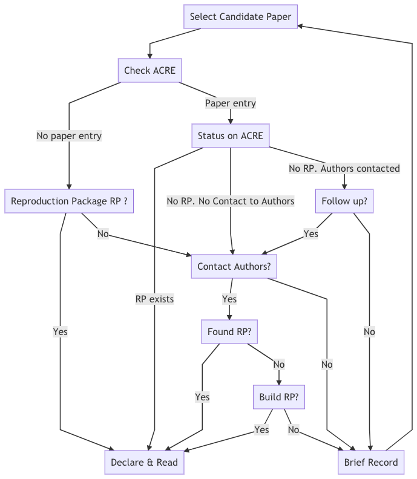

# Scoping

In this stage, you will define the scope of your exercise by declaring a paper and the specific output(s) on which you will focus. You might first consider multiple papers without analyzing them more closely (we refer to these as **candidate papers**) before moving forward with your **declared paper**. 

It is likely that you will choose a declared paper based on whether or not you can locate its reproduction package. A **reproduction package** is the collection of materials that make it possible to reproduce a paper. This package may contain data, code, or documentation. If you are unable to independently locate the reproduction package for your paper, you can ask the paper's author for it (find guidance on this in [Chapter 6](https://bitss.github.io/ACRE/guidance-for-a-constructive-exchange-between-reproducers-and-original-authors.html)) or simply choose another candidate paper. If you still want to explore the reproducibility of a paper with no reproduction package, these guidelines provide instructions for requesting materials from authors to create a public reproduction package, or if this proves unsuccessful, for building your reproduction package from scratch.

To avoid duplicating the efforts of others who may be interested in reproducing one of your candidate papers, **we ask that you record your candidate papers in the ACRE database** (currently under development). 

Note that in this stage, *you are not expected to review the reproduction materials in detail*, as you will dedicate most of your time to this in later stages of the exercise. If materials are available, you will read the paper and declare the scope of the reproduction exercise. You can expect to spend between 1-3 days in this Scoping stage, though this may vary based on the length and the complexity of the paper, and the availability of reproduction materials.

***Use [Survey 1](https://berkeley.qualtrics.com/jfe/form/SV_2bO83uJvU9ZiTXv) to record your work in this stage.***

## From candidate to declared paper

At this point of the exercise, you are *only validating the availability* of (at least) one reproduction package and not assessing the quality of its content. Follow the steps below to verify that a reproduction package is available, and stop whenever you find it (this may mean mean that you have found your declared paper).

  1. Check whether previous reproduction attempts have beeen recorded in the ACRE Database for the paper (more on the ACRE Database in the next section).
  2. Check the journal or publisher's website, looking for materials named "Data and Materials," "Supplemental Materials," "Reproduction/Replication Package/Materials," etc.  
  3. Look for links in the paper (review the footnotes and appendices).  
  4. Review the personal websites of the paper's author(s).
  5. Contact the author(s) to request the reproduction package using [this](https://bitss.github.io/ACRE/guidance-for-a-constructive-exchange-between-reproducers-and-original-authors.html#contacting-the-original-authors-when-there-is-no-reproduction-package) email template. In this and future interactions with authors, we encourage you to follow our guidance outlined in [Chapter 5](https://bitss.github.io/ACRE/guidance-for-a-constructive-exchange-between-reproducers-and-original-authors.html#contacting-the-original-authors-when-there-is-no-reproduction-package).
  6. Deposit the reproduction package in a trusted repository (e.g., [Dataverse](https://dataverse.org/), [Open ICPSR](https://www.openicpsr.org/openicpsr/), [Zenodo](https://zenodo.org/), or the [Open Science Framework](https://osf.io/)) under the name `Original reproduction package for - Title of the paper`. You will be asked to provide the URL of the repository in Survey 1. 
  
In case you need to contact the authors, make sure to *allocate sufficient time for this step* (we suggest at least three weeks before the date you plan to start the reproduction). Instructors should also plan to accordingly (e.g., if the ACRE exericse is expected to take place in the middle of the semester, students should review candidate papers and (if applicable) contact the authors in the first few weeks of the semester).
  
Review the decision tree (Figure #) below for a more detailed overview of this process. Remember, *if at any step of the process you decide to abandon the paper, make sure to record the candidate paper in the ACRE database* before moving on to another candidate paper. Once you have obtained the reproduction package, the *candidate paper* becomes your *declared paper* and you can move forward with the exercise! Do not invest time in doing a detailed read of any paper until you are sure that it is your declared paper. 

### Candidate paper entries in the ACRE Database

If the ACRE database contains previous reproduction attempts of the paper, you will see a report card with the following information:   

>**Box 1:** Summary Report Card for ACRE Paper Entry     
> **Title:**  Sample Title   
> **Authors:**  Jane Doe & John Doe  
> **Original Reproduction Package Available:** URL/No [What does this mean? Add some context]. 
> [If "No"] **Contacted Authors?:** Yes/No  
> [If "Yes(contacted)"] **Type of Response:** Categories (6).  
> **Additional Reproduction Packages:** Number (eg., 2)   
> **Authors Available for Further Questions for ACRE Reproductions:** Yes/No/Unknown   
> **Open for reproductions:** Yes/No  [Same as above: what does this mean? Add more context].

If after taking steps 1-5 above (or for some other reason) you are unable to locate the reproduction package, record your candidate paper (and if applicable, the outcome of your correspondence with the original authors) in the ACRE database following the example above. 

<details><summary>View Decision Tree To Select Paper (Emma: add title and solve bug with svg) </summary>

```{r candidate-paper-dec-tree, eval=FALSE, echo=FALSE}
#JOEL: help to get this to run within the code chunk
#
mermaid("
graph TD
	A0[Select Candidate Paper] --> A[Check ACRE]
  A --> |No paper entry|B1[Reproduction Package RP ?]
  B1 --> |Yes|F1[Declare & Read]
  B1 --> |No|C1[Contact Authors?]
  C1 --> |Yes|D1[Found RP?]
  C1 --> |No|R[Brief Record]
  D1 --> |Yes|F1
  D1 --> |No|E1[Build RP?]
  E1 --> |Yes|F1[Declare & Read]
  E1 --> |No|R

  A --> |Paper entry|B2[Status on ACRE]
  B2 --> |RP exists|F1
  B2 --> |No RP. No Contact to Authors|C1
  B2 --> |No RP. Authors contacted|D2[Follow up?]
  D2 --> |Yes|C1
  D2 --> |No|R

  R -->A0
")  
# https://mermaid-js.github.io/mermaid-live-editor/#/edit/eyJjb2RlIjoiXG5ncmFwaCBURFxuXHRBMFtTZWxlY3QgQ2FuZGlkYXRlIFBhcGVyXSAtLT4gQVtDaGVjayBBQ1JFXVxuICBBIC0tPiB8Tm8gcGFwZXIgZW50cnl8QjFbUmVwcm9kdWN0aW9uIFBhY2thZ2UgUlAgP11cbiAgQjEgLS0-IHxZZXN8RjFbRGVjbGFyZSAmIFJlYWRdXG4gIEIxIC0tPiB8Tm98QzFbQ29udGFjdCBBdXRob3JzP11cbiAgQzEgLS0-IHxZZXN8RDFbRm91bmQgUlA_XVxuICBDMSAtLT4gfE5vfFJbQnJpZWYgUmVjb3JkXVxuICBEMSAtLT4gfFllc3xGMVxuICBEMSAtLT4gfE5vfEUxW0J1aWxkIFJQP11cbiAgRTEgLS0-IHxZZXN8RjFbRGVjbGFyZSAmIFJlYWRdXG4gIEUxIC0tPiB8Tm98UlxuXG4gIEEgLS0-IHxQYXBlciBlbnRyeXxCMltTdGF0dXMgb24gQUNSRV1cbiAgQjIgLS0-IHxSUCBleGlzdHN8RjFcbiAgQjIgLS0-IHxObyBSUC4gTm8gQ29udGFjdCB0byBBdXRob3JzfEMxXG4gIEIyIC0tPiB8Tm8gUlAuIEF1dGhvcnMgY29udGFjdGVkfEQyW0ZvbGxvdyB1cD9dXG4gIEQyIC0tPiB8WWVzfEMxXG4gIEQyIC0tPiB8Tm98UlxuXG4gIFIgLS0-QTAiLCJtZXJtYWlkIjp7InRoZW1lIjoiZGVmYXVsdCJ9LCJ1cGRhdGVFZGl0b3IiOmZhbHNlfQ


```



</details>

<!-- Emma there is a bug that breaks this itemization below when building the book (it works fine when knighting single doc). Please think of a solution-->

## Scoping your declared paper  

Once you have identified your declared paper, get familiarized with it and choose the specific output(s) on which you will focus for the remainder of the exercise.

### Read and summarize the paper {#read-sum}

Depending on how much time you have, we recommend that you write a short (1-2 page) summary of the paper. This will help remind you of the key elements to focus on for the reproduction, and demonstrate your understanding of the paper (for yourself and others like your instructor or advisor).

When reading or summarizing the paper, try to answer the following questions:  

 - Would you classify the paper's scientific claims as mainly focused on estimating a causal relationship, estimating/predicting a descriptive statistic of a population, or something else? 
 - How many scientific claims (descriptive or causal) are investigated in the paper? 
 - What is the population for which the estimates apply?
 - What is the population that is the focus of the paper as a whole?
 - What are the main data sources used in the paper?
 - How many display items are there in the paper (tables, figures, and inline results)?  
 - What is the main statistical or econometric method used to examine each claim?
 - What is the author's preferred specification (or yours, if the authors are not clear)?
 - What are some robustness checks for the preferred specification?
 
### Record scope of the exercise {#declare-estimates}

By now you should have a fairly good understanding of the paper's content. You do not, however, need to have spent any time reviewing the reproduction package in detail.

At this point, you should clearly specify which part of the paper will be the main focus of your reproduction. Focus on specific estimates, represented by a unique combination of claim-display item-specification as represented in figure \@ref(fig:diagram). If you plan to scope more than one claim, *we strongly recommend starting with just one* and recording your results. You can then initiate another record in ACRE later for the second (or third, fourth, etc.) claim to reproduce using the materials and knowledge you developed in the first exercise. You can, however, reproduce more than one claim if you are already familiar with the paper.

In the Assessment stage, the reproduction will be centered around the display item(s) that contain the specification you indicate at this point.
    
#### Declare specific main estimates to reproduce. {-}    

Identify a scientific claim and its corresponding preferred specification, and record its magnitude, standard error, and location in the paper (page, table #, and table row and column). If the authors did not explicitly chose a particular estimate, you will be asked to select one. In addition to the preferred estimate, reproduce up to five estimates that correspond to alternative specifications of the preferred estimate. 


#### Declare possible robustness checks for main estimates (optional). {-}  
After reading the paper, you might wonder why the authors did not conduct a specific robustness test. If you think that such analysis could have been done *within the same methodology* and *using the same data* (e.g., by including or excluding a subset of the data like "high-school dropouts" or "women"), please specify a robustness test that you would like to conduct before starting the Assessment stage.  

These are the elements you will need for the Scoping stage. **You now have all the elements necessary to complete [Survey 1](https://berkeley.qualtrics.com/jfe/form/SV_2bO83uJvU9ZiTXv).** 

-----

## Identify your relevant timeline.  

Before you begin working on the three main stages of the reproduction exercise (Assessment, Improvement, and Robustness), it is important to manage your own expectations and those of your instructor or advisor. Be mindful of your time limitations when defining the scope of your reproduction activity. These will depend on the type of exercise chosen by your instructor or advisor and may vary from a weeklong homework assignment, to a longer class project that may take a month to complete or a semester-long project (an undergraduate thesis, for example).

Table 1 shows an example distribution of time across three different reproduction formats. The Scoping and Assessment stages are expected to last roughly the same amount of time across all formats (lasting longer for the semester-long activities, and acknowledgin that less experienceed researchers, such as undergraduate students, may need more time). Differences emerge in the distribution of time for the last two main stages: Improvements and Robustness. For shorter exercises, we recommend avoiding any possible improvements to the raw data (or cleaning code). This will limit how many robustness checks are possible (for example, by limiting your ability to reconstruct variables according to slightly different definitions), but it should leave plenty of time for testing different specifications at the analysis level. 

Emma: please write this table using R and KableExtra

<style type="text/css">
.tg  {border-collapse:collapse;border-spacing:0;}
.tg td{font-family:Arial, sans-serif;font-size:14px;padding:10px 5px;border-style:solid;border-width:1px;overflow:hidden;word-break:normal;border-color:black;}
.tg th{font-family:Arial, sans-serif;font-size:14px;font-weight:normal;padding:10px 5px;border-style:solid;border-width:1px;overflow:hidden;word-break:normal;border-color:black;}
.tg .tg-baqh{text-align:center;vertical-align:top}
.tg .tg-c3ow{border-color:inherit;text-align:center;vertical-align:top}
.tg .tg-0pky{border-color:inherit;text-align:left;vertical-align:top}
.tg .tg-dvpl{border-color:inherit;text-align:right;vertical-align:top}
.tg .tg-0lax{text-align:left;vertical-align:top}
</style>
<table class="tg">
  <tr>
    <th class="tg-0pky"></th>
    <th class="tg-c3ow" colspan="2">2 weeks <br> (~10 days)</th>
    <th class="tg-c3ow" colspan="2">1 month <br> (~20 days)</th>
    <th class="tg-c3ow" colspan="2">1 semester <br> (~100 days)</th>
  </tr>
  <tr>
    <td class="tg-0pky"></td>
    <td class="tg-0pky">analysis data</td>
    <td class="tg-0pky">raw data</td>
    <td class="tg-0pky">analysis data</td>
    <td class="tg-0pky">raw data</td>
    <td class="tg-0pky">analysis data</td>
    <td class="tg-0pky">raw data</td>
  </tr>
  <tr>
    <td class="tg-0pky">Scoping</td>
    <td class="tg-c3ow" colspan="2">10% (1 day)</td>
    <td class="tg-c3ow" colspan="2">5% (1 day)</td>
    <td class="tg-c3ow" colspan="2">5% (5 days)</td>
  </tr>
  <tr>
    <td class="tg-0pky">Assessment</td>
    <td class="tg-c3ow" colspan="2">35%</td>
    <td class="tg-c3ow" colspan="2">25%</td>
    <td class="tg-c3ow" colspan="2">15%</td>
  </tr>
  <tr>
    <td class="tg-0pky">Improvement</td>
    <td class="tg-c3ow">25%</td>
    <td class="tg-c3ow">0%</td>
    <td class="tg-c3ow" colspan="2">40%</td>
    <td class="tg-c3ow">20%</td>
    <td class="tg-c3ow">30%</td>
  </tr>
  <tr>
    <td class="tg-0pky">Robustness</td>
    <td class="tg-c3ow">25%</td>
    <td class="tg-c3ow">5%</td>
    <td class="tg-c3ow" colspan="2">25%</td>
    <td class="tg-c3ow" colspan="2">25%</td>
  </tr>
</table>


 
 
