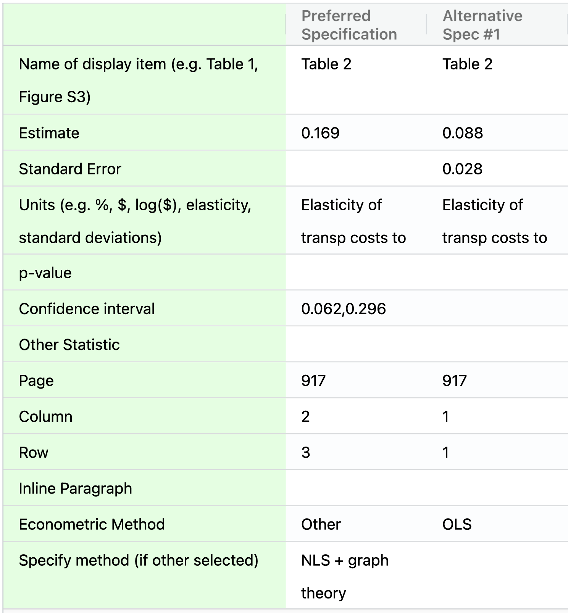

# Scoping

At this stage, you will define the *scope of the reproduction* by identifying the *scientific claims* and related *display items* that you will analyze in the remainder of the reproduction. For this exercise, we follow the a comparable definition of a claim as used in the SCORE project, a related initiative aimed at predicting replicability and reproducibility of research:  

>"A research claim is a single major finding from a published study, as well as details of the methods and results that support this finding. A research claim [may not be] equivalent to an entire article. Sometimes the claim as described in the abstract does not exactly match the claim that is tested. In this case, you should consider the research claim to be that which is described in the [results of the paper]".
>
> -- <cite>[RepliCATS Project](https://replicats.research.unimelb.edu.au/#tab301) </cite>


In the SSRP framework, different claims in a paper may be tested using different methodologies, and their results may be presented in one or more display items, such as tables and figures ([figure 0.1](#fig:diagram) illustrates this idea). Claims can have different structures, here we propose two high-level categories based on the most common structures:

- **Causal claim:** a claim is causal if it can be summarize using causal language. This language can be characterize by the following structure: "The paper estimates the effect of a variable *X* on outcome *Y* for population *P*, using method *M*". For example: "This paper investigates the impact of bicycle provision (X) on secondary school enrollment (Y) among young women in Bihar/India (P), using a Difference in Difference approach (M)."    

- **Descriptive/predictive claim:** a claim is descriptive or predictive if it can be summarize using descriptive or predictive language. language can be characterize by the following structure: "The paper estimates the value of a variable *Y* (estimated or predicted) for population *P* under dimensions *X* (optional) using method *M*. For example, "Drawing on a unique Swiss data set (P) and exploiting systematic anomalies in countries' portfolio investment positions (M), I find that around 8% of the global financial wealth of households is held in tax havens (Y)."  
    
A *display item* is a figure or table that presents the results described in the paper. Each display item may contain several specifications, or estimates that result from variations in specific analytical choices. If the display item of interest is a figure, the specification can be recorded as an number approximated by visual inspection of a particular point in the figure. 

When recording the Scoping section on the SSRP platform, count all of the claims in the paper and provide a one sentence summary for the subset of claims that you will attempt to reproduce. Structure your summaries as follows: "The paper tested the effect of X on Y for population P, using method M. The main results show an effect of magnitude E (specify units and standard errors)" or "The paper estimated the value of Y (estimated or predicted) for population P under dimensions X using method M. The main results presented an estimate of of magnitude E (specify units and standard errors)". Make sure to use the same units of measurement for all scientific claims that you will analyze as part of the reproduction.

**Note:** Once you progress past the Scoping stage on the SSRP, *you will no longer be able to edit your responses in the Scoping stage*, though you will be able to see them. This is because the content of later stages of the reproduction is dependent on the information you record at this stage of the reproduction.


## Read and summarize the paper {#read-sum}


Depending on your reproduction's timeline, we recommend that you write a short (<1000 words) summary of the paper. Writing up such a summary will help you develop and demonstrate a wholesome understanding of the paper and its various components. In your summary, try to address the following:  

- How many scientific claims can you identify in the paper? 
- Would you classify the claims as causal, descriptive (e.g., estimating a population's descriptive statistic), or something else?  
- What is the population that is the focus of the paper as a whole?  
- What is the population for which the estimates apply?  
- What are the primary data sources used in the paper?  
- What is the primary statistical or econometric method used to examine each claim?  
- What is the author's preferred specification (or yours, if the authors' is unclear)?  
- What are some possible robustness checks for the preferred specification?    
- How many display items are there in the paper (tables, figures, and inline results)?  

Draft the summary in a plain text editor and paste the text in the form.  

## Record a revised reproduction package  

At the previous stage, you recorded the location of the original reproduction package made available by the paper's authors. Given that one of the main goals of the ACRe approach is to improve reproducibility, we recommend that you build an alternative reproduction package that will improve the reproducibility of specific display items or the paper as a whole. 
You can start by downloading the original reproduction package (or *forking*, if on GitHub) and uploading a copy titled "Revised reproduction package for [Paper Citation, e.g. Smith et al. (2019)]" to a trusted repository. Examples of trusted repositories include [Dataverse](https://dataverse.org/), [openICPSR](https://www.openicpsr.org/openicpsr/), [Figshare](https://figshare.com), [Dryad](https://datadryad.org/stash), [Zenodo](https://about.zenodo.org/), [Open Science Framework](osf.io/) and others. We encourage you to also use version control software (e.g., Git) during your reproduction.

Trusted repositories have a file size limit (typically around 2gb). If you think that your reproduction package will exceed this limit please do the following:   

- Separate your reproduction package in two: (1) data and (2) code and documentation.    
- Post the second one in a trusted repository.     
- For the data reproduction package identify all the files that are different from the original reproduction package and upload only those. For example, suppose the original repro package has `data/raw_data1.csv`, and `data/clean_data/data_set1.dta`. If you modify only the file `data_set1.dta`, then upload a revised reproduction package that has the same folder structure but only the files that differ: `data/clean_data/data_set1.dta`. If you want to make it even more clear you could add a readme file describing the modified files. 


As you work through the next stages, you can modify the reproduction package and record your improvements on the SSRP. Keeping a record of such changes will help you document your assessments or communicate with the original authors, and it will also allow future reproducers to build on top of your work. For users of version control software (e.g, Git) we recommend to track each improvement in separate commits. Then you can link the specific commits in the improvements section. This way reproducers can clearly communicate to original authors what specific lines of the code were modified (using the `diff` feature). 


## Record scope of the exercise {#declare-estimates}

By now, you probably have a reasonably good understanding of the paper. You do not, however, need to spend any time reviewing the reproduction package in detail yet.

At this point, you should specify the parts of the paper that will be the main focus of your reproduction. Focus on specific estimates, represented by a unique combination of claim-display item-specification as represented in figure \@ref(fig:diagram). Given the complexity of the SSRP approach, unless you are very familiar with the paper, we recommend starting with just one claim before moving onto second or third as part of a later reproduction.

#### Declare a specific estimate(s) to reproduce {-}    

Identify a scientific claim and its corresponding preferred specification and record its magnitude (specify units), standard error, and location in the paper (page, table #, and table row and column). If the authors did not explicitly choose a precise preferred estimate, you can choose one yourself. In addition to the preferred estimate, you can reproduce up to five estimates that correspond to the preferred estimate's alternative specifications. You can then enter all this information in the SSRP in a table like the one below

```{r estim, eval=TRUE, echo=FALSE, fig.cap="SSRP table to input specifications for each claim", fig.show = "hold", out.width = "80%", fig.align='center'}
#Bug1: help to get this to run within the code chunk
#Bug2: cannot call .svg and get pdf (latex) to run

```

#### Declare possible robustness checks for main estimates (optional) {-}    
After reading the paper, you might wonder why the authors did not conduct a specific robustness test. If you think that such analysis could have been done *within the same methodology* and *using the same data* (e.g., by including or excluding a subset of the data like "high-school dropouts" or "women"), please specify a robustness test that you would like to conduct before starting the Assessment stage. Robustness checks in this stage are *optional* and can take the form of a short sentence describing at a high level what you (the reproducer) would like to explore in a later stage. In the robustness stage (after assessment and improvement) you will be able to describe in greater detail how you have modified the reproduction code.
