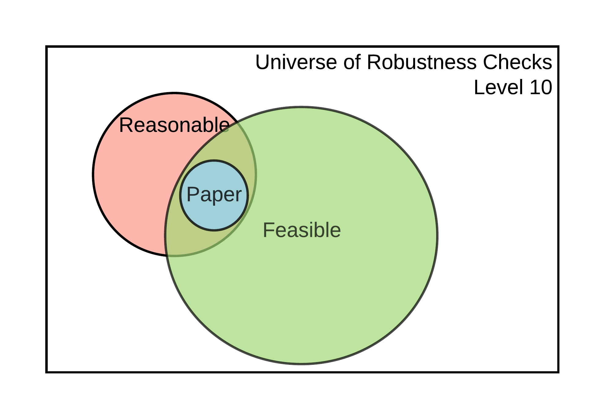

---
output:
  word_document: default
  html_document: default
---
```{r setup-robust, echo = FALSE, warning=FALSE, message=FALSE}
library(tidyverse)
library(knitr)
library(kableExtra)
temp_eval <- FALSE
```

# Checking for Robustness {#robust}

Once you have assessed and improved the computational reproducibility of the display items for a claim within a paper, you can assess the robustness of these results by changing some computational choices and reporting their subsequent effects on the estimates of interest. This **robustness checks** can be both in data analysis and data cleaning. The universe of robustness checks can be very large (potentially infinite!). In these guidelines we will distinguish between reasonable and feasible robustness checks. 

The set of **reasonable robustness checks** ([Simonsohn et. al., 2018](https://urisohn.com/sohn_files/wp/wordpress/wp-content/uploads/Paper-Specification-curve-2018-11-02.pdf)) is defined as (i) sensible tests of the research question, (ii) expected to be statistically valid, and (iii) not redundant with other specifications in the set. The set of **feasible robustness checks** is defined by all the specifications that can be computationally reproduced. We assume that the specifications already published in the paper are part of the reasonable set of specifications.


```{r robusts, eval=TRUE, echo=FALSE, fig.cap="Universe of robustness tests and its elements", fig.show = "hold", out.width = "50%"}
#Bug1: help to get this to run within the code chunk
#Bug2: cannot call .svg and get pdf (latex) to run
knitr::include_graphics("robustness_lvl1.png")
knitr::include_graphics("robustness_lvl2_4.png")
knitr::include_graphics("robustness_lvl5-9.png")

```


```{r, eval=FALSE, echo=FALSE}
include_svg = function(path) {
  if (knitr::is_latex_output()) {
    output = xfun::with_ext(path, 'pdf')
    # you can compare the timestamp of pdf against svg to avoid conversion if necessary
    system2('rsvg-convert', c('-f', 'pdf', '-a', '-o', shQuote(c(output, path))))
  } else {
    output = path
  }
  knitr::include_graphics(output)
}
```

The size of the feasible set of robustness checks, and the likelihood that it contains reasonable and paper specifications, will depend on the current level of reproducibility of the results supporting a claim. This is illustrated in Figure \@ref(fig:robusts). At levels 1-2 it won't be possible to perform additional robustness checks because there is no data to work with. It may be possible to perform additional robustness checks for claims supported by display items reproducible at levels 3-4, but not using the specific estimates declared in the *Scoping Stage* since the display items are not computationally reproducible from analysis data (CRA). It is possible to conduct additional robustness checks to validate core conclusions of a claim based on a display item reproducible at level 5. Finally, claims associated with display items reproducible at level 6 or higher allow for robustness checks that involve variable definitions and an alternative core analytical choice.

The size of feasible robustness checks grows exponentially as higher levels of computational reproducibility are achieved. For example, when checking the robustness to a new variable definition, you will also be able to test the combination of how the main estimate changes under an alternative variable definition *and* an alternative core analytical choice.

Robustness is assessed at the claim level (see our diagram representing a paper's components \@ref(fig:stages-unit)). For a given claim, there will be several specifications presented, one of which will be identified by the authors (or yourself if the authors do not identify one) as the main or preferred specification. Identify which display item contains this specification and refer to the reproduction tree to identify the code files in which you can modify a computational choice. Using the [example tree](#complete-tree) discussed in the *Assessment* stage, we can obtain the following, removing the data files for simplicity. This simplified tree provides a list of potential files in which you can test different  specifications: 

        table1.tex (contains preferred specification of a given claim)
            |___[code] analysis.R
                    |___[code] final_merge.do
                            |___[code] clean_merged_1_2.do
                            |       |___[code] merge_1_2.do
                            |               |___[code] clean_raw_1.py
                            |               |___[code] clean_raw_2.py
                            |___[code] clean_merged_3_4.do
                                    |___[code] merge_3_4.do
                                            |___[code] clean_raw_3.py
                                            |___[code] clean_raw_4.py
                                            
Here we suggest two types of contributions to robustness checks: (1) increasing the number of feasible robustness checks (2) justifying and testing reasonable specifications.  Both contributions should be recorded on the ACRE platform referring to files in a specific reproduction package. 

## Feasible robustness checks: increasing the number of feasible specifications

Increasing the number of feasible robustness checks requires that the reproducer identifies the specific line(s) in the code scripts that execute an analytical choice. An advantage of this type of contribution is that you need not have an in-depth knowledge of the paper and its methodology to contribute. This allows you to potentially map several code files, achieving a broader understanding of the paper and also building on top of the work of others. The disadvantage is that you are not expected to test alternative specifications. 

Analytical choices can include those behind data cleaning and data analysis, below are some proposed types of for each category.   

**Analytical choices in data cleaning code**

  - Variable definition
  - Data sub-setting
  - Data reshaping (merge, append, long/gather, wide/spread)
  - Others (specify as "processing - other")
  
**Analytical choices in analysis code** 

   - Regression function (link function)
   - Key parameters (tuning, tolerance parameters, etc.)
   - Controls
   - Adjustment of standard errors
   - Choice of weights
   - Treatment of missing values
   - Imputations
   - Other (specify as "methods - other")

To record a specific analytical choice in the ACRE platform please follow this steps:  

1.  Review a specific code file (eg `clean_merged_1_2.do`) and find an analytical choice (eg `regress y x if gender == 1`). 

2.  Record the file name, line number, reproduction package (original or name of revised version), choice type and choice value. For the `source` field, type *“original”* whenever the analytical choice is identified for the first time, and `file_name-line number` each time the same analytical choice is applied thereafter (for example, if an analytic choice is identified for the first time in line #103 and for the second time in line #122 their respective values for the `source` field should be `original` and `code_01.do-L103`). For each analytical choice recorded, add the specific choice used in the paper, and describe what alternatives could have been used. The resulting database should have the [following structure](https://docs.google.com/spreadsheets/d/1nZuJSHswbZgaaIfBcyIUGPwG-WIP8zE1Oambud-WoDc/edit?usp=sharing):

```{r robust-checks, echo = FALSE, eval=temp_eval}
robust_checks <- data.frame(entry_id = c("1", "2", "3", "..."),
                            file_name = c("code_01.do", "code_01.do", "code_05.R", "..."),
                            line_number = c("73", "122", "143", "..."),
                            choice_type = c("data sub-setting", "variable definition", "controls", "..."),
                            choice_value = c("males", "income = wages + capital gains", "age, income, education", "..."),
                            choice_range = c("males, female", "wages, capital gains, gifts", "age, income, education, region", "..."),
                            source = c("original", '"code_01.do-L103"', "original", "..."))
                         
robust_checks %>%
    knitr::kable() %>%
    kable_styling(full_width = TRUE) %>%
    scroll_box(width = "100%", box_css = "border: 0px;")
```

|entry_id| file_name  | line_number | choice_type         | choice_value                   | choice_range                  | Source              |
|--------|------------|-------------|---------------------|--------------------------------|-------------------------------|---------------------|
|   1    | code_01.do | 73          | data sub-setting    | males                          | males, female,                | original            |
|   2    | code_01.do | 122         | variable definition | income = wages + capital gains | wages, capital gains, gifts   | "code_01.do-L103"   |
|   3    | code_05.R  | 143         | controls            | age, income, education         | age, income, education, region| original            |
| ...    | ...        | ...         | ...                 | ...                            | ...                           | ...                 |


## Reasonable robustness check: justifying and testing.

Justifying and testing a specific analytical choice requires that the reproducer identifies a feasible analytical choice, conducts a variation on it, and justify its reasonableness. The advantage of this approach is that it allows for an in-depth inspection of a specific section of the paper. The main limitation is that justifying sensibility and validity (and non-redundancy, to an extent) requires a deeper understanding of the paper's topic and the methods, making it less feasible for undergraduate students or graduates with only a surface-level interest in the paper. 


When performing a specific robustness test, follow these steps: 

1. Search the mapping database (discussed above) and record the identifier(s) corresponding to the analytical choice to test (`entry_id`). If there is no entry corresponding for the specific lines, create one yourself. 

2. Propose a specific variation to this analytical choice. 

3. Discuss whether you think this variation is sensible, specifically in the context of the claim tested (e.g., does it make sense to include or exclude low-income Hispanic people from the sample?). 

4. Discuss how this variation could affect the validity of the results (e.g., likely effects on omitted variable bias, measurement error, change in the Local Average Treatment Effects for the underlying population). 

5. Confirm that test is not redundant with other tests in the paper or robustness exercise. 

6. Report the results from the robustness check (new estimate, standard error, and units).


<!--
## Test the robustness of results  

Test the robustness of results to alternative (sensible) specifications

  - Specification curves: DESCRIBE. 
  - Jackknife the preferred estimate: DESCRIBE.  
  - Use ML to select among coriates: DESCRIBE.    
-->
 


