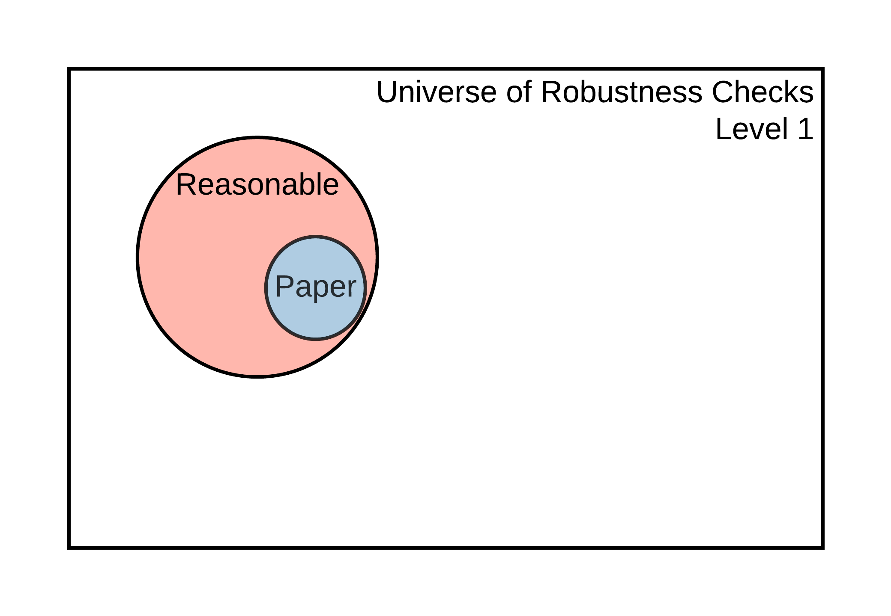

---
output:
  word_document: default
  html_document: default
---
```{r setup-robust, echo = FALSE, warning=FALSE, message=FALSE}
library(tidyverse)
library(knitr)
library(kableExtra)
temp_eval <- TRUE
```

# Checking for Robustness {#robust}

Once you have assessed and potentially improved the computational reproducibility of the display items for a claim within a paper, you can determine these results' robustness by modifying some analytic choices and reporting their subsequent effects on the estimates of interest, i.e., conducting *robustness checks*. The universe of robustness checks can be very large (potentially infinite!) and pertain to data analysis and data cleaning. The SSRP distinguishes between *reasonable* and *feasible* robustness checks. 

**Reasonable robustness checks** ([Simonsohn et. al., 2018](https://urisohn.com/sohn_files/wp/wordpress/wp-content/uploads/Paper-Specification-curve-2018-11-02.pdf)) are (i) sensible tests of the research question, (ii) expected to be statistically valid, and (iii) not redundant with other specifications in the set. The set of **feasible robustness checks** is defined by all the specifications that can be computationally reproduced. We assume that the specifications already published in the paper are part of the set of reasonable specifications.


```{r robusts, eval=TRUE, echo=FALSE, fig.cap="Universe of robustness tests and its elements", fig.show = "hold", out.width = "50%"}
#Bug1: help to get this to run within the code chunk
#Bug2: cannot call .svg and get pdf (latex) to run

knitr::include_graphics("robustness_lvl2_4.png")
knitr::include_graphics("robustness_lvl5-9.png")
knitr::include_graphics("robustness_lvl10.png")
```


```{r, eval=FALSE, echo=FALSE}
include_svg = function(path) {
  if (knitr::is_latex_output()) {
    output = xfun::with_ext(path, 'pdf')
    # you can compare the timestamp of pdf against svg to avoid conversion if necessary
    system2('rsvg-convert', c('-f', 'pdf', '-a', '-o', shQuote(c(output, path))))
  } else {
    output = path
  }
  knitr::include_graphics(output)
}
```

The size of the set of feasible robustness checks, and the likelihood that it contains reasonable specifications, will depend on the current level of reproducibility of the results that support a claim. The idea is illustrated in Figure \@ref(fig:robusts). At [Levels](#levels-of-computational-reproducibility-for-a-specific-output) 1-2, it is impossible to perform additional robustness checks because there are no data to work with. It may be possible to perform additional robustness checks for claims supported by display items reproducible at Levels 3-4, but not using the estimates declared in *Scoping* (because the display items are not computationally reproducible from analysis data). It is possible to conduct additional robustness checks to validate the core conclusions of a claim based on a display item reproducible at Level 5. Finally, claims associated with display items reproducible at Level 6 or higher allow for robustness checks that involve data cleaning, like variable definitions and other types of analytical choices, available only from the raw data.

The number of feasible robustness checks grows exponentially with improved reproducibility. For example, when checking the robustness of a new variable definition, you could test alternative variable definitions *and* changes in the estimation method using such variable.

Robustness is assessed at the claim level (see the diagram with a typical paper's components \@ref(fig:diagram)). There may be several specifications presented in the paper for a given claim, one of which the authors (or you, if the authors did not indicate) have chosen as the main or preferred specification. Identify which display item contains this specification and refer to the reproduction tree to identify the code files in which you can modify a computational choice. Using the [example tree](#complete-tree) discussed in the *Assessment* stage, we can obtain the following (we removed the data files for simplicity). This simplified tree provides a list of potential files in which you can test different  specifications: 

```
        table1.tex (contains preferred specification of a given claim)
            |___[code] analysis.R
                    |___[code] final_merge.do
                            |___[code] clean_merged_1_2.do
                            |       |___[code] merge_1_2.do
                            |               |___[code] clean_raw_1.py
                            |               |___[code] clean_raw_2.py
                            |___[code] clean_merged_3_4.do
                                    |___[code] merge_3_4.do
                                            |___[code] clean_raw_3.py
                                            |___[code] clean_raw_4.py
```

Here we suggest two types of contributions to robustness checks: (1) increasing the number of feasible robustness checks by identifying key analytical choices in code scripts and (2) justifying and testing reasonable specifications within the set of feasible checks. Both contributions should be recorded on the SSRP Platform and be linked to specific files in the reproduction package.

## Feasible robustness checks: increasing the number of feasible specifications

Increasing the number of feasible robustness checks requires identifying the specific line(s) in the code scripts that execute an analytical choice. An advantage of this type of contribution is that you don't need to have an in-depth knowledge of the paper and its methodology to contribute. This allows you to potentially map several code files, achieve a broader understanding of the paper, and build on top of others' work. The disadvantage is that you are not expected to test and justify the reasonableness of alternative specifications.

Analytical choices can include those behind data cleaning and data analysis. Below are some proposed types for each category.   

**Analytical choices in data cleaning code**

- Variable definition
- Data sub-setting
- Data re-shaping (merge, append, long/gather, wide/spread)
- Others (specify as "processing - other")
  
**Analytical choices in analysis code** 

- Regression function (link function)
- Key parameters (tuning, tolerance parameters, and others)
- Controls
- Adjustment of standard errors
- Choice of weights
- Treatment of missing values
- Imputations
- Other (specify as "methods - other")

To record a specific analytical choice on the SSRP, please follow these steps:  

1.  Review a specific code file (e.g. `clean_merged_1_2.do`) and identify an analytical choice (e.g. `regress y x if gender == 1`). 

2.  Record the file name, line number, choice type, and choice value, as they appear in the original reproduction package. Sometimes the same analytical choice will be used more than one time in a fiven analysis (for example, a specific set of covariates is repeated across multiple regressions). In the `source` field, type *“original”* whenever the analytical choice is identified for the first time, and `file name-L+line number` each time the same analytical choice is applied thereafter (for example, if an analytical choice is identified for the first time in line #103 and for the second time in line #122 their respective values for the `source` field should be `original`,  `code_01.do-L103`, and `code_01.do-L103` respectively). For each analytical choice recorded, add the specific choice used in the paper and, optionally, describe what alternatives could have been used. The resulting database would look [like this](https://docs.google.com/spreadsheets/d/1nZuJSHswbZgaaIfBcyIUGPwG-WIP8zE1Oambud-WoDc/edit?usp=sharing):

```{r robust-checks, echo = FALSE, eval=temp_eval}
robust_checks <- data.frame(entry_id = c("1", "2", "3", "..."),
                            file_name = c("code_01.do", "code_01.do", "code_05.R", "..."),
                            line_number = c("73", "122", "143", "..."),
                            choice_type = c("data sub-setting", "variable definition", "controls", "..."),
                            choice_value = c("males", "income = wages + capital gains", "age, income, education", "..."),
                            choice_range = c("males, female", "wages, capital gains, gifts", "age, income, education, region", "..."),
                            source = c("original", 'code_01.do-L103', "original", "..."))
                         
robust_checks %>%
    knitr::kable() %>%
    kable_styling(full_width = TRUE) %>%
    scroll_box(width = "100%", box_css = "border: 0px;")
```


The process of recording analytical choices can take a long time. Here a reproducer is not expected to identify all analytical choices. Ideally reproducers will focus on one script and map as much as possible within that script. Reproducers are encouraged to build on top of previous reproductions by exporting analytical choices of previous reproducers (by searching into previous reproductions and clicking "download table as csv" in the robustness section) and uploading them into their own reproduction (by clicking "upload csv"). 


```{r upload, eval=TRUE, echo=FALSE, fig.cap="Download anlytical choices from previous reproductions and upload them into your own reproduction", fig.show = "hold", out.width = "50%", eval=FALSE}


```

## Justifying and testing reasonable robustness checks

Justifying and testing a specific robustness check involves identifying one or more feasible analytical choices, conducting a variation on them, and justifying its reasonableness. This approach's advantage is that it allows for an in-depth inspection of a specific section of the paper. Its main limitation is that justifying sensibility and validity (and non-redundancy, to an extent) requires a deeper understanding of the paper's topic and the methods. That may mean that undergraduate students or graduate students with only a surface-level interest in the paper (or limited time) may find it challenging to conduct this part of the reproduction.

When performing a specific robustness check, follow these steps: 

1. Identify the set of analytical choices you will modify for a specific robustness test. Record the identifier(s) corresponding to the analytical choice(s) of interest (`entry_id`). For multiple identifiers, separate them using comma (e.g., `entry_id= 2, 5, 7`).

<!--
Eventually, you will be able to search the SSRP database of feasible robustness checks (discussed above) and record the identifier(s) corresponding to the analytical choice(s) of interest (`entry_id`), but you can skip this for now. 
-->

2. Propose a specific variation to these set of analytical choices. 

3. Discuss whether you think these variations are sensible, specifically in the context of the claim tested (e.g., does it make sense to include or exclude low-income Hispanic people from the sample when assessing the impact of a large wave of new immigrants?). 

4. Discuss how these variations could affect the validity of the results (e.g., likely effects on the omitted variable bias, measurement error, change in the Local Average Treatment Effects for the underlying population). 

5. Confirm that this test is not redundant with other tests in the paper or in the robustness exercise. 

6. Report the result of the robustness check (new estimate, standard error, and units), and discuss differences with the pre-specified estimates for this claim.


<!--
## Test the robustness of results  

Test the robustness of results to alternative (sensible) specifications

  - Specification curves: DESCRIBE. 
  - Jackknife the preferred estimate: DESCRIBE.  
  - Use ML to select among coriates: DESCRIBE.  
  - Incorporate recent robustness test from Meager et. al. DESCRIBE
-->
