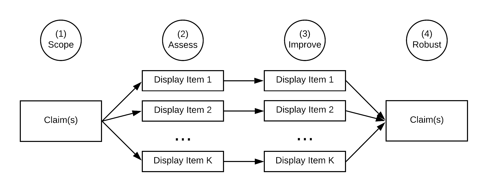

--- 
title: "Guide for Accelerating <br> Computational Reproducibility in the Social Sciences"
subtitle:  |
  [{style="display: block; margin-left: auto;
  margin-right: auto; width: 50%"}](https://www.bitss.org/)  
author: "ACRE Team"
date: "`r Sys.Date()`"
documentclass: book
bibliography: [book.bib, packages.bib]
biblio-style: apalike
always_allow_html: true
link-citations: yes
github-repo: BITSS/ACRE
heading_anchors: true
site: bookdown::bookdown_site
description: "Materials to support the reproduction of published research in social sciences"
output:
  bookdown::html_document2: default
  bookdown::word_document2:
    toc: true

---
#  {-}
```{css, echo = FALSE}
@import url('https://fonts.googleapis.com/css?family=Karla&display=swap');

<style type = "text/css">
    h1{}
    h1, p.date{
        font-family: 'Karla';
        text-align: center;
    }
    p.author{
        display: none;
    }
    p{
        font-family: 'Karla';
    }
</style>
```

<p style="text-align: center;"> 
  [See a full list of contributors](#contributions)
</p>  

A beta version of the [**Social Science Reproduction Platform**](https://www.socialsciencereproduction.org/) is now available! [**Sign up here**](https://forms.gle/yZivWcwijCzEhrBU6) if you would like to be part of our beta testing. 


```{r out.width = '100%', echo=FALSE}
# url
knitr::include_graphics("stages.svg") 
```


<table>
   <thead>
      <tr>
         <th>[(0) <br> Select](#select) </th>
         <th>[(1) <br> Scoping](#scoping) </th>
         <th>[(2) <br> Assessment](#assessment)</th>
         <th colspan=2>[(3) <br> Improvement](#improvements)</th>
         <th>[(4) </br> Robustness](#robust)</th>
      </tr>
   </thead>
   <tbody>
      <tr>
         <td></td>
         <td></td>
         <td></td>
         <td>[Display-item-level](#di-imp)</td>
         <td>[Paper-level](#paper-level)</td>
      </tr>
      <tr>
         <td>&#9744; Select paper</td>
         <td>[&#9744;  Read paper](#read-summ)</td>
         <td>[&#9744; Describe inputs](#describe-inputs)</td>
         <td>[&#9744; + Raw data](#rd)</td>
         <td>[&#9744; + Version control](#paper-level)</td>
         <td>[&#9744; Analytical choices](#id-analy)</td>
      </tr>
      <tr>
         <td>[&#9744; Search materials](#declaree)</td>
         <td>[&#9744; Identify claims](#declare-estimates)</td>
         <td>[&#9744; Build reproduction diagrams](#diagram)</td>
         <td>[&#9744; + Analysis data](#ad)</td>
         <td>[&#9744; + Documentation](#paper-level)</td>
         <td>[&#9744; Type of choice](#id-type)</td>
      </tr>
      <tr>
         <td>[&#9744; Check SSRP](#check-acre)</td>
         <td>[&#9744; Declare estimates](#declare-estimates)</td>
         <td>[&#9744; Assign a reproducibility score](#score)</td>
         <td>[&#9744; + Analysis code](#ac)</td>
         <td>[&#9744; + Dynamic document](#paper-level)</td>
         <td>[&#9744; Choice value](#id-val)</td>
      </tr>
      <tr>
         <td>&#9744;  Declare/Discard paper</td>
         <td></td>
         <td></td>
         <td>[&#9744; + Cleaning code](#cc)</td>
         <td>[&#9744; + File structure](#paper-level)</td>
         <td>[&#9744; Justify and test alternatives](#test-rob)</td>
      </tr>
      <tr>
         <td></td>
         <td></td>
         <td></td>
         <td>[&#9744; Debug analysis code](#dac)</td>
         <td></td>
         <td>
         <td></td>
      </tr>
      <tr>
         <td></td>
         <td></td>
         <td></td>
         <td>[&#9744; Debug cleaning code](#dcc)</td>
         <td></td>
         <td></td>
      </tr>
   </tbody>
</table>

This work is licensed under the Creative Commons Attribution-NonCommercial 4.0 International License. To view a copy of this license, visit http://creativecommons.org/licenses/by-nc/4.0/.

<!--chapter:end:index.Rmd-->

---
output:
  pdf_document: default
  html_document: default
---
```{r setup-intro, echo = FALSE, warning=FALSE, message=FALSE}
library(tidyverse)
library(knitr)
library(kableExtra)
```

# Introduction {-#intro}

*Computational reproducibilty* is the degree to which it is possible to obtain consistent results using the same input data, computational methods, and conditions of analysis [@national2019reproducibility]. In 2019, the [American Economic Association](https://www.aeaweb.org/journals/policies/data-code/) updated its Data and Code Availability Policy to require that the AEA Data Editor verify the reproducibility of all papers before they are accepted by an AEA journal. Similar policies have been adopted in political science, particularly at the [*American Journal of Political Science*](https://ajps.org/ajps-verification-policy/). In addition to the requirements laid out in such policies, the data editors of several social science journals produced detailed [recommendations and resources](https://social-science-data-editors.github.io/guidance/) to facilitate compliance. This goal of such policy changes is to improve the computational reproducibility of *all* published research going forward, after several studies showed that rates of computational reproducibility in the social sciences range from somewhat low to  alarmingly low [@galiani2018make; @chang2015economics; @kingi2018reproducibility].

This Guide includes a common approach, terminology, and standards for conducting *reproductions*, or attempts to assess and improve the computational reproducibility of published work**. At the center of this process is the *reproducer* (you!), a party rarely involved in the production of the original paper. Reproductions sometimes involve the *original author* (whom we refer to as "the author") in cases where additional guidance and materials are needed to execute the process. Reproductions should be distinguished from *replications*, where replicators re-examine a study's hypotheses using *different data* or *different methods* (or both) [@King95]. We find that reproducibility is necessary for replicability, though both allow science to be "self-correcting."

We recommend using this Guide in conjunction with the [**Social Science Reproduction Platform**](https://www.socialsciencereproduction.org/) (SSRP), an open-source platform that crowdsources and catalogs attempts to assess and improve the computational reproducibility of published social science research. Though in its current version, the Guide is primarily intended for reproductions in economics, it may be used in other social science disciplines, and we welcome contributions that aim to "translate" any of its parts to other social science disciplines (learn how you can contribute [here](https://bitss.github.io/ACRE/contributions.html)). Find definitions of fundamental concepts in reproducibility and the process of conducting reproductions in the ["Glossary" chapter](https://bitss.github.io/ACRE/definitions.html).

This Guide and the SSRP were developed as part of the Accelerating Computational Reproducibility in Economics [(ACRE)](https://www.bitss.org/ecosystem/acre/) project, which aims to assess, enable, and improve the computational reproducibility of published economics research. The ACRE project is led by the Berkeley Initiative for Transparency in the Social Sciences [(BITSS)](https://bitss.org)—an initiative of the Center for Effective Global Action [(CEGA)](https://cega.berkeley.edu/)—and [Dr. Lars Vilhuber](https://www.vilhuber.com/lars/), Data Editor for the journals of the American Economic Association (AEA). This project is supported by the Laura and John Arnold Foundation.

```{r weai-presentation, out.width = '80%', echo=FALSE, fig.cap= "BITSS Project Scientist Fernando Hoces provides an overview of the ACRE project and the process of conducting a reproduction as part of a webinar hosted at the 95th WEAI virtual conference Jun 27, 2020.", eval=FALSE}
knitr::include_url("https://www.youtube.com/embed/Xv1t8An2gPo")
```

[View slides used for the presentation "How to Teach Reproducibility in Classwork"](https://bitss.github.io/WEAI2020_slides/)

<!-- 
add clarebout principle and discuss effect on a more inclusive scientific community
-->

## Beyond binary judgments {-}

Assessments of reproducibility can easily gravitate towards binary judgments that declare an entire paper as "(ir-)reproducible". We suggest a more nuanced approach by highlighting two realities that make binary judgments less relevant. 

First, a paper may contain several scientific claims (or major hypotheses) that may vary in computational reproducibility. Each claim is tested using different methodologies, presenting results in one or more display items (outputs like tables and figures). Each display item will itself contain several specifications. Figure \@ref(fig:diagram) illustrates this idea. 

```{r diagram, eval=TRUE, echo=FALSE,out.width = '100%', fig.cap="One paper has multiple components to reproduce. <br> DI: Display Item, S: Specification "}
library(DiagrammeR)

knitr::include_graphics("paper-claims.png") 

if (FALSE) {
grViz("
digraph a_nice_graph {

graph [layout = neato, rankdir= TB, overlap=true]  ## layout = [neato|twopi, etc]
#https://rich-iannone.github.io/DiagrammeR/graphviz_and_mermaid.html


# node definitions with substituted label text
node [fontname = Helvetica, shape = box, style=empty ]
paper [label = '@@1']    ## label indicates the position of the letter

node [fontname = Helvetica, shape = diamond, fontsize = 10, fixedsize = TRUE, fillcolor=Gray]
claim1 [label = '@@2-1', color=red]
claim2 [label = '@@2-2']
claim3 [label = '@@2-3']

node [fontname = Helvetica, shape = circle, fillcolor=YellowGreen, fixedsize = TRUE]
output1 [label = '@@3-1', color = red]
output2 [label = '@@3-2']
output3 [label = '@@3-3']
output4 [label = '@@3-4']
output5 [label = '@@3-5']
output6 [label = '@@3-6']

node [fontname = Helvetica, shape = circle, fixedsize = TRUE, fillcolor=Peru]
spec1 [label = '@@4-1', color=red]
spec2 [label = '@@4-2']
spec3 [label = '@@4-3']
spec4 [label = '@@4-4']
spec5 [label = '@@4-5']
spec6 [label = '@@4-6']
spec7 [label = '@@4-7']
spec8 [label = '@@4-8']
spec9 [label = '@@4-9']
spec10 [label = '@@4-10']
spec11 [label = '@@4-11']
spec12 [label = '@@4-12']


# edge definitions with the node IDs
paper -> {claim1} [color=red]      ##[label = ...] adds text on the edge
paper -> {claim2 claim3} 
claim1 -> {output1} [color=red]
claim1 -> {output2} 
claim2 -> {output3 output4}
claim3 -> {output5 output6}
output1 -> {spec1} [color=red]
output1 -> {spec2} 
output2 -> {spec3 spec4}
output3 -> {spec5 spec6}
output4 -> {spec7 spec8}
output5 -> {spec9 spec10}
output6 -> {spec11 spec12}
}

[1]: 'Paper'            ## adds label to each box
[2]: c('Claim 1', 'Claim 2', 'Claim 3')
[3]: c('DI 1' , 'DI 2', 'DI 3', 'DI 4', 'DI 5', 'DI 6')
[4]: paste0('S ', 1:10)

")
}
```

Second, for any given specification, there are several reproducibility levels, ranging from the absence of any materials to complete reproducibility starting from raw data. Moreover, even for a specific claim-specification combination, distinguishing the appropriate level can be far more constructive than simply labeling it as (ir-)reproducible.

Note that the highest level of reproducibility, which requires complete reproducibility starting from raw data, is very demanding and should not be expected of all published research — especially before 2019. Instead, this level can serve as an aspiration for social science research, as we look to improve the reproducibility of research and facilitate the transmission of knowledge throughout the scientific community.

## Reproduction stages {-}

Reproductions can be divided into five stages, corresponding to the first five chapters of this guide:   

0.    [**Paper selection**](#select), where you will select a *candidate* paper and try to locate its *reproduction package*. If a reproduction package is available, you will *declare* the paper and start the reproduction, or select a new candidate paper (after leaving a record on the SSRP);  
1.    [**Scoping**](#scoping), where you will define the scope of the exercise by recording the claims, display items, and specifications you will focus on in the remainder of the reproduction;  
2.    [**Assessment**](#assessment), where you will review and describe in detail the available reproduction package and assess the current level of computational reproducibility of the selected display items; 
3.    [**Improvement**](#improvements), where you will modify the content and/or the organization of the reproduction package to improve its reproducibility;  
4.    [**Robustness**](#robust), where you will identify feasible robustness checks and/or assess the reasonableness of variations in analytical choices.  

This Guide does not include a possible fifth stage of **extension**, where you may extend the current paper by including new methodologies or data, which would bring the exercise closer to *replication*.


```{r stages-intro, out.width = '100%', echo=FALSE, fig.cap="Four stages of a reproduction attempt"}
knitr::include_graphics("stages.svg") 
``` 

The order of the stages may not be chronologically linear. For example, you may realize that the scope of a reproduction is too ambitious and switch to a less intensive one. Later in the exercise, you can also begin testing different specifications for robustness while also assessing the paper's reproducibility level. The only stage that should go first, and cannot be edited once finished, is the Scoping stage.

Different stages in the reproduction process correspond to different units of analysis (see Figure \@ref(fig:stages-unit) for an overview). E.g., the Scoping stage will focus on scientific *claims* selected for reproduction. Once you specify your claims of interest, in the Assessment and Improvement stages you will focus on the display items associated with those claims. In the Robustness stage, claims are once again the unit of analysis.

```{r stages-unit, out.width = '100%', echo=FALSE, fig.cap="Relevant unit of analysis at each stage of a reproduction attempt", eval=TRUE}
 
```


## Reproduction strategies {-}

In most cases, you will begin a reproduction with a thorough reading of your paper of interest. However, the sequence of the steps you take in the remainder of the reproduction may follow various  *reproduction strategies*. The most obvious strategy would be to follow the order of the steps as outlined above. You may also first choose one of the paper's many claims and then focus on assessing and improving the reproduction package accordingly. Using an alternative strategy, you might identify potential robustness checks or extensions while reading the paper and then focus only on the results associated with that robustness check. In another strategy, you may identify a paper that uses a particular dataset in which you are interested and then only reproduce or conduct robustness checks for the results associated with that dataset. The various uses of reproduction make the number of potential reproduction strategies potentially infinite, so it helps identify the goal of the reproduction from the start.

<!--chapter:end:01-intro.Rmd-->

# Selecting a paper {#select}

The goal of this stage is to help you define the scope of your exercise by declaring a paper and the specific output(s) on which you will focus. You might first consider multiple papers without analyzing them more closely (we refer to these as **candidate papers**) before moving forward with your **declared paper**. 

The main difference between a candidate and a declared paper is the availability of a reproduction package. A **reproduction package** is the collection of materials that make it possible to reproduce a paper. This package may contain data, code, or documentation. If you are unable to independently locate the reproduction package for your paper, you can ask the paper's author for it (find guidance on this in [Chapter 5](https://bitss.github.io/ACRE/guidance-for-a-constructive-exchange-between-reproducers-and-original-authors.html)) or simply choose another candidate paper. If you still want to explore the reproducibility of a paper with no reproduction package, these guidelines provide instructions for requesting materials from authors to create a public reproduction package, or if this proves unsuccessful, for building your reproduction package from scratch.

To avoid duplicating the efforts of others who may be interested in reproducing one of your candidate papers, **we ask that you record your candidate papers in the SSRP database** (currently under development).

Note that in this stage, *you are not expected to review the reproduction materials in detail*, as you will dedicate most of your time to this in later stages of the exercise. 

## From candidate to declared paper {#declare}

At this point of the exercise, you are *only validating the availability* of (at least) one reproduction package and not assessing the quality of its content. Follow the steps below to verify that a reproduction package is available, and stop whenever you find it (this may mean that you have found your declared paper).

  1. Check whether previous reproduction attempts have been recorded in the SSRP Database for the paper (more on the SSRP Database in the next section).
  2. Check the journal or publisher's website, looking for materials named "Data and Materials," "Supplemental Materials," "Reproduction/Replication Package/Materials," etc.  
  3. Look for links in the paper (review the footnotes and appendices).  
  4. Review the personal websites of the paper's author(s).
  5. Contact the author(s) to request the reproduction package using [this](https://bitss.github.io/ACRE/guidance-for-a-constructive-exchange-between-reproducers-and-original-authors.html#contacting-the-original-authors-when-there-is-no-reproduction-package) email template. In this and future interactions with authors, we encourage you to follow our guidance outlined in [Chapter 5](https://bitss.github.io/ACRE/guidance-for-a-constructive-exchange-between-reproducers-and-original-authors.html#contacting-the-original-authors-when-there-is-no-reproduction-package).
  6. Deposit the reproduction package in a trusted repository (e.g., [Dataverse](https://dataverse.org/), [Open ICPSR](https://www.openicpsr.org/openicpsr/), [Zenodo](https://zenodo.org/), or the [Open Science Framework](https://osf.io/)) under the name `Original reproduction package for - Title of the paper`. You will be asked to provide the URL of the repository in Survey 1.

In case you need to contact the authors, make sure to *allocate sufficient time for this step* (we suggest at least three weeks before the date you plan to start the reproduction). Instructors should also plan to accordingly (e.g., if the ACRE exercise is expected to take place in the middle of the semester, students should review candidate papers and (if applicable) contact the authors in the first few weeks of the semester).

Review the decision tree (Figure \@ref(fig:candidate-paper-dec-tree)) below for a more detailed overview of this process. Remember, *if at any step of the process you decide to abandon the paper, make sure to record the candidate paper in the ACRE database* before moving on to another candidate paper. Once you have obtained the reproduction package, the *candidate paper* becomes your *declared paper* and you can move forward with the exercise! Do not invest time in doing a detailed read of any paper until you are sure that it is your declared paper.

### Candidate paper entries in the SSRP Database {#check-acre}

If the SSRP database contains previous reproduction attempts of the paper, you will see a report card with the following information:   

>**Box 1:** Summary Report Card for ACRE Paper Entry     
> **Title:**  Sample Title   
> **Authors:**  Jane Doe & John Doe  
> **Original Reproduction Package Available:** Yes (link)/No.
> [If "No"] **Contacted Authors?:** Yes/No  
> [If "Yes(contacted)"] **Type of Response:** Categories (6).  
> **Additional Reproduction Packages:** Number (eg., 2)   
> **Authors Available for Further Questions for ACRE Reproductions:** Yes/No/Unknown   

If after taking steps 1-5 above (or for some other reason) you are unable to locate the reproduction package, record your candidate paper (and if applicable, the outcome of your correspondence with the original authors) in the SSRP database following the example above.


```{r candidate-paper-dec-tree, eval=TRUE, echo=FALSE, fig.cap="Decision tree to move from candidate to declared paper", out.width = '80%'}
#Bug1: help to get this to run within the code chunk
#Bug2: cannot call .svg and get pdf (latex) to run
#
if (FALSE) {
mermaid("
graph TD
	A0[Select Candidate Paper] --> A[Check SSRP]
  A --> |No paper entry|B1[Reproduction Package-RP-?]
  B1 --> |Yes|F1[Declare & Read]
  B1 --> |No|C1[Contact Authors?]
  C1 --> |Yes|D1[Found RP?]
  C1 --> |No|R[Brief Record]
  D1 --> |Yes|F1
  D1 --> |No|E1[Build RP?]
  E1 --> |Yes|F1[Declare & Read]
  E1 --> |No|R

  A --> |Paper entry|B2[Status on SSRP]
  B2 --> |RP exists|F1
  B2 --> |No RP. No Contact to Authors|C1
  B2 --> |No RP. Authors contacted|D2[Follow up?]
  D2 --> |Yes|C1
  D2 --> |No|R

  R -->A0
")  
}
# [](https://mermaid-js.github.io/mermaid-live-editor/#/edit/eyJjb2RlIjoiXG5ncmFwaCBURFxuXHRBMFtTZWxlY3QgQ2FuZGlkYXRlIFBhcGVyXSAtLT4gQVtDaGVjayBTU1JQXVxuICBBIC0tPiB8Tm8gcGFwZXIgZW50cnl8QjFbXCJSZXByb2R1Y3Rpb24gUGFja2FnZSA8YnI-IChSUCkgQXZhaWxhYmxlP1wiXVxuICBCMSAtLT4gfFllc3xGMVtEZWNsYXJlICYgUmVhZF1cbiAgQjEgLS0-IHxOb3xDMVtDb250YWN0IEF1dGhvcnM_XVxuICBDMSAtLT4gfFllc3xEMVtGb3VuZCBSUD9dXG4gIEMxIC0tPiB8Tm98UltCcmllZiBSZWNvcmRdIFxuICBEMSAtLT4gfFllc3xGMVxuICBEMSAtLT4gfE5vfEUxW0J1aWxkIFJQP11cbiAgRTEgLS0-IHxZZXN8RjFbRGVjbGFyZSAmIFJlYWRdXG4gIEUxIC0tPiB8Tm98UlxuXG4gIEEgLS0-IHxQYXBlciBlbnRyeXxCMltTdGF0dXMgb24gU1NSUF1cbiAgQjIgLS0-IHxSUCBleGlzdHN8RjFcbiAgQjIgLS0-IHxObyBSUC4gTm8gQ29udGFjdCB0byBBdXRob3JzfEMxXG4gIEIyIC0tPiB8Tm8gUlAuIEF1dGhvcnMgY29udGFjdGVkfEQyW0ZvbGxvdyB1cD9dXG4gIEQyIC0tPiB8WWVzfEMxXG4gIEQyIC0tPiB8Tm98UlxuXG4gIFIgLS0-QTAiLCJtZXJtYWlkIjp7InRoZW1lIjoiZGVmYXVsdCJ9LCJ1cGRhdGVFZGl0b3IiOmZhbHNlfQ)

#BUG: bookdown cannot seem to load the svg versio of the figure below
knitr::include_graphics("candidate-to-declared-paper.png") 
```


<!-- Bug: there is a bug that breaks this itemization below when building the book (it works fine when knighting single doc). Please think of a solution-->


## Identify your relevant timeline.  

Before you begin working on the four main stages of the reproduction exercise (Scoping, Assessment, Improvement, and Robustness), it is important to manage your own expectations and those of your instructor or advisor. Be mindful of your time limitations when defining the scope of your reproduction activity. These will depend on the type of exercise chosen by your instructor or advisor and may vary from a weeklong homework assignment, to a longer class project that may take a month to complete or a semester-long project (an undergraduate thesis, for example).

Table 1 shows an example distribution of time across three different reproduction formats. The Scoping and Assessment stages are expected to last roughly the same amount of time across all formats (lasting longer for the semester-long activities, and acknowledging that less experienced researchers, such as undergraduate students, may need more time). Differences emerge in the distribution of time for the last two main stages: Improvements and Robustness. For shorter exercises, we recommend avoiding any possible improvements to the raw data (or cleaning code). This will limit how many robustness checks are possible (for example, by limiting your ability to reconstruct variables according to slightly different definitions), but it should leave plenty of time for testing different specifications at the analysis level.


```{r stages-dis, out.width = '100%', echo=FALSE, eval=FALSE}
# Ask a URAP TO REPRODUCE HTML TABLE BELOW USING KABLE
stages_info <- data.frame(Exercise  = c('Graduate course', 'Graduate research', 'Undergrad thesis'),
                            Scope    = c("10%", "5%", "5%"),
                            Assess   = c("35%", "25%", "20%"),
                            Improve  = c("25%", "40%", "50%"),
                            Robust   = c("30%", "30%", "25%") )

stages_info %>%
    knitr::kable(caption = "Suggested Relative Level of Effort by Type of exercise") %>%
    kable_styling(full_width = TRUE)
```

<style type="text/css">
.tg  {border-collapse:collapse;border-spacing:0;}
.tg td{font-family:Arial, sans-serif;font-size:14px;padding:10px 5px;border-style:solid;border-width:1px;overflow:hidden;word-break:normal;border-color:black;}
.tg th{font-family:Arial, sans-serif;font-size:14px;font-weight:normal;padding:10px 5px;border-style:solid;border-width:1px;overflow:hidden;word-break:normal;border-color:black;}
.tg .tg-baqh{text-align:center;vertical-align:top}
.tg .tg-c3ow{border-color:inherit;text-align:center;vertical-align:top}
.tg .tg-0pky{border-color:inherit;text-align:left;vertical-align:top}
.tg .tg-dvpl{border-color:inherit;text-align:right;vertical-align:top}
.tg .tg-0lax{text-align:left;vertical-align:top}
</style>
<table class="tg">
  <tr>
    <th class="tg-0pky"></th>
    <th class="tg-c3ow" colspan="2">2 weeks <br> (~10 days)</th>
    <th class="tg-c3ow" colspan="2">1 month <br> (~20 days)</th>
    <th class="tg-c3ow" colspan="2">1 semester <br> (~100 days)</th>
  </tr>
  <tr>
    <td class="tg-0pky"></td>
    <td class="tg-0pky">analysis data</td>
    <td class="tg-0pky">raw data</td>
    <td class="tg-0pky">analysis data</td>
    <td class="tg-0pky">raw data</td>
    <td class="tg-0pky">analysis data</td>
    <td class="tg-0pky">raw data</td>
  </tr>
  <tr>
    <td class="tg-0pky">Scoping</td>
    <td class="tg-c3ow" colspan="2">10% (1 day)</td>
    <td class="tg-c3ow" colspan="2">5% (1 day)</td>
    <td class="tg-c3ow" colspan="2">5% (5 days)</td>
  </tr>
  <tr>
    <td class="tg-0pky">Assessment</td>
    <td class="tg-c3ow" colspan="2">35%</td>
    <td class="tg-c3ow" colspan="2">25%</td>
    <td class="tg-c3ow" colspan="2">15%</td>
  </tr>
  <tr>
    <td class="tg-0pky">Improvement</td>
    <td class="tg-c3ow">25%</td>
    <td class="tg-c3ow">0%</td>
    <td class="tg-c3ow" colspan="2">40%</td>
    <td class="tg-c3ow">20%</td>
    <td class="tg-c3ow">30%</td>
  </tr>
  <tr>
    <td class="tg-0pky">Robustness</td>
    <td class="tg-c3ow">25%</td>
    <td class="tg-c3ow">5%</td>
    <td class="tg-c3ow" colspan="2">25%</td>
    <td class="tg-c3ow" colspan="2">25%</td>
  </tr>
</table>

<!--chapter:end:02-select.Rmd-->

# Scoping

At this stage, you will define the *scope of the reproduction* by identifying the *scientific claims* and related *display items* that you will analyze in the remainder of the reproduction. For this exercise, we follow the a comparable definition of a claim as used in the SCORE project, a related initiative aimed at predicting replicability and reproducibility of research:  

>"A research claim is a single major finding from a published study, as well as details of the methods and results that support this finding. A research claim [may not be] equivalent to an entire article. Sometimes the claim as described in the abstract does not exactly match the claim that is tested. In this case, you should consider the research claim to be that which is described in the [results of the paper]".
>
> -- <cite>[RepliCATS Project](https://replicats.research.unimelb.edu.au/#tab301) (not dated)</cite>

A *display item* is a figure or table that presents the results described in the paper. Each display item contains several *specifications*. 

When recording the Scoping section on the SSRP plataform, count all of the claims in the paper and provide a one sentence summary for the subset of claims that you will attempt to reproduce. Structure your summary as follows: "The paper tested the effect of X on Y for population P, using method F. The main results show an effect of magnitude E (specify units and standard errors)" or "The paper estimated the value of Y (estimated or predicted) for population P under dimensions X using method M. The main results presented an estimate of of magnitude E (specify units and standard errors)". Make sure to use the same units of measurement for all scientific claims that you will analyze as part of the reproduction.

**Note:** Once you progress past the Scoping stage on the SSRP, *you will no longer be able to edit your responses in the Scoping stage*, though you will be able to see them. This is because the content of later stages of the reproduction is dependent on the information you record at this stage of the reproduction.


## Read and summarize the paper {#read-sum}


Depending on your reproduction's timeline, we recommend that you write a short (<1000 words) summary of the paper. Writing up such a summary will help you develop and demonstrate a wholesome understanding of the paper and its various components. In your summary, try to address the following:  

- How many scientific claims can you identify in the paper? 
- Would you classify the claims as causal, descriptive (e.g., estimating a population's descriptive statistic), or something else?  
- What is the population that is the focus of the paper as a whole?  
- What is the population for which the estimates apply?  
- What are the primary data sources used in the paper?  
- What is the primary statistical or econometric method used to examine each claim?  
- What is the author's preferred specification (or yours, if the authors' is unclear)?  
- What are some possible robustness checks for the preferred specification?    
- How many display items are there in the paper (tables, figures, and inline results)?  

Draft the summary in a plain text editor and paste the text in the form.  

## Record a revised reproduction package  

At the previous stage, you recorded the original reproduction package made available by the paper's authors. Given that one of the main goals of the ACRe approach is to improve reproducibility, we recommend that you build an alternative reproduction package that will improve the reproducibility of specific display items or the paper as a whole. 
You can start by downloading the reproduction package (or *forking*, if on GitHub) and uploading a copy titled "Revised reproduction package for [Paper Citation, e.g. Smith et al. (2019)]" to a trusted repository. Examples of trusted repositories include [Dataverse](https://dataverse.org/), [openICPSR](https://www.openicpsr.org/openicpsr/), [Figshare](https://figshare.com), [Dryad](https://datadryad.org/stash), [Zenodo](https://about.zenodo.org/), [Open Science Framework](osf.io/) and others. We encourage you to also use version control software (e.g., Git) during your reproduction.

As you work through the next stages, you can modify the reproduction package and record your improvements on the SSRP. Keeping a record of such changes will help you document your assessments or communicate with the original authors, and it will also allow future reproducers to build on top of your work.

## Record scope of the exercise {#declare-estimates}

By now, you probably have a reasonably good understanding of the paper. You do not, however, need to spend any time reviewing the reproduction package in detail.

At this point, you should specify the parts of the paper that will be the main focus of your reproduction. Focus on specific estimates, represented by a unique combination of claim-display item-specification as represented in figure \@ref(fig:diagram). Given the complexity of the SSRP approach, unless you are very familiar with the paper, we recommend starting with just one claim before moving onto second or third as part of a later reproduction.

#### Declare a specific estimate(s) to reproduce {-}    

Identify a scientific claim and its corresponding preferred specification and record its magnitude, standard error, and location in the paper (page, table #, and table row and column). If the authors did not explicitly choose a precise preferred estimate, you can choose one yourself. In addition to the preferred estimate, you can reproduce up to five estimates that correspond to the preferred estimate's alternative specifications.

#### Declare possible robustness checks for main estimates (optional) {-}    
After reading the paper, you might wonder why the authors did not conduct a specific robustness test. If you think that such analysis could have been done *within the same methodology* and *using the same data* (e.g., by including or excluding a subset of the data like "high-school dropouts" or "women"), please specify a robustness test that you would like to conduct before starting the Assessment stage. Robustness checks in this stage are *optional* and can take the form of a short sentence describing at a high level what you (the reproducer) would like to explore in a later stage. In the robustness stage (after assessment and improvement) you will be able to describe in greater detail how you have modified the reproduction code.

<!--chapter:end:03-scope.Rmd-->


```{r setup-assessment, echo = FALSE, warning=FALSE, message=FALSE}
library(tidyverse)
library(knitr)
library(kableExtra)
temp_eval <- TRUE
```

# Assessment

In the *Assessment* stage, you will describe the available reproduction materials and assign a reproducibility score to the display items associated with your selected claims. You will also review reproducibility practices for the overall paper. This stage records rich information about each reproduction to allow future reproducers to pick up easily where others have left off.

In the previous two stages, you declared a paper and identified claims and their associated estimates (found in display items) that you intend to analyze in the remainder of your reproduction. In this stage, you will get to decide whether you are interested in assessing the reproducibility of entire display items (e.g., "Table 1") or only specific estimates found in display items (e.g., "rows 3 and 4 of Table 1"). You can also include additional display items of interest.

The Assessment stage aims to analyze the reproduction package's *current* reproducibility—before you suggest any improvements. By the end of this section, you will have created a very detailed description of the reproduction package's current reproducibility that you can use to implement improvements, potentially with the paper's original authors' help.

On the SSRP, you will first provide a detailed description of available inputs in the reproduction package. You will then connect the display items you've chosen to reproduce with their corresponding inputs. With these elements in place, you can assign a score of each display item's reproducibility and record various paper-level dimensions of reproducibility.

*Tip:* We recommend that you first focus on just one display item (e.g., "Table 1"). After completing the assessment for this display item, you will have a much easier time assessing others.

## Describe the inputs {#describe-inputs}

This section explains how to record the *input* materials found (or referenced) in the reproduction package. At this point, it may be challenging to precisely identify the materials that correspond to your selected claims and display items, so we recommend listing *all* files in the reproduction packages (*tip*: using the command line, go to the directory of the reproduction package, and type `file */*` on a Mac or `dir /s /b /o:gn` on Windows to obtain a printout of all files within a folder). However, if the reproduction package is too extensive to record in its entirety, you can focus only on the materials required to reproduce a specific display item.


The following concepts may be helpful as you work in the Assessment stage (also see the ACRe glossary [here](https://bitss.github.io/ACRE/definitions.html)):

 - **Raw data** -- Unmodified data files obtained by the authors from the sources cited in the paper. Data from which personally identifiable information (PII) has been removed are *still considered raw*. All other modifications to raw data make it *processed*.    
 - **Analysis/Analytic data** -- Data used as the final input in a workflow to produce a statistic displayed in the paper (including appendices).    
 -	**Cleaning code:** A script associated primarily with data cleaning. Most of its content is dedicated to actions like deleting variables or observations, merging data sets, removing outliers, or reshaping the data structure (from long to wide, or vice versa).    
 -	**Analysis code:** A script associated primarily with analysis. Most of its content is dedicated to generate some type of estimate to be presented in the paper (including the appendix). Examples of computations that lead to such estimates are: running regressions, running hypothesis tests, computing standard errors, and imputing missing values.


In section "Describe input" on the SSRP, you can record data sources and connect them with their raw data files (if available). You can then locate and provide a brief description of the analytic data files and then record script files in Table.


### Describe the data sources and raw data {#desc-sourc}

In the paper you chose, find references to all *data sources* used in the analysis. A data source is usually described in narrative form. For example, if in the body of the paper, or the appendix, you see text like “(...) for earnings in 2018 we use the Current Population Survey”, the data source is “2018 Current Population Survey ”. If the first reference to this data source is found on page 1 of the appendix, you should record its location as “A1”. Do this for all data sources mentioned in the paper. Each row represents a unique data source.

Data sources also vary by unit of analysis, with some sources matching the same unit of analysis used in the paper (as in previous examples). In contrast, others may be less clear, e.g., "our information on regional minimum wages comes from the Bureau of Labor Statistics." You should record such data source as "regional minimum wages from the Bureau of Labor Statistics."

Next, look at the reproduction package and map the *data sources* mentioned in the paper to the *Data Files* in the reproduction package. In the *Location* column, record their folder locations relative to the main reproduction folder^[a relative location takes the form of `folder_in_rep_materials/sub_folder/file.txt`, in contrast to an absolute location that takes the form of `/username/documents/projects/repros/folder_in_rep_materials/sub_folder/file.txt`]. In addition to looking at the existing data files, we recommend that you also review the first lines of all code files (especially cleaning code), looking for lines that call the datasets. Inspecting these scripts may help you understand how different data sources are used, and possibly identify any missing files from the reproduction package. Whenever a data source contains multiple files, enter them in the same cell, separated by semicolon (`;`).

If you cannot find the files or file name corresponding to a specific data source, type "Missing" in the *Notes* column.

Check the *Provided* column if the data source was included in the original reproduction package. Check the *Cited* column if the data source was explicitly cited in the paper.

this [standardized spreadsheet](https://docs.google.com/spreadsheets/d/1LUIdVFH0OfR70C7z07TYeE-uWzKI_JIeWUMaYhqEKK0/edit#gid=0&range=A1) (download it or make a copy for yourself), using the following structure:    
```{r raw-data-information, echo = FALSE, eval=temp_eval}
raw_data_info <- data.frame(data_source = c('"Current Population Survey 2018"', '"Provincial Administration Reports"', '"2017 SAT scores"', "..."),
                            page = c("A1", "A4", "4", "..."),
                            data_files = c("cepr_march_2018.dta", "coast_simplepoint2.csv; rivers_simplepoint2.csv; RAIL_dummies.dta; railways_Dissolve_Simplify_point2.csv", "Not available", "..."),
                            directory = c("data/", " Data/maps/", "data/to_clean/", "..."),
                            known_missing = c(" ", "  ", " ", "..."),
                            provided = c(" TRUE ", " TRUE ", " FALSE ", "..."),
                            cited = c("FALSE ", " FALSE  ", " TRUE ", "..."))

raw_data_info %>%
    knitr::kable(caption = "Raw data information") %>%
    kable_styling(full_width = TRUE) %>%
    scroll_box(width = "100%", box_css = "border: 0px;")
```

### Describe the analytic data {#desc-analy}

First, identify all analytic data files in the reproduction package and record their names in the *Analytic Data* column in Table 1.2. You will recognize analytic data files based on the documentation, their location folder, or if a code file produces them.

Second, record each analytic data file's location relative to the main folder of the reproduction package in the *Location* column.

Finally, provide a one-line description of each file in the *Description* column (e.g., all_waves.csv can be "data for region-level analysis"). This will become easier as you progress through the reproduction, and you can always return to this table later on and add or modify your descriptions.

The resulting table may look like this:  

```{r analysis-data-information, echo = FALSE, eval=temp_eval}
analysis_data_info <- data.frame(analysis_data = c("final_data.csv", "all_waves.csv", "..."),
                                 location = c("analysis/fig1/", "final_data/v1_april/", "..."),
                                 description = c("data for figure1", "data for region-level analysis", "..."))

analysis_data_info %>%
    knitr::kable(caption = "Analysis data information") %>%
    kable_styling(full_width = TRUE) %>%
    scroll_box(width = "100%", box_css = "border: 0px;")
```

### Describe the code scripts{#desc-scripts}

First, identify all code files in the reproduction package and record their names in the *File Name* column and record their locations relative to the main folder in the *Location* column.

Then, review the beginning and end of each code file to identify the inputs required to successfully run the file and the outputs it produces. Inputs are data sets or other code scripts that are typically found at the beginning of the script (e.g., 'load', 'read', 'source', 'run', 'do'). Outputs are other data sets, or plain text files typically found at the end of a script (e.g., 'save, write, export). Record those in the *Inputs* and *Outputs* columns.

Finally, provide a brief description of the code's function in the *Description* column and classify its function as analysis or cleaning and/or construction in the *Primary Type* column.

For each code file, record all outputs together and separate each item with ";". Record all of this information in the SSRP using the following structure:

```{r code-files-information, echo = FALSE, eval=temp_eval}
code_files_info <- data.frame(file_name = c("output_table1.do", "data_cleaning02.R", "..."),
                              location = c("code/analysis/", "code/cleaning", "..."),
                              inputs = c("analysis_data01.csv", "admin_01raw.csv", "..."),
                              outputs = c("output1_part1.txt", "analysis_data02.csv","..."),
                              description = c("produces first part of table 1 (unformatted)", "removes outliers and missing vals from raw admin data", "..."),
                              primary_type = c("analysis", "cleaning", "..."))

code_files_info %>%
    knitr::kable(caption = "Code files information") %>%
    kable_styling(full_width = TRUE) %>%
    scroll_box(width = "100%", box_css = "border: 0px;")
```


#### Common issues that might when creating a reproduction tree:

 - If you notice that some files iterate between each other (e.g., file1.do calls data1.csv to generate data2.csv, and file2.R calls data2.csv to generate data1.csv), look within the files to identify the one that contains some stopping criteria (e.g., stop when SSR is minimized). Then designate only one output as the final and record that in reproduction diagram in the next section.  

 - Sometimes the reproduction package will not produce display items as its final outputs. In this situation, the final code script will generate some type of output (e.g., "results1.log", "results2.csv") that will require manual copying and pasting to reproduce the desired display item (e.g. "Table 1"). In this case, we recommend adding one auxiliary line to the table linking the final output to the desired display item (e.g., File Name: aux1, Inputs: "results1.log; results2.csv", Outputs: "Table 1").


## Connect display items to all its inputs usign the ReproducibiliTREE {#diagram}

Using the information above, the SSRP will build a diagram that can help you visually trace your display items to the code and data files that produce them. If the reproduction package does not organize the code around display items, you can identify all of the outputs that contain the results used in a specific display item.

### Complete workflow information {#complete-tree}

If you were able to identify all of the relevant components in the previous section, the SSRP Diagram Builder will produce a tree diagram that looks similar to the one below.

```
  table1.tex
      └──[code] analysis.R
          └──analysis_data.dta
              └──[code] final_merge.do
                  └──cleaned_1_2.dta
                  |   └──[code] clean_merged_1_2.do
                  |       └──merged_1_2.dta
                  |           └──[code] merge_1_2.do
                  |               └──cleaned_1.dta
                  |               |   └──[code] clean_raw_1.py
                  |               |       └──raw_1.dta
                  |               └──cleaned_2.dta
                  |                   └──[code] clean_raw_2.py
                  |                       └──raw_2.dta
                  └──cleaned_3_4.dta
                      └──[code] clean_merged_3_4.do
                          └──merged_3_4.dta
                              └──[code] merge_3_4.do
                                  └──cleaned_3.dta
                                  |   └──[code] clean_raw_3.py
                                  |       └──raw_3.dta
                                  └──cleaned_4.dta
                                      └──[code] clean_raw_4.py
                                          └──raw_4.dta
```

This diagram, built with the information you provided, contributes to understanding the necessary components required to reproduce a specific display item. It also summarizes key information to allow for more constructive exchanges with original authors or other reproducers. For example, when contacting the authors for guidance, you can use the diagram to ask for specific files. Formulating your request this way makes it easier for authors to respond and demonstrates that you understand the reproduction package. You can also add this diagram to the readme of your revised reproduction package.   

### Incomplete workflow information

In some cases, some of the workflow components may not be easily identifiable in the reproduction package (or might be missing). Here the SSRP Diagram Builder will return a fagmented reproduction tree diagram. See below how you can work around such cases, but even if the reproduction tree is fragmented, you can still go on to the next step of the reproduction.

For example, here's a simple complete reproduction tree:

```
  table1.tex
    └── analysis.R
        └── analysis_data.dta
            └── final_merge.do
                └── cleaned_1_2.dta
                   └── clean_merged_1_2.do
                       └── merged_1_2.dta
```                      

For this case, if the the file `final_merge.do` is missing, the SSRP Diagram Builder will produce the following reproduction tree:

```
  table1.tex
    └── analysis.R
        └── analysis_data.dta

  cleaned_1_2.dta
    └── clean_merged_1_2.do
        └── merged_1_2.dta
```

You can still manually combine this partial information with your knowledge from the paper and own (subjective) judgement to produce a "candidate" reproduction tree. This may look like the following:

```
  table1.tex
    └── analysis.R
        └── cleaned_1_2.dta
            └── MISSSING_CODE_FILE_1
                └── cleaned_1_2.dta
                   └── clean_merged_1_2.do
                       └── merged_1_2.dta
```

If you notice that the reproduction tree is fragmented where it shouldn't be, you may need to amend Table 1.3 above with placeholders. In the example above, that can look like this:
```{r adding-rows, echo = FALSE, eval=temp_eval}
adding_rows_to_code <- data.frame(file_name = c("...", "MISSSING_CODE_FILE_1"),
                                  location = c("...", "unknown"),
                                  inputs = c("...", "cleaned_1_2.dta"),
                                  outputs = c("...", "cleaned_1_2.dta"),
                                  description = c("...", "missing code"),
                                  primary_type = c("...", "unknown"))

adding_rows_to_code %>%
    knitr::kable(caption = "Adding rows to code spreadsheet") %>%
    kable_styling(full_width = TRUE)
```


As in the cases with complete workflows, these diagrams (fragmented or reconstructed trees) provide important information for assessing and improving the reproducibility of specific display items. For more examples of diagrams connecting final outputs to initial raw data, [see here](#examples-of-reproduction-trees).  


## Assign a reproducibility score. {#score}
Once you have identified all possible inputs and have a clear understanding of the connection between the display items and their inputs, you can assign reproducibility scores to individual display items.

The following concepts may be helpful in this section:     

 - **Computationally Reproducible from Analytic data (CRA)** — The output can be reproduced with minimal effort starting from the *analytic* datasets.

 - **Computationally Reproducible from Raw data (CRR)** — The output can be reproduced with minimal effort from the *raw* datasets.

 - **Standard of *minimal effort*** — One hour or less is required to run the code, not including computing time.


### Levels of Computational Reproducibility for a Specific Output  

Each level of computational reproducibility is defined by the availability of data and materials, and whether the available materials faithfully reproduce the display item of interest. The description of each level also includes possible improvements that can help advance the display item's reproducibility. You will learn in more detail about the possible improvements at the [*Improvement* stage](https://bitss.github.io/ACRE/improvements.html).

Note that the assessment is made *at the level of individual display items*—a paper can be highly reproducible for its main results, but its other display items may not be as reproducible. The assessment includes a 10-point scale, where 1 represents that, under the current circumstances, reproducers cannot access any reproduction package. At level 10, the reproducer can access all of the necessary materials to faithfully reproduce the target display item from the raw data.

 - **Level 1 (L1):** No data or code are available. Possible improvements include adding: raw data (+AD), analysis data (+RD), cleaning code (+CC), and analysis code (+AC).

 You may have detected papers without any reproduction materials at the *Paper Selection* stage, where you should have recorded them as unsuccessful candidate papers.

 - **Level 2 (L2):** Code scripts are available (partial or complete), but no data are available. Possible improvements include adding: raw data (+AD) and analysis data (+RD).

 - **Level 3 (L3):** Analytic data and code are partially available, but raw data and cleaning code are missing. Possible improvements include: completing analysis data and/or code, adding raw data (+RD), and adding analysis code (+AC).  

 - **Level 4 (L4):** All analytic data sets and analysis code are available, but the code fails to run or produces results inconsistent with the paper (not CRA). Possible improvements include: debugging the analysis code (DAC) or obtaining raw data (+RD).      

 - **Level 5 (L5):** Analytic data sets and analysis code are available and they produce the same results as presented in the paper (CRA). The reproducibility package may be improved by obtaining the original raw data (+RD).

**Note:** This is the highest level that most published research papers can attain currently. Computational reproducibility *from raw data* is required for papers that are reproducible at Level 6 and above.

 - **Level 6 (L6):** Cleaning code is partially available, but raw data is missing. Possible improvements include: completing cleaning code (+CC) and/or raw data (+RD).   

 - **Level 7 (L7):** Cleaning code is available and complete, but raw data are missing. Possible improvements: adding raw data (+RD).  

 - **Level 8 (L8):** Cleaning code is available and complete, and raw data is partially available. Possible improvements: adding raw data (+RD).

 - **Level 9 (L9):**  All the materials (raw data, analytic data, cleaning code, and analysis code) are available. The analysis code produces the same output as presented in the paper (CRA). However, the cleaning code fails to run or produces different results from those presented in the paper (not CRR). Possible improvements: debugging the cleaning code (DCC).

 **Level 10 (L10):** All necessary materials are available and produce consistent results with those presented in the paper. The reproduction involves minimal effort and can be conducted starting from the analytic data (yes CRA) or the raw data (yes CRR).  *Note that Level 10 is aspirational and may be unattainable for most research published today.*

The following figure summarizes the different levels of computational reproducibility (for any given display item). For each level, there are reproducibility components and practices that are present (`✔`) or can be implemented to advance the level of reproducibility (-).

```{r levels-of-computational-reproducibility, echo = FALSE, eval=temp_eval}
lcr_levels <- data.frame(levels = c("L1: No materials", "L2: Only code","L3: Partial analysis data & code", "L4: All analysis data & code","L5: Reproducible from analysis", "L6: Some cleaning code","L7: All cleaning code", "L8: Some raw data", "L9: All raw data", "L10: Reproducible from raw data"))
availability <- data.frame(col1 = c("--",rep("✔", 9)),
                         col2 = c("--",rep("✔", 9)),
                         col3 = c("--", "--", rep("✔", 8)),
                         col4 = c("--", "--", "--", rep("✔", 7)),
                         col5 = c(rep("--", 4), rep("✔", 6)),
                         col6 = c(rep("--", 5), rep("✔", 5)),
                         col7 = c(rep("--", 6), rep("✔", 4)),
                         col8 = c(rep("--", 7), "✔", "✔", "✔"),
                         col9 = c(rep("--", 8), "✔", "✔"),
                         col10 = c(rep("--", 9),"✔"))
assign_lcr_score <- cbind(lcr_levels, availability)

kable(assign_lcr_score,
      col.names = c(" ", rep(c("P", "C","P", "C", " "), 2)),
      caption = 'Levels of Computational Reproducibility \\\n (P denotes "partial", C denotes "complete")') %>%
    add_header_above(c(" ","Analysis Code" = 2, "Analysis Data" = 2,
                       "CRA", "Cleaning Code" = 2, "Raw Data" = 2, "CRR")) %>%
    add_header_above(c(" ","Availability of materials, and reproducibility" = 10)) %>%
        #add horizontal line to separate sections
    row_spec(c(1, 5), extra_css = "border-bottom: 1px solid") %>%
    footnote(alphabet = c("**Computationally Reproducible from Analytic data (CRA):** The output can be reproduced with minimal effort starting from the *analytic* datasets.",
                         "**Computationally Reproducible from Raw data (CRR):** The output can be reproduced with minimal effort from the *raw* datasets."))
```

You may disagree with some of the levels outlined above, particularly wherever subjective judgment may be required. If so, you are welcome to interpret the levels as unordered categories (independent from their sequence) and suggest improvements using the "Edit" button above (top left corner if you are reading this document in your browser).

#### Adjusting Levels To Account for Confidential/Proprietary Data {-}

Much of published research in the social sciences uses confidential or proprietary data (e.g. government data from tax records or service provision), generally referred to as *administrative data*. Since administrative data are rarely readily publicly available, some reproducibility levels presented above only apply once modified. The underlying theme of these modifications is that when data cannot be provided, you can assign a reproducibility score based on the level of detail in the instructions for accessing the data. Similarly, when the reproducer cannot directly assess the reproducibility based on publicly available materials, the reproduction package should include certification that a competent and unbiased third party (not involved in the paper's production) faithfully reproduced the results.

 - **Levels 1 and 2** can be applied as described above.

 - **Adjusted Level 3 (L3\*):** All analysis code is provided, but only partial instructions to access the *analysis data* are available. This means that the original authors have provided some, but not all, of the following information:
    a. *Contact information*, including name of the organization(s) that provides access to at least one individual's data and contact information.
    b. *Terms of use*, including licenses and eligibility criteria for accessing the data, if any.
    c. *Information on data files (meta-data)*, including the name(s) and number of files, file size(s), relevant file version(s), and number of variables and observations in each file. Though not required, other relevant information may be included, including a dataset dictionary, summary statistics, and synthetic data (fake data with the same statistical properties as the original data).
    d. *Estimated costs for access*, including monetary costs such as fees and licences required to access the data, and non-monetary costs such as wait times and specific geographical locations from where researchers need to access it.  

 - **Adjusted Level 4 (L4\*):** All analysis code is provided, and complete and detailed instructions on how to access the *analysis data* are available.

 - **Adjusted Level 5 (L5\*):** All requirements for Level 4\* are met, and the authors provide a certification that a third party was able to reproduce  the display item (or the paper as a whole) from the analysis data (CRA). Such certification may include a signed letter by a disinterested reproducer or a certificate from a certification agency for data and code (e.g., see [CASCaD](https://www.cascad.tech/)).

 - **Levels 6 and 7** can be applied as described above.

 - **Adjusted Level 8 (L8\*):** All requirements for Level 7\* are met, but instructions for accessing the *raw data* are incomplete. Use the instructions described in Level 3 above to assess the instructions' completeness.

 - **Adjusted Level 9 (L9\*):**  All requirements for Level 8\* are met, and instructions for accessing the *raw data* are complete.

 - **Adjusted Level 10 (L10\*):** All requirements for Level 9\* are met, and a certification is provided that the display item can be reproduced from the raw data (CRA).

```{r levels-of-computational-reproducibility-adjusted, echo = FALSE, eval=temp_eval}
lcr_levels_adjusted <- data.frame(levels = c("L1: No materials", "L2: Only code","L3: Partial analysis data & code", "L4*: All analysis data & code","L5*: Proof of third party CRA", "L6: Some cleaning code","L7: All cleaning code", "L8*: Some instr. for raw data", "L9*: All instr. for raw data", "L10*: Proof of third party CRR"))
#using same content as the last table
assign_lcr_adjusted <- cbind(lcr_levels_adjusted, availability)

kable(assign_lcr_adjusted,
      col.names = c(" ", rep(c("P", "C","P", "C", " "), 2)),
      caption = 'Levels of Computational Reproducibility with Proprietary/Confidential Data \\\n (P denotes "partial", C denotes "complete")') %>%
    add_header_above(c(" ","Analysis Code" = 2, "Instr. Analysis Data" = 2,
                       "CRA", "Cleaning Code" = 2, "Instr. Raw Data" = 2, "CRR")) %>%
    add_header_above(c(" ","Availability of materials, and reproducibility" = 10)) %>%
        #add horizontal line to separate sections
    row_spec(c(1, 5), extra_css = "border-bottom: 1px solid") %>%
    footnote(alphabet = c("**Computationally Reproducible from Analytic data (CRA):** The output can be reproduced with minimal effort starting from the *analytic* datasets.",
                         "**Computationally Reproducible from Raw data (CRR):** The output can be reproduced with minimal effort from the *raw* datasets."))
```

### Reproducibility dimensions at the paper-level   
There are many tools and practices that facilitate the computational reproducibility of the paper as a whole. You can learn more about implementing such reproducibility tools and practices in the [*Improvements*'(https://bitss.github.io/ACRE/improvements.html) stage, but at this stage, you should only verify whether the current reproduction materials make use of any such tools and practices.

**Note:** The Assessment stage is the minimum requirement to submit your reproduction. To gain a better understanding of the paper and to help improve the reproducibility of social science research, however, we encourage you to also complete the *Improvements* and *Robustness* stages.

<!--chapter:end:04-assess.Rmd-->

```{r setup-improvements, echo = FALSE, warning=FALSE, message=FALSE}
library(tidyverse)
library(knitr)
library(kableExtra)
```
# Improvements   

As you assess a paper, you can start proposing ways to improve its reproducibility. These improvements can be at the paper level or specific to a display item. The SSRP also allows you to record improvements that you've already implemented or that you suggest for future reproducers (including yourself) to implement. Considering improvements is an opportunity to gain a deeper understanding of a paper's methods, findings, and overall contributions. Each contribution can also be assessed and used by the wider Social Science Reproduction Platform (SSRP) community, including other students and researchers using the SSRP.

Some of the improvements might require you to engage with the original authors of the study you are reproducing. This stage will help you identify if the authors have already been contacted with a similar request and, if not, how to approach them in order to have a constructive exchange.  

As with the *Assessment* stage, we recommend that you first focus on one specific display item (e.g., “Table 1”). After making improvements to this first item, you will have a much easier time translating those improvements to other items.   

## Display item improvements {#di-imp}

As part of your assessment of specific display items, you will identify potential issues with the original reproduction package (for any score lower than level 10). In addition to identifying these gaps, you are encouraged to implement specific improvements. In this section we suggest steps on how to add missing materials (data or code), or debug analysis or cleaning code. Record these improvements in the "Display item improvements" section.

### Adding raw data: missing files or metadata {#rd}

Reproduction packages often do not include all original [raw datasets](#describe-inputs). To obtain any missing raw data or information about them, follow these steps:

1. Identify the missing file. During the [Assessment](#assessment) stage, you identified all data sources from the paper's body and appendices (Assessment step 1.1.). However, some data sources (as collected by the original investigators) might be missing one or more files. You can sometimes find the specific name of those files by looking at the beginning of the cleaning code scripts. If you find the name of the file, record it in Assessment step 1.1. as above. If not, record it as “Some/All" in the `known_missing` field of the for each specific data source.      
2. Verify whether this file (or files) can be easily obtained from the web.   
      - 2.1 - If yes: obtain the missing files and add them to the reproduction package. Make sure to obtain permission from the original author to publicly share this data. See [chapter 7](https://bitss.github.io/ACRE/guidance-for-a-constructive-exchange-between-reproducers-and-original-authors.html) for more guidance.   
      - 2.2 - If no: proceed to step 3.   
3. Use the SSRP to verify whether previous reproducers have contacted the authors regarding this paper and the specific missing files.  
4. Contact the original authors and politely request the original materials. Be mindful of their time, and remember that the paper you are trying to reproduce was possibly published at a time when standards for computational reproducibility were different. See [chapter 7](https://bitss.github.io/ACRE/guidance-for-a-constructive-exchange-between-reproducers-and-original-authors.html) for sample language on how to approach the authors for this specific scenario.  
5. If the datasets are not available due to legal or ethical restrictions, you can still improve the reproduction package by providing detailed instructions for future researchers to follow, including contact information and possible costs of obtaining the raw data.

### Adding missing analytic data files {#ad}

[Analytic data](#describe-inputs) might be missing for two reasons: (1) raw data exists, but the procedures to transform it into analytic data are not fully reproducible, or (2) some or all raw data is missing, and some or all analytic data is not included in the original reproduction package. To obtain any missing analytic data, follow these steps:

1. Identify the specific name of the missing data set. Typically this information can be found in some of the analysis code that calls the data to perform an analysis (e.g., `analysis_data_03.csv`).   
2. Verify that the data cannot be obtained by running the data cleaning code over the raw data.    
3. Use the SSRP to verify if previous attempts have been made to contact the authors about this data.    
4. [Contact the authors](#tips-for-communication) and request the specific data set.

### Adding missing analysis code {#ac}
[Analysis code](#describe-inputs) can be added when analytic data files are available, but some or all methodological steps are missing from the code. In this case, follow these steps:  

1. Identify the specific line or paragraph in the paper that describes the analytic step that is missing from the code (e.g., “We impute missing values to...” or “We estimate this regression using a bandwidth of...”).  
2. Identify the code file and the approximate line in the script where the analysis can be carried out. If you cannot find the relevant code file, identify its location relative to the main folder using the the steps in the [reproduction diagram](#diagram).   
3. Use the SSRP to verify if previous attempts have been made to contact the authors about this issue.     
4. [Contact the authors](#tips-for-communication) and request the specific code files.     
5. If step #4 does not work, we encourage you to attempt to recreate the analysis using your own interpretation of the paper, and making explicit your assumptions when filling in any gaps.   

### Adding missing data cleaning code {#cc}  

[Data cleaning (processing) code](#describe-inputs) might be added when steps are missing in the creation or re-coding of variables, merging, subsetting of the data sets, or other steps related to data cleaning and processing. You should follow the same steps you used when adding missing analysis code (steps 1-5 above).  

### Debugging analysis code  {#dac}

Whenever code is available in the reproduction package, you should be able to debug those scripts. There are four types of debugging that can improve the reproduction package:  

- *Code cleaning:* Simplify the instructions (e.g., by wrapping repetitive steps in a function or a loop) or remove redundant code (i.e., old code that was commented out) while keeping the original output intact.  
- *Performance improvement:* Replace the original instructions with new ones that perform the same tasks but take less time (e.g., choose one numerical optimization algorithm over another while still obtaining the same results).    
- *Environment set up:* Modify the code to include correct paths to files, specific versions of software, and instructions to install missing packages or libraries.    
- *Correcting errors:* A coding error will occur when a section of the code in the reproduction package executes a procedure that is in direct contradiction with the intended procedure expressed in the documentation (i.e., paper or code comments). For example, an error will occur if the paper specifies that the analysis is performed on a population of males, but the code restricts the analysis to females only. Please follow the ACRE procedure to report coding errors.  


### Debugging cleaning code 

Follow the same steps that you did to debug the analysis code (above), but report them separately.  

<!--
### Reporting results    

Track all the different types of improvements you make and record in [this standardized spreadsheet](https://docs.google.com/spreadsheets/d/1LUIdVFH0OfR70C7z07TYeE-uWzKI_JIeWUMaYhqEKK0/edit#gid=0&range=A3) with the following structure:   

```{r improvements-spreadsheet, echo = FALSE}
improvements <- data.frame(output_name = c("table 1", "table 1", "table 1", "figure 1", "figure 1", "inline 1", "..."),
                           imprv = c("+AD", "+RD", "DCC", "+CC", "DAC", "DAC", "..."),
                           description_of_added_files = c("ADD EXAMPLES", "ADD EXAMPLES", "ADD EXAMPLES", "", "", "", "..."),
                           lvl= c("5", "5", "5", "6", "6", "8", "..."))

improvements %>%
    knitr::kable(caption = "Level-specific quality improvements: add data/code, debug code")
```

-->

##  Paper-level improvements {#paper-level}

<!-- future task: provide more guidance on each of the items below -->

There are at least  six additional improvements you can make to improve a paper's overall reproducibility. These additional improvements can be applied across all reproducibility levels (including level 10). Record these improvements in the "Paper-level improvements" section.   

1. Set up the reproduction package using version control software, such as Git.
2. Improve documentation by adding comments to the code.
3. Integrate the documentation with the code by adapting the paper into a literate programming environment (e.g., using Jupyter notebooks, RMarkdown, or a Stata Dynamic Doc).
4. If the code was written using a proprietary statistical software (e.g., Stata or Matlab), re-write some parts of it using an open source statistical software (e.g., R, Python, or Julia).
5. Re-organize the reproduction package into a set of folders and sub-folders that follow [standardized best practices](https://www.projecttier.org/tier-protocol/specifications/#overview-of-the-documentation), and add a master script that executes all the code in order, with no further modifications. [See AEA's reproduction template](https://github.com/AEADataEditor/replication-template).  
6. Set up a computing capsule that executes the entire reproduction in a web browser without needing to install any software. For examples, see [Binder](https://mybinder.org/) and [Code Ocean](https://codeocean.com/).


<!--chapter:end:05-improve.Rmd-->

---
output:
  word_document: default
  html_document: default
---
```{r setup-robust, echo = FALSE, warning=FALSE, message=FALSE}
library(tidyverse)
library(knitr)
library(kableExtra)
temp_eval <- FALSE
```

# Checking for Robustness {#robust}

Once you have assessed, and potentially improved, the computational reproducibility of the display items for a claim within a paper, you can assess the robustness of these results by modifying some analytic choices and reporting their subsequent effects on the estimates of interest, i.e. conducting **robustness checks**. The universe of robustness checks can be very large (potentially infinite!) and they can pertain to both data analysis and data cleaning. In these guidelines, we will distinguish between **reasonable** and **feasible** robustness checks. 

**Reasonable robustness checks** ([Simonsohn et. al., 2018](https://urisohn.com/sohn_files/wp/wordpress/wp-content/uploads/Paper-Specification-curve-2018-11-02.pdf)) are defined as (i) sensible tests of the research question, (ii) expected to be statistically valid, and (iii) not redundant with other specifications in the set. The set of **feasible robustness checks** is defined by all the specifications that can be computationally reproduced. We assume that the specifications already published in the paper are part of the reasonable set of specifications.


```{r robusts, eval=TRUE, echo=FALSE, fig.cap="Universe of robustness tests and its elements", fig.show = "hold", out.width = "50%"}
#Bug1: help to get this to run within the code chunk
#Bug2: cannot call .svg and get pdf (latex) to run
knitr::include_graphics("robustness_lvl1.png")
knitr::include_graphics("robustness_lvl2_4.png")
knitr::include_graphics("robustness_lvl5-9.png")
knitr::include_graphics("robustness_lvl10.png")
```


```{r, eval=FALSE, echo=FALSE}
include_svg = function(path) {
  if (knitr::is_latex_output()) {
    output = xfun::with_ext(path, 'pdf')
    # you can compare the timestamp of pdf against svg to avoid conversion if necessary
    system2('rsvg-convert', c('-f', 'pdf', '-a', '-o', shQuote(c(output, path))))
  } else {
    output = path
  }
  knitr::include_graphics(output)
}
```

The size of the feasible set of robustness checks, and the likelihood that it contains reasonable specifications, will depend on the current level of reproducibility of the results supporting a claim. This is illustrated in Figure \@ref(fig:robusts). At levels 1-2, it won't be possible to perform additional robustness checks because there is no data to work with. It may be possible to perform additional robustness checks for claims supported by display items reproducible at levels 3-4, but not using the specific estimates declared in the *Scoping Stage* since the display items are not computationally reproducible from analysis data (lacking CRA). It is possible to conduct additional robustness checks to validate the core conclusions of a claim based on a display item reproducible at level 5. Finally, claims associated with display items reproducible at level 6 or higher allow for robustness checks that involve variable definitions other types of analytical choices.

The size of feasible robustness checks grows exponentially as higher levels of computational reproducibility are achieved. For example, when checking the robustness to a new variable definition, you will also be able to test the combination of how the main estimate changes under an alternative variable definition *and* an alternative variable definitions.

Robustness is assessed at the claim level (see our diagram representing a paper's components \@ref(fig:stages-unit)). For a given claim, there will be several specifications presented, one of which will be identified by the authors (or yourself if the authors did not identify one) as the main or preferred specification. Identify which display item contains this specification and refer to the reproduction tree to identify the code files in which you can modify a computational choice. Using the [example tree](#complete-tree) discussed in the *Assessment* stage, we can obtain the following (we removed the data files for simplicity). This simplified tree provides a list of potential files in which you can test different  specifications: 

```
        table1.tex (contains preferred specification of a given claim)
            |___[code] analysis.R
                    |___[code] final_merge.do
                            |___[code] clean_merged_1_2.do
                            |       |___[code] merge_1_2.do
                            |               |___[code] clean_raw_1.py
                            |               |___[code] clean_raw_2.py
                            |___[code] clean_merged_3_4.do
                                    |___[code] merge_3_4.do
                                            |___[code] clean_raw_3.py
                                            |___[code] clean_raw_4.py
```

Here we suggest two types of contributions to robustness checks: (1) increasing the number of feasible robustness checks by identifying key analytical choices in code scripts, and (2) justifying and testing reasonable specifications within the set of feasible checks. Both contributions should be recorded on the SSRP Platform and refer to specific files in the reproduction package.

## Feasible robustness checks: increasing the number of feasible specifications

Increasing the number of feasible robustness checks requires that you, as the reproducer identify the specific line(s) in the code scripts that execute an analytical choice. An advantage of this type of contribution is that you don't need to have an in-depth knowledge of the paper and its methodology to contribute. This allows you to potentially map several code files, achieving a broader understanding of the paper, and also building on top of the work of others. The disadvantage is that you are not expected to test and justify the reasonableness of an alternative specifications. 

Analytical choices can include those behind data cleaning and data analysis. Below are some proposed types for each category.   

**Analytical choices in data cleaning code**

- Variable definition
- Data sub-setting
- Data re-shaping (merge, append, long/gather, wide/spread)
- Others (specify as "processing - other")
  
**Analytical choices in analysis code** 

- Regression function (link function)
- Key parameters (tuning, tolerance parameters, etc.)
- Controls
- Adjustment of standard errors
- Choice of weights
- Treatment of missing values
- Imputations
- Other (specify as "methods - other")

To record a specific analytical choice in the ACRE platform, please follow these steps:  

1.  Review a specific code file (e.g. `clean_merged_1_2.do`) and identify an analytical choice (e.g. `regress y x if gender == 1`). 

2.  Record the file name, line number, reproduction package (original or name of revised version), choice type, and choice value. For the `source` field, type *“original”* whenever the analytical choice is identified for the first time, and `line number` each time the same analytical choice is applied thereafter (for example, if an analytical choice is identified for the first time in line #103 and for the second time in line #122 their respective values for the `source` field should be `original` and `103`). For each analytical choice recorded, add the specific choice used in the paper and, optionally, describe what alternatives could have been used. The resulting database should have the [following structure](https://docs.google.com/spreadsheets/d/1nZuJSHswbZgaaIfBcyIUGPwG-WIP8zE1Oambud-WoDc/edit?usp=sharing):

```{r robust-checks, echo = FALSE, eval=temp_eval}
robust_checks <- data.frame(entry_id = c("1", "2", "3", "..."),
                            file_name = c("code_01.do", "code_01.do", "code_05.R", "..."),
                            line_number = c("73", "122", "143", "..."),
                            choice_type = c("data sub-setting", "variable definition", "controls", "..."),
                            choice_value = c("males", "income = wages + capital gains", "age, income, education", "..."),
                            choice_range = c("males, female", "wages, capital gains, gifts", "age, income, education, region", "..."),
                            source = c("original", '"code_01.do-L103"', "original", "..."))
                         
robust_checks %>%
    knitr::kable() %>%
    kable_styling(full_width = TRUE) %>%
    scroll_box(width = "100%", box_css = "border: 0px;")
```

|entry_id| file_name  | line_number | choice_type         | choice_value                   | choice_range                  | Source              |
|--------|------------|-------------|---------------------|--------------------------------|-------------------------------|---------------------|
|   1    | code_01.do | 73          | data sub-setting    | males                          | males, female,                | original            |
|   2    | code_01.do | 122         | variable definition | income = wages + capital gains | wages, capital gains, gifts   | "code_01.do-L103"   |
|   3    | code_05.R  | 143         | controls            | age, income, education         | age, income, education, region| original            |
| ...    | ...        | ...         | ...                 | ...                            | ...                           | ...                 |


## Reasonable robustness check: justifying and testing.

Justifying and testing a specific analytical choice requires that the reproducer identifies a feasible analytical choice, conducts a variation on it, and justifies its reasonableness. The advantage of this approach is that it allows for an in-depth inspection of a specific section of the paper. The main limitation is that justifying sensibility and validity (and non-redundancy, to an extent) requires a deeper understanding of the paper's topic and the methods, making it less feasible for undergraduate students or graduates with only a surface-level interest in the paper and limited time. 

When performing a specific robustness check, follow these steps: 

1. Search the database of feasible robustness checks (discussed above) and record the identifier(s) corresponding to the analytical choice to test (`entry_id`). If there is no entry corresponding for the specific lines, create one yourself. 

2. Propose a specific variation to this analytical choice. 

3. Discuss whether you think this variation is sensible, specifically in the context of the claim tested (e.g., does it make sense to include or exclude low-income Hispanic people from the sample when assessing the impact of a large wave of new inmigrants?). 

4. Discuss how this variation could affect the validity of the results (e.g., likely effects on omitted variable bias, measurement error, change in the Local Average Treatment Effects for the underlying population). 

5. Confirm that test is not redundant with other tests in the paper or robustness exercise. 

6. Report the results from the robustness check (new estimate, standard error, and units)[is what's in the brackets the suggested reporting format for this -- if so, be explicit about it].


<!--
## Test the robustness of results  

Test the robustness of results to alternative (sensible) specifications

  - Specification curves: DESCRIBE. 
  - Jackknife the preferred estimate: DESCRIBE.  
  - Use ML to select among coriates: DESCRIBE.  
  - Incorporate recent robustness test from Meager et. al. DESCRIBE
-->
 


<!--chapter:end:06-robust.Rmd-->

# Concluding the Reproduction 

Once you have completed each of the reproduction stages for all of your claims of interest, you will be ready to submit your work. For a reproduction to be considered complete and ready for submission, you must have **assessed at least one display item.**

Before submitting a reproduction, you will be able to modify your answers to any entry in the ACRE platform. After you hit "Submit", however, you will not be able to modify your reproduction attempt any further. If you wish to modify your reproduction after submitting it, you will have to record *a new reproduction attempt* on the platform and link to the previously completed reproduction.

## Outputs

A completed reproduction will consist of three different types of outputs: 

**1. Revised reproduction package** -- Deposit your revised version of the original reproduction package in a trusted repository, such as [Dataverse](https://dataverse.org/), [openICPSR](https://www.openicpsr.org/openicpsr/), [Figshare](https://figshare.com), [Dryad](https://datadryad.org/stash), [Zenodo](https://about.zenodo.org/), or the [Open Science Framework](osf.io/). You should submit a revised reproduction package any time that you perform any type of [improvement](#improvements) to the original reproduction package. This revised reproduction package is expected to be self-contained as it might be used by future reproducers for assessment and improvement. If your new reproduction package is larger than 2Gb (?)[A: how is this determined, it sounds arbitrary?], or it contains data that you don’t have permission to share, remove the specific files from your reproduction package and add a reference to the original reproduction package [A: what does making a reference mean and look like in this context? I suggest providing an example of how to do that.].  

Before submitting the reproduction, make sure that your revised reproduction package fulfills the following requirements:   
- Has a digital object identifier (DOI). All of the trusted repositories referenced above generate DOIs. This is a stable, citable link that will allow others to easily find your work.
- Is titled following this convention: `revised reproduction package for - title of the paper - last name of reproducer - year when the reproduction was completed` 
- If it is not self-contained, indicate the DOI of the last reproduction package used for the reproduction (the original or a previously revised reproduction package), and the relative file location of the missing files (e.g. `/data/raw/large_file.csv`).
     
  
**2. Reproduction report(s)** -- At the end of each stage, the Social Science Reproduction Platform will give you the option to generate a report summarizing your work for that stage. Once you've submitted your final reproduction, the platform will also automatically generate a final report with its own DOI (different from the DOI used for the revised reproduction package). If you are conducting this reproduction as part of a supervised course or project, your instructor or advisor should have defined the structure of those reports (e.g., Stage 1 and 2 reports may be  part of problem set 1, and Stage 3 and 4 reports may be a part of problem set 2). Each report will contain the following information:   
- ***Scoping Report:*** basic information about the paper, descriptive statistics about the number of claims identified and the subset that was assessed, and a summary of the claims and associated specifications.   
- ***Assessment Reoprt:*** a summary of the display items assessed and their connections with the claims.  
- ***Improvement Report:*** descriptions of improvements implemented and of improvements suggested for future reproductions, and an updated reproducibility score, if any.  
- ***Robustness Report:*** summary of all of the analytical choices identified, and a description of the results of robustness tests to reasonable new specifications, if any.
- ***Final reproduction report:*** includes everything, plus final comments, and it cannot be edited after submission.   
  
  
**3. Your data** -- You will be able to export a .csv file containing all of your responses recorded as part of your reproduction attempt. 

## Anonymity and data sharing 

- Anonymity: You may choose to post your reproduction anonymously for up to one year after submitting it. During this embargo period, unidentifiable data from your reproduction (i.e., numerical and categorical form responses) will be visible to other platform users, but your identity and indentifiable data (i.e., text form responses) will not be revealed.

- Using the data from your reproduction: The Social Science Reproduction Platform will aggregate descriptive statistics from all submitted reproductions recorded to produce reproducibility metrics across disciplines, sub-disciplines, journals, and topical bodies of literature. 


<!--chapter:end:07-concluding-repro.Rmd-->

# Guidance for a Constructive Exchange Between Reproducers and Original Authors

This chapter contains guidance for constructive and respectful communication between reproducers and original authors. Exchanges that contain charged or adversarial language can damage professional relationships and hamper scientific progress. Janz and Freese ([2019](https://www.mzes.uni-mannheim.de/openscience/wp-content/uploads/2019/01/Janz-Freese_-Good-and-Bad-Replications-1.pdf)) articulate two important steps reproducers can take to ensure that their interactions with original authors are constructive. We summarize and build on this approach below and encourage you to follow this guidance. Remember the **golden rule of reproductions** (and replications): *treat others and their work, as you would like others to treat you and your work!*


**1. Carefully and transparently plan your study.**  
a. Clearly state that you are conducting a reproduction of their original work.   
b. Explain why you have chosen this study. 
c. Explain how “far” your results must deviate from the original work before claiming that the study could not be reproduced. Engage deeply with the substantive literature to ensure that your interpretation of differences between the original and reproduction is thorough and acceptable to other authors in the field.  


**2. Use professional and sensitive language. Discuss potential discrepancies between your work and the original paper just like you might do for your own work.**  
a. Avoid binary judgments and statements like “failed to reproduce.” Clearly state which results reproduced and which did not (e.g., “we successfully reproduced X, but failed to reproduce Y”) unless you uncover apparent scientific misconduct (e.g., see [Broockman, Kalla and Aronow, 2015](https://doi.org/10.31222/osf.io/qy2se)).
b. Talk about *the study, not the author*, to avoid making it personal. Make clear what the positive contribution of the original article is. Consider sending a copy of your reproduction report to the original authors.  
c. Discuss what your reproduction contributes to the literature, and refrain from claiming to give the final answer to the question.   
d. For papers published five or more years ago, be mindful that norms for reproducibility have evolved since then.   
e. Remember, *the goal is not to criticize previous work or hunt for errors, but to move the literature forward!*  
   
To help you put these recommendations into practice, we've developed template language for common scenarios that reproducers and authors may encounter in their interactions.
   
While we hope that you find these useful, note that they are *only recommendations*, and you are welcome to modify them based on the context and needs of your specific project. Feel free to [contact us](mailto:acre@berkeley.edu) if you need more guidance or would like to provide feedback on these materials.  


## For reproducers contacting the authors of the original study

Consider the following *before* you contact the original author:  

1. Carefully read all footnotes, appendices, tables, captions, etc. to learn if, how, and where reproduction materials are provided. Follow this [Data and Code Guidance](https://social-science-data-editors.github.io/guidance/Verification_guidance.html) to determine whether you have everything before you start. A few things to consider:  
   - A *Readme* file, if available, would be a good place to start. For economics, all papers published in AEA journals after July 2019 should have such documentation.  
   - Check whether there are any restrictions on accessing the data or code, and whether there are instructions on how to access these files for the purpose of reproduction.

2. If a reproduction package is not readily available in the location where the article is published (e.g., the journal website), check the authors’ websites, Dataverse profiles, or other relevant archives and/or data repositories like the [ICPSR Publications Related Archive](https://www.icpsr.umich.edu/icpsrweb/).

3. If steps 1 and 2 don’t yield anything, contact the corresponding author (copying the co-authors, if any), consolidating your requests into as few emails as possible. In your email, make sure to include the following details:  
   - Basic information about the paper being reproduced (include title, version, date, and a DOI (or just a URL));   
   - Context for the reproduction (as part of a class exercise, thesis, personal project, etc.) and a note that the outcome will be recorded on the [Social Science Reproduction Platform](https://www.socialsciencereproduction.org/)(SSRP); 
   - Items from the reproduction package that are missing, as well as locations where you had (unsuccessfully) searched for them;  
   - Your use plan: Will the materials be used exclusively for this project? Ask for permission to share the data publicly.  
   - Right to consultation and results: Will you share the outcome of the reproduction with the original authors?    
   - A deadline to respond (we suggest at least two weeks).  

4. Follow up if you don’t get a response within two weeks (or whatever deadline you set), and include any details or clarifications that were left out in your first email. 

5. Record the outcome of your interaction with the original author on the SSRP. You can qualify the outcome as one of the following:
   - A *complete* reproduction package was provided
   - An *incomplete* reproduction package was provided. You can also select one of the following reasons:  
      - Data is of sensitive, confidential, or proprietary character and cannot be shared;
      - Data is of sensitive, confidential, or proprietary character, but access instructions were provided.
   - The author *declined* to share the reproduction package
   - The author *did not respond* (including after a reminder was sent) within 4 weeks after the initial request.

### Contacting the original author(s) when there is no reproduction package


**Template email:**  

>**Subject:** Reproduction package for `[“Title of the paper”]`

>Dear `[Title (e.g., "Dr.") Last name of Corresponding Author]`,
>
> I am contacting you to request a reproduction package for your paper titled `[Title]` which was published in `[Journal]` in `[year]` (vol `[volume]`, no. `[no.]`), `[link]`. A reproduction package contains (raw and/or analytic) data, code, and other documentation that makes it possible to reproduce the paper. Would you be able to share any of these items?
>
>I am a `[graduate student/postdoc/other position]` at `[Institution]`, and I would like to reproduce the results, tables, and other figures using the reproduction materials mentioned above. I have chosen this paper because `[add context for why you want to reproduce this particular paper using neutral language (e.g., "This is a seminal paper in my field"), avoiding any statements that would put the respondent on the defensive]`. Unfortunately, I was not able to locate any of these materials on the journal website, Dataverse `[or other data and code repositories]`, or your website.
>
>I will record the result of my reproduction attempt on the [Social Science Reproduction Platform](https://www.socialsciencereproduction.org/) (SSRP), an open-source repository for the results of verifications of computational reproducibility of published work in the social sciences. SSRP is hosted by the [Berkeley Initiative for Transparency in the Social Sciences)](https://www.bitss.org/). With your permission, I will also record the materials you share with me, which would allow access for other reproducers and avoid repeated requests directed to you. Please let me know if there are any legal or ethical restrictions that apply to any of the reproduction materials so that I can take that into consideration during this exercise.
>
>In addition to your response above, would you be available to respond to future (non-repetitive) inquiries from me or other SSRP users? Though your cooperation with my and/or future requests would be extremely helpful, please note that you are *not required to respond*.
>
>Since I am required to complete this project by `[date]`, I would appreciate your response by `[deadline]`.
>
>Let me know if you have any questions. Please also feel free to contact my supervisor/instructor `[Name (email)]` for further details on this exercise. Thank you in advance for your help!
>
>Best regards,  
>`[Reproducer]`
 
#### Follow-up if the author only provides the appendix
 
If the original author asks you to reproduce the results using the appendix, you are not obligated to undertake that effort. Should you choose to do so, you can send a follow-up email as follows.

> Dear `[Title (e.g., "Dr.") Last name of Corresponding Author]`,
>
> Thank you for your response.
> 
> Our group's goal is to improve computational reproducibility using original data and code. Your appendix was very helpful and I have attempted to use it to reproduce your results.`[Describe initial efforts to reproduce the results.]`.
> 
> I was hoping for either source code or guidance so on a few points of confusion. `[List out any unclear steps, data sources, or otherwise missing components.]`.
> 
> We very much appreciate your time. Once completed, the reproduction package will be publicly available so you can use it as a reference if and when another reproducer comes with a similar request. Please let me know if you have any questions.
>
>Best regards,  
>`[Reproducer]`
 
### Contacting the original author(s) to request specific missing items of a reproduction package

**Template email:**  

>**Subject:** Reproduction materials for `[“Title of the paper”]`

>Dear `[Title (e.g., "Dr.") Last name of Corresponding Author]`,
>
> I am contacting you regarding reproduction materials for your paper titled `[Title]` which was published in `[Journal]` in `[year]` (vol `[volume]`, no. `[no.]`), `[link]`.
>
>I am a `[graduate student/postdoc/other position]` at `[Institution]`, and I’m working to reproduce this paper as part of a class exercise. `[Add context for why you want to reproduce this particular paper using neutral language (e.g., "This is a seminal paper in my field"), avoiding any statements that would put the respondent on the defensive]`.  
>
>To help me reproduce the paper in full, I hope that you can share the following items: [`list items missing from reproduction package, preferably bulleted if more than one (e.g., raw/analytic data, code, protocols for conducting the experiment, etc.)`]. I have already searched `[locations where you searched for items, with links provided]`, but I was unable to locate the items. You can be assured that I will not share any of the materials without your permission, and I will use them exclusively for the purpose of this exercise. Let me know if there are any legal or ethical restrictions that apply to any of the reproduction materials so that I can take that into consideration during this exercise.
>
>Note that I will record the outcome of my reproduction on the [Social Science Reproduction Platform](https://www.socialsciencereproduction.org/)(SSRP), an open-source repository for the results of verifications of computational reproducibility of published work in the social sciences. SSRP is hosted by the [Berkeley Initiative for Transparency in the Social Sciences)](https://www.bitss.org/). Let me know if you would like me to share the outcome of my reproduction with you, and whether you might be interested in providing a response.
>
>Since I am required to complete this project by `[date]`, I would appreciate your response by `[deadline]`.
>
>Let me know if you have any questions. Please also feel free to contact my supervisor/instructor `[Name (email)]` for further details on this exercise. Thank you in advance for your help!
>
>Best regards,  
>`[Reproducer]`

### Asking for additional guidance when some materials have been shared  

*Note:* Even when a corresponding author has shared a reproduction package, you may still run into challenges in interpreting or executing the materials. That shouldn’t discourage you from asking the corresponding author to provide clarifications or to share missing materials. As in the previous scenario described above, demonstrate that you've made an honest effort to reproduce the work using the available resources and try to consolidate your requests into as few emails as possible.  

**Template email:**  

>**Subject:** Clarification for reproduction materials for `[“Title of the paper”]`  

>Dear `[Title (e.g., "Dr.") Last name of Corresponding Author]`,
>
>Thank you for sharing your materials. They have been immensely helpful for my work.
>
>Unfortunately, I ran into a few issues as I delved into the reproduction, and I think your guidance would be helpful in resolving them. `[Describe the issues and how you have tried to resolve them. Describe whatever files or parts of the data or code are missing. Refer to examples 1 and 2 below for more details]`.  
>  
>Thank you in advance for your help.
>  
>Best regards,  
>`[Reproducer]`  


**1: An example of well-described issues:**

>Specifically, I am attempting to reproduce OUTPUT X (e.g., table 1, figure 3). I found that the following components are required to reproduce OUTPUT X:     

         OUTPUT X
            └───[code] formatting_table1.R
                ├───output1_part1.txt  
                |   └───[code] output_table1.do           
                |       └───[data] analysis_data01.csv
                |          └───[code] data_cleaning01.R*
                |             └───[data] UNKNOWN
                └───output1_part2.txt  
                    └───[code] output_table2.do           
                        └───[data] analysis_data02.csv
                           └───[code] data_cleaning02.R
                              └───[data] admin_01raw.csv* 
>I have marked with an asterisk (*) the items that I could not find in the reproduction materials: **data_cleaning01.R** and **admin_01raw.csv**. After accessing these files, I will also be able to identify the name of the raw data set required to obtain output1_part1.txt. This is to let you know that I may need to contact you again if I cannot find this file (labeled as UNKNOWN above) in the reproduction materials.
>
>I understand that this request will require some work for you, but I want to assure you that I will add these missing files to the reproduction package for your paper on the [Social Science Reproduction Platform](https://www.socialsciencereproduction.org/). **Doing this will ensure that you will not be asked twice for the same missing file.**


**2. An example of poorly described issues:** 

>Your paper does not reproduce. I have tried for several hours now, and can’t get the DO files to run. Could you please share all the missing reproduction materials? Data and code sharing are basic principles of open science, so I am confident that you will do the right thing.

### Response when the original author has declined to share due to *undisclosed reasons*   


*Note:* You can also use this template if a corresponding author has not submitted a response after two or more follow-up emails.

**Template email:**  

>**Subject:** Re: Reproduction materials for `[“Title of the paper”]`

>Dear `[Title (e.g., "Dr.") Last name of Corresponding Author]`,
>
>Thank you for considering my request. I will try to reproduce the paper using the available materials and will record the missing items accordingly on the [Social Science Reproduction Platform](https://www.socialsciencereproduction.org/) (SSRP). l will also post my assessment of the reproducibility of the paper in its current form based on the [SSRP reproducibility scale](https://bitss.github.io/ACRE/assessment.html#levels-of-computational-reproducibility-for-a-specific-output). 
>
>Let me know if you have any questions.
>
>Best regards,  
>`[Reproducer]`  


### Response when the original author has declined to share due to legal or ethical restrictions of the data

**Template email:**  

>**Subject:** Re: Reproduction materials for `[“Title of the paper”]`    

>Dear `[Title (e.g., "Dr.") Last name of Corresponding Author]`,
>
>Thank you for your response and for clarifying the terms of use for the reproduction materials.
>
>Though I understand you are unable to share the raw data, there may be alternative steps you can take that would help me improve the reproducibility of your paper. These include:  
>
>   1. Sharing the analytic version of the data (the version of the dataset that was used for analysis in the final version of your paper);  
>   2. Providing a public description of the steps other researchers can follow to request access to the raw data or materials, including an estimate of the costs and the duration of the process. You can find examples of data availability statements for proprietary or restricted-access data [here](https://social-science-data-editors.github.io/guidance/Requested_information_dcas.html); and  
>   3. Providing access to all data and materials for which the constraints do not apply.  
>  
> Based on my assessment, your paper would currently rank at `[level X]` on the [SSRP reproducibility scale](https://bitss.github.io/ACRE/assessment.html#levels-of-computational-reproducibility-for-a-specific-output). However, *this score can be easily improved*. Being able to provide analytic data would elevate the reproducibility of your paper to `[level Y]`. Providing public instructions on how other parties can access the data would further elevate its reproducibility to `[level Z]`.
>
>I would be happy to help if you are interested in taking any of the steps I outlined above.
>
>Thank you for your help!  
>
>Best regards,  
>`[Reproducer]`


### Contacting the original author to share the results of your reproduction exercise

*Note*: Reporting the results of reproductions can be the most contentious part of the process, particularly in instances where the reproducer is not able to fully reproduce the paper or finds significant deviations from the original work. However, if the reproduction can correctly identify the sources of such deviations, it may be viewed as an improved version of the original work.

Regardless of the outcome of the reproduction exercise, the guidance from the introduction of this chapter still stands: *reproduce the work of others as you would like for others to reproduce yours*, and make sure that is reflected in how you discuss any discrepancies between your and the original work.


**Template email:**  

>**Subject:** Reproducibility Assessment of `[“Title of the paper”]`

> Dear `[Title (e.g., "Dr.") Last name of Corresponding Author]`,
>
>Thank you for your support throughout my project as I worked to verify and advance the reproducibility of `[Paper]`. I’m writing now to share the results of my project and to invite your feedback.
>
>The results of each step of my reproduction include i) Assessment, ii) Improvements, iii) Robustness Checks, (and iv) Extensions, if applicable).  
>`[Include the following items in the body of your email:   
>
> - Briefly describe which parts of the paper you tried to reproduce (e.g., a specific estimate, a table, etc.).   
> - Within the scope of your reproduction, describe exactly which items you were able to reproduce.  
> - Discuss the differences you observed between the results of your reproduction and the original work, and demonstrate that you did your due diligence in trying to reproduce each item. Remember that it is more constructive to discuss discrepancies, differences or deviations, rather than errors, mistakes, or failures, and *always talk about the work -- not the author!*  
> - Use sensitive language when presenting discrepancies, e.g., “Unfortunately, I found X, which differs from the Y result in the original paper...”. Be cognizant of any potential limitations of your work, and explain how you have tried to address them -- that way you will proactively address potential criticism!   
> - Describe how you tried to improve the reproducibility of the paper. If some of the improvements are based on discretionary judgment (e.g., file organization or code commenting), try to explain why you think they are an improvement over the original work. If you didn’t make improvements, point out some concrete steps that the author(s) can take to improve the reproducibility of the section you reproduced.]`  
>
>I look forward to your questions, comments, and suggestions for my work. As discussed previously, I will record the outcomes of my reproduction, along with the improvements, on the [Social Science Reproduction Platform](https://www.socialsciencereproduction.org/).  
>
>Best regards,  
>`[Reproducer]`


### Responding to hostile responses from original authors

*Note:* Planning your study carefully and transparently, and using professional and sensitive language are the best ways to ensure that the interaction will be beneficial to both you and the original author. However, unpleasant interactions may happen despite your best efforts, and can range anywhere from dismissive comments to bullying, discrimination, and harassment. Find guidance at the end of this chapter on how to deal with instances of bullying, harassment, or discrimination.

#### Dismissive comments

In cases of dismissive comments, the best course of action may be to simply thank the author for their response and continue with the exercise.


**Template email:**  

>**Subject:** Re: Reproduction materials for `[“Title of the paper”]`

>Dear `[Title (e.g., "Dr.") Last name of Corresponding Author]`,
>
>Thank you for your response. I will work to reproduce your paper using the available materials and will record my results accordingly on the [Social Science Reproduction Platform](https://www.socialsciencereproduction.org/). l will also post my assessment of the reproducibility of the paper in its current form based on the [SSRP reproducibility scale](https://bitss.github.io/ACRE/assessment.html#levels-of-computational-reproducibility-for-a-specific-output).  
>  
> Let me know if you have any questions.
>
>Best regards,  
>`[Reproducer]`


  
## For original authors responding to requests from reproducers

This section contains guidance for authors of papers involved in reproductions on the Social Science Reproduction Platform. We present language that may be helpful for various scenarios in which authors find themselves when interacting with reproducers. Though every interaction between authors and reproducers takes place in a distinct context and may carry its own unique challenges, the guiding principle of [this chapter](https://bitss.github.io/ACRE/guidance-for-a-constructive-exchange-between-reproducers-and-original-authors.html) always applies: “Treat others and their work as you would like others to treat you and your work!” We hope that these resources will facilitate more efficient and constructive exchanges between the parties involved. [Let us know](emailto:acre@berkeley.edu) if you need guidance in other scenarios!

### Responding to a repeated request that has been addressed in an earlier interaction 

>Dear [Reproducer],
>
>Thank you for your interest in my work. Note that I have been contacted about this issue by another SSRP reproducer before and provided a response, which I suspect >may be already recorded on the SSRP. I'm copying my original response below for your reference. You may find further guidance in the readme file in the reproduction >package.
>
>If there are no prior records of these issues on the SSRP, please record the enclosed response [and materials]. This will also help avoid the duplication of effort >on the part of others who may be interested in reproducing this work.
>Good luck with the remainder of your project and thank you in advance for your cooperation!
>
>Best regards,
>[Author]


### Acknowledging that the author no longer has access to certain part(s) of the reproduction package 

>Dear [Reproducer],
>
>Thank you for reviewing my work closely. I wish I could be of more help, but unfortunately I no longer have access to the >requested materials due to `[briefly describe the circumstances that prevent you from providing the materials]`. 
>
>While I recognize that the current standards in the discipline suggest that work should be reproducible using materials that >are readily available for this >purpose, note that this paper was written at a time when different standards of reproducibility >were mandated. Please feel free to evaluate the paper as is and propose any improvements wherever possible.
>
>I look forward to working with you to address this and improve the overall reproducibility of the paper.
>
>Best regards,
>[Author]

### Acknowledging that some material is still embargoed for future research

>Dear [Reproducer],
>
>Thank you for your interest in my work. The data/materials/program that you reference are not publicly accessible for the time >being because they are embargoed until `[embargo period]`. 
>
>`[Depending on the restrictions that apply to the reproduction package, consider alternatives to sharing the reproduction materials in full. These include:
> 1.Sharing the analytic version of the data (the version of the dataset that was used for analysis in the final version of your paper); 
> 2. Providing a public description of the steps other researchers can follow to request access to the raw data or materials, including an estimate of the costs and the duration of the process. Find examples of data availability statements for proprietary or restricted-access data [here](https://social-science-data-editors.github.io/guidance/Requested_information_dcas.html); and
> 3. Providing access to all data and materials for which the constraints do not apply.]`
>
>I hope you find this helpful for reproducing the paper. Please feel free to contact me if you have any further questions.
>
>Best regards,
>[Author]

###  Responding to incomplete/unclear requests
>Dear [Reproducer],
>
>Thank you for your interest in my work. I would be happy to assist you and other reproducers to assess and improve the reproducibility of this paper.
>
>To help me give more concrete guidance on this issue, I’d appreciate if you could provide a more specific description >of the items that you need from me. You can find helpful information and resources in Chapter 6 of the Guide, >specifically [here](https://bitss.github.io/ACRE/guidance-for-a-constructive-exchange-between-reproducers-and-original-authors.html#asking-for-additional-guidance-when-some-materials-have-been-shared) `[based on the context, you may need to point >the reproducer to a >different scenario and/or provide further information]`.
>
>Feel free to contact me if you have any further questions. Thank you for your cooperation.
>
>Best regards,
>[Author]


## Harassment and/or discrimination

The American Economic Association and other economic societies have strict policies against harassment and discrimination. Here are some of the behaviors that the [AEA Policy on Harassment and Discrimination](https://www.aeaweb.org/about-aea/aea-policy-harassment-discrimination) has listed as unacceptable and could emerge in a hostile exchange regarding a reproduction:  

  - Intentionally intimidating, threatening, harassing, or abusive actions or remarks (both spoken and in other media)
  - Prejudicial actions or comments that undermine the principles of equal opportunity, fair treatment, or free academic exchange
  - Deliberate intimidation, stalking, or following
  - Real or implied threat of physical harm.
  
Here are a some steps you can take if you believe you have experienced bullying, discrimination or harassment: 

  - **File a complaint with the [AEA Ombudsperson](https://www.aeaweb.org/about-aea/aea-ombudsperson).** Any AEA member can file a complaint. (You can also join the AEA solely for the purpose of filing a report.) The person about whom you are making the complaint need not be an AEA member. A non-AEA member can also file a report if the act of harassment or discrimination was committed by an AEA member or in the context of an AEA-sponsored activity. Learn more about the process [here](https://www.aeaweb.org/about-aea/aea-ombudsperson/faq).
  - **File a report with your institution’s office for the prevention of harassment & discrimination.** US-based institutions have internal mechanisms that allow students and faculty to seek support in cases of discrimination and harassment on the basis of race, color, national origin, gender, age, or sexual orientation/identity, including allegations of sexual harassment and sexual violence. Formal titles of this office vary across institutions, but common names include “Office for the Prevention of Harassment and Discrimination” (in institutions that are part of the University of California system), “Office of Equity and Title IX”, etc.
  - **Contact your institution’s Ombudsperson/Ombuds Office.** If you believe that you have experienced academic bullying or other forms of disrespectful behavior that fall outside the scope of harassment and/or discrimination as described above, you should know that university ombuds officers are a confidential, impartial resource to discuss your concerns and learn about potential next steps available in your case. 
  - **Access mental health services at your institution.** While no amount of bullying, discrimination, or harassment is acceptable or the fault of the victim, these unfortunately still occur and can take a toll on victims' mental health. Many universities offer short-term Counseling & Psychological Services (CAPS) for academic, career, and personal issues.
  - **Ask for support from your academic supervisor.** If you are unsure on how to proceed, consult your academic supervisor on whether continuing the reproduction is appropriate.


<!--chapter:end:08-tips-for-a-productive.Rmd-->

```{r setup-more-diagrams, echo = FALSE, warning=FALSE, message=FALSE}
library(tidyverse)
library(knitr)
library(kableExtra)
temp_eval <- TRUE
```

# Examples of Reproduction Trees 
A diagram generated by the ACRE Diagram Builder which represents all the available data and code on behind a specific display item. The tree is meant to represent the entire computational workflow behind a result from the paper. It allows reproducers to trace a display item to its primary sources. It can also be used to guide users of the reproduction package and/or to identify missing components for a complete reproduction. 

A reproduction tree is complete when it is possible to connect its output (a given display item) with all of its inputs down to the raw data. A reproduction is incomplete when it is not possible to connect all the inputs to the resulting display item. Paraphrasing the author Leo Tolstoy, *complete workflows are all alike; every incomplete computational workflow is incomplete in its own way*. This chapter presents a few examples of reproduction trees, focusing particularly on the many possible ways in which a tree could be incomplete. If you have a reproduction tree that contains an instructive example please [contribute](#contrib-guide) to this chapter (via a pull request or emailing your reproduction tree to [ACRE@berkeley.edu](mailto:ACRE@berkeley.edu).) 


## Stylized examples

### Complete reproduction tree
Below is an example of output from the ACRE Diagram builder for a display item that can be fully constructed using the files contained in the reproduction package. The diagram displays files as outputs and inputs to code scripts all the way down to the raw data.

```
          table 1
            └───[code] formatting_table1.R
                ├───output1_part1.txt  
                |   └───[code] output_table1.do           
                |       └───[data] analysis_data01.csv
                |          └───[code] data_cleaning01.R
                |             └───[data] survey_01raw.csv
                └───output1_part2.txt  
                    └───[code] output_table2.do           
                        └───[data] analysis_data02.csv
                           └───[code] data_cleaning02.R
                              └───[data] admin_01raw.csv  
```

### Incomplete reproduction tree

#### Raw data and analytic data are available, but cleaning code is missing.

Below is an example of output from the ACRE Diagram Builder for a display item that is missing some of the code needed to generate it from the raw data. There are two reasons to suspect that this workflow is incomplete: (i) there is no clear data cleaning step (only analysis that generates output and formatting), and (ii) there are unused files that are likely to be raw data. None of these reasons can confirm unequivocally that the tree is incomplete, but a reproducer familiar with the paper and its data sources could use the tree to certify its (in)completeness and request missing files.  

```
          table 1
            └───[code] formatting_table1.R
                ├───output1_part1.txt  
                |   └───[code] output_table1.do           
                |       └───[data] analysis_data01.csv
                └───output1_part2.txt  
                    └───[code] output_table2.do           
                        └───[data] analysis_data02.csv

           Unused files: 
           - survey_01raw.csv
           - admin_01raw.csv  
```

Reproducers are asked to speculate on where the missing files might go, and hence propose how a complete tree might look like (where possible). For this example, we have assumed there are missing code scripts that at some point take in `survey_01raw.csv` and `admin_01raw.csv`, and eventually output `analysis_data01.csv` and `analysis_data02.csv`, though this requires the reproducer's discretion.

```
          table 1
            └───[code] formatting_table1.R
                ├───output1_part1.txt  
                |   └───[code] output_table1.do           
                |       └───[data] analysis_data01.csv
                |          └───[code] MISSING FILE(S)
                |             └───[data] survey_01raw.csv
                └───output1_part2.txt  
                    └───[code] output_table2.do           
                        └───[data] analysis_data02.csv
                           └───[code] MISSING FILE(S)
                              └───[data] admin_01raw.csv  
```

### Unused data sources

It is possible that not all data included in a replication package are actually used in code scripts in the reproduction package. This would be the case if, for example, the raw data and analysis data are included, but not the script that generates the analysis data. As a concrete example, consider what the original diagram above would look like if the only code included in the reproduction package were analysis.R:

```
        table1.tex
            |___[code] analysis.R
                |___analysis_data.dta

        Unused data sources:
        raw_1.dta
        raw_2.dta
        raw_3.dta
        raw_4.dta

        Unused analysis data:
        cleaned_1.dta
        cleaned_2.dta
        cleaned_3.dta
        cleaned_4.dta
        merged_1_2.dta
        merged_3_4.dta
        cleaned_1_2.dta
        cleaned_3_4.dta
```

In this case, there are many data files that were listed in the raw data and analytic data spreadsheets that are not used by any code script in the replication package.


### Final outputs is not a display item  

<!-- TODO -->

## Examples from real reproduction attempts


### Possibly missing code for producing a display item^[This is from a reproduction attempt conducted as part of a UC Berkeley Development Economics course].

This reproduction diagram fragment likely shows a missing piece of code. In a complete reproduction package there are no unused files and all final outputs are display items. `cps2018.dta` and `cps_march2017.dta` are included as inputs in the reproduction kit, but never used to make a display item, i.e., there is no piece of code that is listed as using them as inputs. Likewise, `PublicSalary.dta` is listed as a final output, meaning it, too, is not used to make a display item since it is not listed as an input for any code script. Perhaps `Paper2_PoExitDataset.dta` is made by a missing code script that takes `PublicSalary.dta`, `cps2018.dta`, and `cps_march2017.dta` as inputs? It may be the case that the only way to find out for sure is to contact the study author(s), in which case, such a diagram can be used to help them identify any missing files.

```
        PublicSalary.dta
        |___MakeData2.do
            |___Paper2_ProviderDataset.dta
            |___Paper2_SSPDataset_wIRT_final.dta
            |___PublicFacilitySurvey_clean.dta

        Table1.xml
        |___Table1.do
            |___ProviderData.dta
            |   |___MakeData4.do
            |       |___Paper2_PoExitDataset.dta
            |       |___Paper2_ProviderDataset.dta
            |       |___Paper2_SSPDataset_wIRT_final.dta
            |___VillageDataset.dta
            |   |___MakeData8.do
            |       |___Paper2_HouseholdDataset1.dta
            |       |___Paper2_VillageDataset.dta
            |___HouseholdDataset.dta
                |___MakeData8.do
                    |___Paper2_HouseholdDataset1.dta
                    |___Paper2_VillageDataset.dta

        Unusued data sources:
        cps2018.dta
        cps_march2017.dta  
```

### Long, complicated tree^[This is from a reproduction attempt conducted as part of a UC Berkeley Development Economics course].

This diagram shows that the production of a given display item may be very complicated, highlighting the usefulness of the ACRE Diagram Builder as a visualization tool. In reproducing such a complicated display item, it can be useful to have such a diagram to determine, for example, the order in which code scripts should be run, what files might depend on a faulty code script, or which files are necessary to keep if the goal is to only produce the specific display item.

```{style="max-height: 300px;"}
        results_days.dta
        |___lightspaper_replication.do
            |___isocvout.dbf
            |   |___v4cvggini_bycountry_prep.aml
            |       |___ctryliggrid
            |       |   |___v4unzip.bat
            |       |       |___rad_cal.tar
            |       |       |___phys_geo.zip
            |       |       |___world_avg_fixed.tfw
            |       |       |___af_grumpv1_ppoints_csv.zip
            |       |       |___gl_grumpv1_area_ascii_30.zip
            |       |       |___malaria_ecology.zip
            |       |       |___gl_gpwv3_pcount_00_wrk_25.zip
            |       |       |___gasflares.zip
            |       |       |___F%sy%.v4.tar
            |       |       |___boundaries.zip
            |       |___l%sy%nm
            |       |   |___v4lightsprep.aml
            |       |       |___F%sy%.v4b_web.stable_lights.avg_vis.tfw
            |       |       |   |___v4unzip.bat
            |       |       |       |___rad_cal.tar
            |       |       |       |___phys_geo.zip
            |       |       |       |___world_avg_fixed.tfw
            |       |       |       |___af_grumpv1_ppoints_csv.zip
            |       |       |       |___gl_grumpv1_area_ascii_30.zip
            |       |       |       |___malaria_ecology.zip
            |       |       |       |___gl_gpwv3_pcount_00_wrk_25.zip
            |       |       |       |___gasflares.zip
            |       |       |       |___F%sy%.v4.tar
            |       |       |       |___boundaries.zip
            |       |       |___F%sy%.v4b_web.stable_lights.avg_vis.tif
            |       |       |   |___v4unzip.bat
            |       |       |       |___rad_cal.tar
            |       |       |       |___phys_geo.zip
            |       |       |       |___world_avg_fixed.tfw
            |       |       |       |___af_grumpv1_ppoints_csv.zip
            |       |       |       |___gl_grumpv1_area_ascii_30.zip
            |       |       |       |___malaria_ecology.zip
            |       |       |       |___gl_gpwv3_pcount_00_wrk_25.zip
            |       |       |       |___gasflares.zip
            |       |       |       |___F%sy%.v4.tar
            |       |       |       |___boundaries.zip
            |       |       |___world_avg.tfw
            |       |       |   |___v4unzip.bat
            |       |       |       |___rad_cal.tar
            |       |       |       |___phys_geo.zip
            |       |       |       |___world_avg_fixed.tfw
            |       |       |       |___af_grumpv1_ppoints_csv.zip
            |       |       |       |___gl_grumpv1_area_ascii_30.zip
            |       |       |       |___malaria_ecology.zip
            |       |       |       |___gl_gpwv3_pcount_00_wrk_25.zip
            |       |       |       |___gasflares.zip
            |       |       |       |___F%sy%.v4.tar
            |       |       |       |___boundaries.zip
            |       |       |___gluareag_alpha1.asc
            |       |       |   |___v4unzip.bat
            |       |       |       |___rad_cal.tar
            |       |       |       |___phys_geo.zip
            |       |       |       |___world_avg_fixed.tfw
            |       |       |       |___af_grumpv1_ppoints_csv.zip
            |       |       |       |___gl_grumpv1_area_ascii_30.zip
            |       |       |       |___malaria_ecology.zip
            |       |       |       |___gl_gpwv3_pcount_00_wrk_25.zip
            |       |       |       |___gasflares.zip
            |       |       |       |___F%sy%.v4.tar
            |       |       |       |___boundaries.zip
            |       |       |___F%sy%.v4b_web.cf_cvg.tif
            |       |       |   |___v4unzip.bat
            |       |       |       |___rad_cal.tar
            |       |       |       |___phys_geo.zip
            |       |       |       |___world_avg_fixed.tfw
            |       |       |       |___af_grumpv1_ppoints_csv.zip
            |       |       |       |___gl_grumpv1_area_ascii_30.zip
            |       |       |       |___malaria_ecology.zip
            |       |       |       |___gl_gpwv3_pcount_00_wrk_25.zip
            |       |       |       |___gasflares.zip
            |       |       |       |___F%sy%.v4.tar
            |       |       |       |___boundaries.zip
            |       |       |___F%sy%.v4b_web.cf_cvg.tfw
            |       |       |   |___v4unzip.bat
            |       |       |       |___rad_cal.tar
            |       |       |       |___phys_geo.zip
            |       |       |       |___world_avg_fixed.tfw
            |       |       |       |___af_grumpv1_ppoints_csv.zip
            |       |       |       |___gl_grumpv1_area_ascii_30.zip
            |       |       |       |___malaria_ecology.zip
            |       |       |       |___gl_gpwv3_pcount_00_wrk_25.zip
            |       |       |       |___gasflares.zip
            |       |       |       |___F%sy%.v4.tar
            |       |       |       |___boundaries.zip
            |       |       |___world_avg.tif
            |       |           |___v4unzip.bat
            |       |               |___rad_cal.tar
            |       |               |___phys_geo.zip
            |       |               |___world_avg_fixed.tfw
            |       |               |___af_grumpv1_ppoints_csv.zip
            |       |               |___gl_grumpv1_area_ascii_30.zip
            |       |               |___malaria_ecology.zip
            |       |               |___gl_gpwv3_pcount_00_wrk_25.zip
            |       |               |___gasflares.zip
            |       |               |___F%sy%.v4.tar
            |       |               |___boundaries.zip
            |       |___cvg%sy%
            |       |   |___v4lightsprep.aml
            |       |       |___F%sy%.v4b_web.stable_lights.avg_vis.tfw
            |       |       |   |___v4unzip.bat
            |       |       |       |___rad_cal.tar
            |       |       |       |___phys_geo.zip
            |       |       |       |___world_avg_fixed.tfw
            |       |       |       |___af_grumpv1_ppoints_csv.zip
            |       |       |       |___gl_grumpv1_area_ascii_30.zip
            |       |       |       |___malaria_ecology.zip
            |       |       |       |___gl_gpwv3_pcount_00_wrk_25.zip
            |       |       |       |___gasflares.zip
            |       |       |       |___F%sy%.v4.tar
            |       |       |       |___boundaries.zip
            |       |       |___F%sy%.v4b_web.stable_lights.avg_vis.tif
            |       |       |   |___v4unzip.bat
            |       |       |       |___rad_cal.tar
            |       |       |       |___phys_geo.zip
            |       |       |       |___world_avg_fixed.tfw
            |       |       |       |___af_grumpv1_ppoints_csv.zip
            |       |       |       |___gl_grumpv1_area_ascii_30.zip
            |       |       |       |___malaria_ecology.zip
            |       |       |       |___gl_gpwv3_pcount_00_wrk_25.zip
            |       |       |       |___gasflares.zip
            |       |       |       |___F%sy%.v4.tar
            |       |       |       |___boundaries.zip
            |       |       |___world_avg.tfw
            |       |       |   |___v4unzip.bat
            |       |       |       |___rad_cal.tar
            |       |       |       |___phys_geo.zip
            |       |       |       |___world_avg_fixed.tfw
            |       |       |       |___af_grumpv1_ppoints_csv.zip
            |       |       |       |___gl_grumpv1_area_ascii_30.zip
            |       |       |       |___malaria_ecology.zip
            |       |       |       |___gl_gpwv3_pcount_00_wrk_25.zip
            |       |       |       |___gasflares.zip
            |       |       |       |___F%sy%.v4.tar
            |       |       |       |___boundaries.zip
            |       |       |___gluareag_alpha1.asc
            |       |       |   |___v4unzip.bat
            |       |       |       |___rad_cal.tar
            |       |       |       |___phys_geo.zip
            |       |       |       |___world_avg_fixed.tfw
            |       |       |       |___af_grumpv1_ppoints_csv.zip
            |       |       |       |___gl_grumpv1_area_ascii_30.zip
            |       |       |       |___malaria_ecology.zip
            |       |       |       |___gl_gpwv3_pcount_00_wrk_25.zip
            |       |       |       |___gasflares.zip
            |       |       |       |___F%sy%.v4.tar
            |       |       |       |___boundaries.zip
            |       |       |___F%sy%.v4b_web.cf_cvg.tif
            |       |       |   |___v4unzip.bat
            |       |       |       |___rad_cal.tar
            |       |       |       |___phys_geo.zip
            |       |       |       |___world_avg_fixed.tfw
            |       |       |       |___af_grumpv1_ppoints_csv.zip
            |       |       |       |___gl_grumpv1_area_ascii_30.zip
            |       |       |       |___malaria_ecology.zip
            |       |       |       |___gl_gpwv3_pcount_00_wrk_25.zip
            |       |       |       |___gasflares.zip
            |       |       |       |___F%sy%.v4.tar
            |       |       |       |___boundaries.zip
            |       |       |___F%sy%.v4b_web.cf_cvg.tfw
            |       |       |   |___v4unzip.bat
            |       |       |       |___rad_cal.tar
            |       |       |       |___phys_geo.zip
            |       |       |       |___world_avg_fixed.tfw
            |       |       |       |___af_grumpv1_ppoints_csv.zip
            |       |       |       |___gl_grumpv1_area_ascii_30.zip
            |       |       |       |___malaria_ecology.zip
            |       |       |       |___gl_gpwv3_pcount_00_wrk_25.zip
            |       |       |       |___gasflares.zip
            |       |       |       |___F%sy%.v4.tar
            |       |       |       |___boundaries.zip
            |       |       |___world_avg.tif
            |       |           |___v4unzip.bat
            |       |               |___rad_cal.tar
            |       |               |___phys_geo.zip
            |       |               |___world_avg_fixed.tfw
            |       |               |___af_grumpv1_ppoints_csv.zip
            |       |               |___gl_grumpv1_area_ascii_30.zip
            |       |               |___malaria_ecology.zip
            |       |               |___gl_gpwv3_pcount_00_wrk_25.zip
            |       |               |___gasflares.zip
            |       |               |___F%sy%.v4.tar
            |       |               |___boundaries.zip
            |       |___isocvgst.dbf
            |       |   |___pre_aml.do
            |       |       |___afpv1.csv
            |       |       |   |___v4unzip.bat
            |       |       |       |___rad_cal.tar
            |       |       |       |___phys_geo.zip
            |       |       |       |___world_avg_fixed.tfw
            |       |       |       |___af_grumpv1_ppoints_csv.zip
            |       |       |       |___gl_grumpv1_area_ascii_30.zip
            |       |       |       |___malaria_ecology.zip
            |       |       |       |___gl_gpwv3_pcount_00_wrk_25.zip
            |       |       |       |___gasflares.zip
            |       |       |       |___F%sy%.v4.tar
            |       |       |       |___boundaries.zip
            |       |       |___ctrynum.dbf
            |       |___ginistrt.dbf
            |           |___pre_aml.do
            |               |___afpv1.csv
            |               |   |___v4unzip.bat
            |               |       |___rad_cal.tar
            |               |       |___phys_geo.zip
            |               |       |___world_avg_fixed.tfw
            |               |       |___af_grumpv1_ppoints_csv.zip
            |               |       |___gl_grumpv1_area_ascii_30.zip
            |               |       |___malaria_ecology.zip
            |               |       |___gl_gpwv3_pcount_00_wrk_25.zip
            |               |       |___gasflares.zip
            |               |       |___F%sy%.v4.tar
            |               |       |___boundaries.zip
            |               |___ctrynum.dbf
            |___ginioutu.dbf
            |   |___v4cvggini_bycountry_prep.aml
            |       |___ctryliggrid
            |       |   |___v4unzip.bat
            |       |       |___rad_cal.tar
            |       |       |___phys_geo.zip
            |       |       |___world_avg_fixed.tfw
            |       |       |___af_grumpv1_ppoints_csv.zip
            |       |       |___gl_grumpv1_area_ascii_30.zip
            |       |       |___malaria_ecology.zip
            |       |       |___gl_gpwv3_pcount_00_wrk_25.zip
            |       |       |___gasflares.zip
            |       |       |___F%sy%.v4.tar
            |       |       |___boundaries.zip
            |       |___l%sy%nm
            |       |   |___v4lightsprep.aml
            |       |       |___F%sy%.v4b_web.stable_lights.avg_vis.tfw
            |       |       |   |___v4unzip.bat
            |       |       |       |___rad_cal.tar
            |       |       |       |___phys_geo.zip
            |       |       |       |___world_avg_fixed.tfw
            |       |       |       |___af_grumpv1_ppoints_csv.zip
            |       |       |       |___gl_grumpv1_area_ascii_30.zip
            |       |       |       |___malaria_ecology.zip
            |       |       |       |___gl_gpwv3_pcount_00_wrk_25.zip
            |       |       |       |___gasflares.zip
            |       |       |       |___F%sy%.v4.tar
            |       |       |       |___boundaries.zip
            |       |       |___F%sy%.v4b_web.stable_lights.avg_vis.tif
            |       |       |   |___v4unzip.bat
            |       |       |       |___rad_cal.tar
            |       |       |       |___phys_geo.zip
            |       |       |       |___world_avg_fixed.tfw
            |       |       |       |___af_grumpv1_ppoints_csv.zip
            |       |       |       |___gl_grumpv1_area_ascii_30.zip
            |       |       |       |___malaria_ecology.zip
            |       |       |       |___gl_gpwv3_pcount_00_wrk_25.zip
            |       |       |       |___gasflares.zip
            |       |       |       |___F%sy%.v4.tar
            |       |       |       |___boundaries.zip
            |       |       |___world_avg.tfw
            |       |       |   |___v4unzip.bat
            |       |       |       |___rad_cal.tar
            |       |       |       |___phys_geo.zip
            |       |       |       |___world_avg_fixed.tfw
            |       |       |       |___af_grumpv1_ppoints_csv.zip
            |       |       |       |___gl_grumpv1_area_ascii_30.zip
            |       |       |       |___malaria_ecology.zip
            |       |       |       |___gl_gpwv3_pcount_00_wrk_25.zip
            |       |       |       |___gasflares.zip
            |       |       |       |___F%sy%.v4.tar
            |       |       |       |___boundaries.zip
            |       |       |___gluareag_alpha1.asc
            |       |       |   |___v4unzip.bat
            |       |       |       |___rad_cal.tar
            |       |       |       |___phys_geo.zip
            |       |       |       |___world_avg_fixed.tfw
            |       |       |       |___af_grumpv1_ppoints_csv.zip
            |       |       |       |___gl_grumpv1_area_ascii_30.zip
            |       |       |       |___malaria_ecology.zip
            |       |       |       |___gl_gpwv3_pcount_00_wrk_25.zip
            |       |       |       |___gasflares.zip
            |       |       |       |___F%sy%.v4.tar
            |       |       |       |___boundaries.zip
            |       |       |___F%sy%.v4b_web.cf_cvg.tif
            |       |       |   |___v4unzip.bat
            |       |       |       |___rad_cal.tar
            |       |       |       |___phys_geo.zip
            |       |       |       |___world_avg_fixed.tfw
            |       |       |       |___af_grumpv1_ppoints_csv.zip
            |       |       |       |___gl_grumpv1_area_ascii_30.zip
            |       |       |       |___malaria_ecology.zip
            |       |       |       |___gl_gpwv3_pcount_00_wrk_25.zip
            |       |       |       |___gasflares.zip
            |       |       |       |___F%sy%.v4.tar
            |       |       |       |___boundaries.zip
            |       |       |___F%sy%.v4b_web.cf_cvg.tfw
            |       |       |   |___v4unzip.bat
            |       |       |       |___rad_cal.tar
            |       |       |       |___phys_geo.zip
            |       |       |       |___world_avg_fixed.tfw
            |       |       |       |___af_grumpv1_ppoints_csv.zip
            |       |       |       |___gl_grumpv1_area_ascii_30.zip
            |       |       |       |___malaria_ecology.zip
            |       |       |       |___gl_gpwv3_pcount_00_wrk_25.zip
            |       |       |       |___gasflares.zip
            |       |       |       |___F%sy%.v4.tar
            |       |       |       |___boundaries.zip
            |       |       |___world_avg.tif
            |       |           |___v4unzip.bat
            |       |               |___rad_cal.tar
            |       |               |___phys_geo.zip
            |       |               |___world_avg_fixed.tfw
            |       |               |___af_grumpv1_ppoints_csv.zip
            |       |               |___gl_grumpv1_area_ascii_30.zip
            |       |               |___malaria_ecology.zip
            |       |               |___gl_gpwv3_pcount_00_wrk_25.zip
            |       |               |___gasflares.zip
            |       |               |___F%sy%.v4.tar
            |       |               |___boundaries.zip
            |       |___cvg%sy%
            |       |   |___v4lightsprep.aml
            |       |       |___F%sy%.v4b_web.stable_lights.avg_vis.tfw
            |       |       |   |___v4unzip.bat
            |       |       |       |___rad_cal.tar
            |       |       |       |___phys_geo.zip
            |       |       |       |___world_avg_fixed.tfw
            |       |       |       |___af_grumpv1_ppoints_csv.zip
            |       |       |       |___gl_grumpv1_area_ascii_30.zip
            |       |       |       |___malaria_ecology.zip
            |       |       |       |___gl_gpwv3_pcount_00_wrk_25.zip
            |       |       |       |___gasflares.zip
            |       |       |       |___F%sy%.v4.tar
            |       |       |       |___boundaries.zip
            |       |       |___F%sy%.v4b_web.stable_lights.avg_vis.tif
            |       |       |   |___v4unzip.bat
            |       |       |       |___rad_cal.tar
            |       |       |       |___phys_geo.zip
            |       |       |       |___world_avg_fixed.tfw
            |       |       |       |___af_grumpv1_ppoints_csv.zip
            |       |       |       |___gl_grumpv1_area_ascii_30.zip
            |       |       |       |___malaria_ecology.zip
            |       |       |       |___gl_gpwv3_pcount_00_wrk_25.zip
            |       |       |       |___gasflares.zip
            |       |       |       |___F%sy%.v4.tar
            |       |       |       |___boundaries.zip
            |       |       |___world_avg.tfw
            |       |       |   |___v4unzip.bat
            |       |       |       |___rad_cal.tar
            |       |       |       |___phys_geo.zip
            |       |       |       |___world_avg_fixed.tfw
            |       |       |       |___af_grumpv1_ppoints_csv.zip
            |       |       |       |___gl_grumpv1_area_ascii_30.zip
            |       |       |       |___malaria_ecology.zip
            |       |       |       |___gl_gpwv3_pcount_00_wrk_25.zip
            |       |       |       |___gasflares.zip
            |       |       |       |___F%sy%.v4.tar
            |       |       |       |___boundaries.zip
            |       |       |___gluareag_alpha1.asc
            |       |       |   |___v4unzip.bat
            |       |       |       |___rad_cal.tar
            |       |       |       |___phys_geo.zip
            |       |       |       |___world_avg_fixed.tfw
            |       |       |       |___af_grumpv1_ppoints_csv.zip
            |       |       |       |___gl_grumpv1_area_ascii_30.zip
            |       |       |       |___malaria_ecology.zip
            |       |       |       |___gl_gpwv3_pcount_00_wrk_25.zip
            |       |       |       |___gasflares.zip
            |       |       |       |___F%sy%.v4.tar
            |       |       |       |___boundaries.zip
            |       |       |___F%sy%.v4b_web.cf_cvg.tif
            |       |       |   |___v4unzip.bat
            |       |       |       |___rad_cal.tar
            |       |       |       |___phys_geo.zip
            |       |       |       |___world_avg_fixed.tfw
            |       |       |       |___af_grumpv1_ppoints_csv.zip
            |       |       |       |___gl_grumpv1_area_ascii_30.zip
            |       |       |       |___malaria_ecology.zip
            |       |       |       |___gl_gpwv3_pcount_00_wrk_25.zip
            |       |       |       |___gasflares.zip
            |       |       |       |___F%sy%.v4.tar
            |       |       |       |___boundaries.zip
            |       |       |___F%sy%.v4b_web.cf_cvg.tfw
            |       |       |   |___v4unzip.bat
            |       |       |       |___rad_cal.tar
            |       |       |       |___phys_geo.zip
            |       |       |       |___world_avg_fixed.tfw
            |       |       |       |___af_grumpv1_ppoints_csv.zip
            |       |       |       |___gl_grumpv1_area_ascii_30.zip
            |       |       |       |___malaria_ecology.zip
            |       |       |       |___gl_gpwv3_pcount_00_wrk_25.zip
            |       |       |       |___gasflares.zip
            |       |       |       |___F%sy%.v4.tar
            |       |       |       |___boundaries.zip
            |       |       |___world_avg.tif
            |       |           |___v4unzip.bat
            |       |               |___rad_cal.tar
            |       |               |___phys_geo.zip
            |       |               |___world_avg_fixed.tfw
            |       |               |___af_grumpv1_ppoints_csv.zip
            |       |               |___gl_grumpv1_area_ascii_30.zip
            |       |               |___malaria_ecology.zip
            |       |               |___gl_gpwv3_pcount_00_wrk_25.zip
            |       |               |___gasflares.zip
            |       |               |___F%sy%.v4.tar
            |       |               |___boundaries.zip
            |       |___isocvgst.dbf
            |       |   |___pre_aml.do
            |       |       |___afpv1.csv
            |       |       |   |___v4unzip.bat
            |       |       |       |___rad_cal.tar
            |       |       |       |___phys_geo.zip
            |       |       |       |___world_avg_fixed.tfw
            |       |       |       |___af_grumpv1_ppoints_csv.zip
            |       |       |       |___gl_grumpv1_area_ascii_30.zip
            |       |       |       |___malaria_ecology.zip
            |       |       |       |___gl_gpwv3_pcount_00_wrk_25.zip
            |       |       |       |___gasflares.zip
            |       |       |       |___F%sy%.v4.tar
            |       |       |       |___boundaries.zip
            |       |       |___ctrynum.dbf
            |       |___ginistrt.dbf
            |           |___pre_aml.do
            |               |___afpv1.csv
            |               |   |___v4unzip.bat
            |               |       |___rad_cal.tar
            |               |       |___phys_geo.zip
            |               |       |___world_avg_fixed.tfw
            |               |       |___af_grumpv1_ppoints_csv.zip
            |               |       |___gl_grumpv1_area_ascii_30.zip
            |               |       |___malaria_ecology.zip
            |               |       |___gl_gpwv3_pcount_00_wrk_25.zip
            |               |       |___gasflares.zip
            |               |       |___F%sy%.v4.tar
            |               |       |___boundaries.zip
            |               |___ctrynum.dbf
            |___global_total_dn_uncal_longdiff9206.dta
            |   |___v4lights_stataprep_uncal.do
            |       |___ctryoutu.dbf
            |       |   |___v4ctrytables_uncal.aml
            |       |       |___ctryliggrid
            |       |       |   |___v4unzip.bat
            |       |       |       |___rad_cal.tar
            |       |       |       |___phys_geo.zip
            |       |       |       |___world_avg_fixed.tfw
            |       |       |       |___af_grumpv1_ppoints_csv.zip
            |       |       |       |___gl_grumpv1_area_ascii_30.zip
            |       |       |       |___malaria_ecology.zip
            |       |       |       |___gl_gpwv3_pcount_00_wrk_25.zip
            |       |       |       |___gasflares.zip
            |       |       |       |___F%sy%.v4.tar
            |       |       |       |___boundaries.zip
            |       |       |___l%sy%nm
            |       |       |   |___v4lightsprep.aml
            |       |       |       |___F%sy%.v4b_web.stable_lights.avg_vis.tfw
            |       |       |       |   |___v4unzip.bat
            |       |       |       |       |___rad_cal.tar
            |       |       |       |       |___phys_geo.zip
            |       |       |       |       |___world_avg_fixed.tfw
            |       |       |       |       |___af_grumpv1_ppoints_csv.zip
            |       |       |       |       |___gl_grumpv1_area_ascii_30.zip
            |       |       |       |       |___malaria_ecology.zip
            |       |       |       |       |___gl_gpwv3_pcount_00_wrk_25.zip
            |       |       |       |       |___gasflares.zip
            |       |       |       |       |___F%sy%.v4.tar
            |       |       |       |       |___boundaries.zip
            |       |       |       |___F%sy%.v4b_web.stable_lights.avg_vis.tif
            |       |       |       |   |___v4unzip.bat
            |       |       |       |       |___rad_cal.tar
            |       |       |       |       |___phys_geo.zip
            |       |       |       |       |___world_avg_fixed.tfw
            |       |       |       |       |___af_grumpv1_ppoints_csv.zip
            |       |       |       |       |___gl_grumpv1_area_ascii_30.zip
            |       |       |       |       |___malaria_ecology.zip
            |       |       |       |       |___gl_gpwv3_pcount_00_wrk_25.zip
            |       |       |       |       |___gasflares.zip
            |       |       |       |       |___F%sy%.v4.tar
            |       |       |       |       |___boundaries.zip
            |       |       |       |___world_avg.tfw
            |       |       |       |   |___v4unzip.bat
            |       |       |       |       |___rad_cal.tar
            |       |       |       |       |___phys_geo.zip
            |       |       |       |       |___world_avg_fixed.tfw
            |       |       |       |       |___af_grumpv1_ppoints_csv.zip
            |       |       |       |       |___gl_grumpv1_area_ascii_30.zip
            |       |       |       |       |___malaria_ecology.zip
            |       |       |       |       |___gl_gpwv3_pcount_00_wrk_25.zip
            |       |       |       |       |___gasflares.zip
            |       |       |       |       |___F%sy%.v4.tar
            |       |       |       |       |___boundaries.zip
            |       |       |       |___gluareag_alpha1.asc
            |       |       |       |   |___v4unzip.bat
            |       |       |       |       |___rad_cal.tar
            |       |       |       |       |___phys_geo.zip
            |       |       |       |       |___world_avg_fixed.tfw
            |       |       |       |       |___af_grumpv1_ppoints_csv.zip
            |       |       |       |       |___gl_grumpv1_area_ascii_30.zip
            |       |       |       |       |___malaria_ecology.zip
            |       |       |       |       |___gl_gpwv3_pcount_00_wrk_25.zip
            |       |       |       |       |___gasflares.zip
            |       |       |       |       |___F%sy%.v4.tar
            |       |       |       |       |___boundaries.zip
            |       |       |       |___F%sy%.v4b_web.cf_cvg.tif
            |       |       |       |   |___v4unzip.bat
            |       |       |       |       |___rad_cal.tar
            |       |       |       |       |___phys_geo.zip
            |       |       |       |       |___world_avg_fixed.tfw
            |       |       |       |       |___af_grumpv1_ppoints_csv.zip
            |       |       |       |       |___gl_grumpv1_area_ascii_30.zip
            |       |       |       |       |___malaria_ecology.zip
            |       |       |       |       |___gl_gpwv3_pcount_00_wrk_25.zip
            |       |       |       |       |___gasflares.zip
            |       |       |       |       |___F%sy%.v4.tar
            |       |       |       |       |___boundaries.zip
            |       |       |       |___F%sy%.v4b_web.cf_cvg.tfw
            |       |       |       |   |___v4unzip.bat
            |       |       |       |       |___rad_cal.tar
            |       |       |       |       |___phys_geo.zip
            |       |       |       |       |___world_avg_fixed.tfw
            |       |       |       |       |___af_grumpv1_ppoints_csv.zip
            |       |       |       |       |___gl_grumpv1_area_ascii_30.zip
            |       |       |       |       |___malaria_ecology.zip
            |       |       |       |       |___gl_gpwv3_pcount_00_wrk_25.zip
            |       |       |       |       |___gasflares.zip
            |       |       |       |       |___F%sy%.v4.tar
            |       |       |       |       |___boundaries.zip
            |       |       |       |___world_avg.tif
            |       |       |           |___v4unzip.bat
            |       |       |               |___rad_cal.tar
            |       |       |               |___phys_geo.zip
            |       |       |               |___world_avg_fixed.tfw
            |       |       |               |___af_grumpv1_ppoints_csv.zip
            |       |       |               |___gl_grumpv1_area_ascii_30.zip
            |       |       |               |___malaria_ecology.zip
            |       |       |               |___gl_gpwv3_pcount_00_wrk_25.zip
            |       |       |               |___gasflares.zip
            |       |       |               |___F%sy%.v4.tar
            |       |       |               |___boundaries.zip
            |       |       |___cvg%sy%
            |       |       |   |___v4lightsprep.aml
            |       |       |       |___F%sy%.v4b_web.stable_lights.avg_vis.tfw
            |       |       |       |   |___v4unzip.bat
            |       |       |       |       |___rad_cal.tar
            |       |       |       |       |___phys_geo.zip
            |       |       |       |       |___world_avg_fixed.tfw
            |       |       |       |       |___af_grumpv1_ppoints_csv.zip
            |       |       |       |       |___gl_grumpv1_area_ascii_30.zip
            |       |       |       |       |___malaria_ecology.zip
            |       |       |       |       |___gl_gpwv3_pcount_00_wrk_25.zip
            |       |       |       |       |___gasflares.zip
            |       |       |       |       |___F%sy%.v4.tar
            |       |       |       |       |___boundaries.zip
            |       |       |       |___F%sy%.v4b_web.stable_lights.avg_vis.tif
            |       |       |       |   |___v4unzip.bat
            |       |       |       |       |___rad_cal.tar
            |       |       |       |       |___phys_geo.zip
            |       |       |       |       |___world_avg_fixed.tfw
            |       |       |       |       |___af_grumpv1_ppoints_csv.zip
            |       |       |       |       |___gl_grumpv1_area_ascii_30.zip
            |       |       |       |       |___malaria_ecology.zip
            |       |       |       |       |___gl_gpwv3_pcount_00_wrk_25.zip
            |       |       |       |       |___gasflares.zip
            |       |       |       |       |___F%sy%.v4.tar
            |       |       |       |       |___boundaries.zip
            |       |       |       |___world_avg.tfw
            |       |       |       |   |___v4unzip.bat
            |       |       |       |       |___rad_cal.tar
            |       |       |       |       |___phys_geo.zip
            |       |       |       |       |___world_avg_fixed.tfw
            |       |       |       |       |___af_grumpv1_ppoints_csv.zip
            |       |       |       |       |___gl_grumpv1_area_ascii_30.zip
            |       |       |       |       |___malaria_ecology.zip
            |       |       |       |       |___gl_gpwv3_pcount_00_wrk_25.zip
            |       |       |       |       |___gasflares.zip
            |       |       |       |       |___F%sy%.v4.tar
            |       |       |       |       |___boundaries.zip
            |       |       |       |___gluareag_alpha1.asc
            |       |       |       |   |___v4unzip.bat
            |       |       |       |       |___rad_cal.tar
            |       |       |       |       |___phys_geo.zip
            |       |       |       |       |___world_avg_fixed.tfw
            |       |       |       |       |___af_grumpv1_ppoints_csv.zip
            |       |       |       |       |___gl_grumpv1_area_ascii_30.zip
            |       |       |       |       |___malaria_ecology.zip
            |       |       |       |       |___gl_gpwv3_pcount_00_wrk_25.zip
            |       |       |       |       |___gasflares.zip
            |       |       |       |       |___F%sy%.v4.tar
            |       |       |       |       |___boundaries.zip
            |       |       |       |___F%sy%.v4b_web.cf_cvg.tif
            |       |       |       |   |___v4unzip.bat
            |       |       |       |       |___rad_cal.tar
            |       |       |       |       |___phys_geo.zip
            |       |       |       |       |___world_avg_fixed.tfw
            |       |       |       |       |___af_grumpv1_ppoints_csv.zip
            |       |       |       |       |___gl_grumpv1_area_ascii_30.zip
            |       |       |       |       |___malaria_ecology.zip
            |       |       |       |       |___gl_gpwv3_pcount_00_wrk_25.zip
            |       |       |       |       |___gasflares.zip
            |       |       |       |       |___F%sy%.v4.tar
            |       |       |       |       |___boundaries.zip
            |       |       |       |___F%sy%.v4b_web.cf_cvg.tfw
            |       |       |       |   |___v4unzip.bat
            |       |       |       |       |___rad_cal.tar
            |       |       |       |       |___phys_geo.zip
            |       |       |       |       |___world_avg_fixed.tfw
            |       |       |       |       |___af_grumpv1_ppoints_csv.zip
            |       |       |       |       |___gl_grumpv1_area_ascii_30.zip
            |       |       |       |       |___malaria_ecology.zip
            |       |       |       |       |___gl_gpwv3_pcount_00_wrk_25.zip
            |       |       |       |       |___gasflares.zip
            |       |       |       |       |___F%sy%.v4.tar
            |       |       |       |       |___boundaries.zip
            |       |       |       |___world_avg.tif
            |       |       |           |___v4unzip.bat
            |       |       |               |___rad_cal.tar
            |       |       |               |___phys_geo.zip
            |       |       |               |___world_avg_fixed.tfw
            |       |       |               |___af_grumpv1_ppoints_csv.zip
            |       |       |               |___gl_grumpv1_area_ascii_30.zip
            |       |       |               |___malaria_ecology.zip
            |       |       |               |___gl_gpwv3_pcount_00_wrk_25.zip
            |       |       |               |___gasflares.zip
            |       |       |               |___F%sy%.v4.tar
            |       |       |               |___boundaries.zip
            |       |       |___gluareag
            |       |       |   |___v4lightsprep.aml
            |       |       |       |___F%sy%.v4b_web.stable_lights.avg_vis.tfw
            |       |       |       |   |___v4unzip.bat
            |       |       |       |       |___rad_cal.tar
            |       |       |       |       |___phys_geo.zip
            |       |       |       |       |___world_avg_fixed.tfw
            |       |       |       |       |___af_grumpv1_ppoints_csv.zip
            |       |       |       |       |___gl_grumpv1_area_ascii_30.zip
            |       |       |       |       |___malaria_ecology.zip
            |       |       |       |       |___gl_gpwv3_pcount_00_wrk_25.zip
            |       |       |       |       |___gasflares.zip
            |       |       |       |       |___F%sy%.v4.tar
            |       |       |       |       |___boundaries.zip
            |       |       |       |___F%sy%.v4b_web.stable_lights.avg_vis.tif
            |       |       |       |   |___v4unzip.bat
            |       |       |       |       |___rad_cal.tar
            |       |       |       |       |___phys_geo.zip
            |       |       |       |       |___world_avg_fixed.tfw
            |       |       |       |       |___af_grumpv1_ppoints_csv.zip
            |       |       |       |       |___gl_grumpv1_area_ascii_30.zip
            |       |       |       |       |___malaria_ecology.zip
            |       |       |       |       |___gl_gpwv3_pcount_00_wrk_25.zip
            |       |       |       |       |___gasflares.zip
            |       |       |       |       |___F%sy%.v4.tar
            |       |       |       |       |___boundaries.zip
            |       |       |       |___world_avg.tfw
            |       |       |       |   |___v4unzip.bat
            |       |       |       |       |___rad_cal.tar
            |       |       |       |       |___phys_geo.zip
            |       |       |       |       |___world_avg_fixed.tfw
            |       |       |       |       |___af_grumpv1_ppoints_csv.zip
            |       |       |       |       |___gl_grumpv1_area_ascii_30.zip
            |       |       |       |       |___malaria_ecology.zip
            |       |       |       |       |___gl_gpwv3_pcount_00_wrk_25.zip
            |       |       |       |       |___gasflares.zip
            |       |       |       |       |___F%sy%.v4.tar
            |       |       |       |       |___boundaries.zip
            |       |       |       |___gluareag_alpha1.asc
            |       |       |       |   |___v4unzip.bat
            |       |       |       |       |___rad_cal.tar
            |       |       |       |       |___phys_geo.zip
            |       |       |       |       |___world_avg_fixed.tfw
            |       |       |       |       |___af_grumpv1_ppoints_csv.zip
            |       |       |       |       |___gl_grumpv1_area_ascii_30.zip
            |       |       |       |       |___malaria_ecology.zip
            |       |       |       |       |___gl_gpwv3_pcount_00_wrk_25.zip
            |       |       |       |       |___gasflares.zip
            |       |       |       |       |___F%sy%.v4.tar
            |       |       |       |       |___boundaries.zip
            |       |       |       |___F%sy%.v4b_web.cf_cvg.tif
            |       |       |       |   |___v4unzip.bat
            |       |       |       |       |___rad_cal.tar
            |       |       |       |       |___phys_geo.zip
            |       |       |       |       |___world_avg_fixed.tfw
            |       |       |       |       |___af_grumpv1_ppoints_csv.zip
            |       |       |       |       |___gl_grumpv1_area_ascii_30.zip
            |       |       |       |       |___malaria_ecology.zip
            |       |       |       |       |___gl_gpwv3_pcount_00_wrk_25.zip
            |       |       |       |       |___gasflares.zip
            |       |       |       |       |___F%sy%.v4.tar
            |       |       |       |       |___boundaries.zip
            |       |       |       |___F%sy%.v4b_web.cf_cvg.tfw
            |       |       |       |   |___v4unzip.bat
            |       |       |       |       |___rad_cal.tar
            |       |       |       |       |___phys_geo.zip
            |       |       |       |       |___world_avg_fixed.tfw
            |       |       |       |       |___af_grumpv1_ppoints_csv.zip
            |       |       |       |       |___gl_grumpv1_area_ascii_30.zip
            |       |       |       |       |___malaria_ecology.zip
            |       |       |       |       |___gl_gpwv3_pcount_00_wrk_25.zip
            |       |       |       |       |___gasflares.zip
            |       |       |       |       |___F%sy%.v4.tar
            |       |       |       |       |___boundaries.zip
            |       |       |       |___world_avg.tif
            |       |       |           |___v4unzip.bat
            |       |       |               |___rad_cal.tar
            |       |       |               |___phys_geo.zip
            |       |       |               |___world_avg_fixed.tfw
            |       |       |               |___af_grumpv1_ppoints_csv.zip
            |       |       |               |___gl_grumpv1_area_ascii_30.zip
            |       |       |               |___malaria_ecology.zip
            |       |       |               |___gl_gpwv3_pcount_00_wrk_25.zip
            |       |       |               |___gasflares.zip
            |       |       |               |___F%sy%.v4.tar
            |       |       |               |___boundaries.zip
            |       |       |___ctrynum.dbf
            |       |       |___gasflares.shp
            |       |       |   |___merge_gf.pyw
            |       |       |       |___afprimates.csv
            |       |       |       |   |___pre_aml.do
            |       |       |       |       |___afpv1.csv
            |       |       |       |       |   |___v4unzip.bat
            |       |       |       |       |       |___rad_cal.tar
            |       |       |       |       |       |___phys_geo.zip
            |       |       |       |       |       |___world_avg_fixed.tfw
            |       |       |       |       |       |___af_grumpv1_ppoints_csv.zip
            |       |       |       |       |       |___gl_grumpv1_area_ascii_30.zip
            |       |       |       |       |       |___malaria_ecology.zip
            |       |       |       |       |       |___gl_gpwv3_pcount_00_wrk_25.zip
            |       |       |       |       |       |___gasflares.zip
            |       |       |       |       |       |___F%sy%.v4.tar
            |       |       |       |       |       |___boundaries.zip
            |       |       |       |       |___ctrynum.dbf
            |       |       |       |___gas flares by country
            |       |       |           |___v4unzip.bat
            |       |       |               |___rad_cal.tar
            |       |       |               |___phys_geo.zip
            |       |       |               |___world_avg_fixed.tfw
            |       |       |               |___af_grumpv1_ppoints_csv.zip
            |       |       |               |___gl_grumpv1_area_ascii_30.zip
            |       |       |               |___malaria_ecology.zip
            |       |       |               |___gl_gpwv3_pcount_00_wrk_25.zip
            |       |       |               |___gasflares.zip
            |       |       |               |___F%sy%.v4.tar
            |       |       |               |___boundaries.zip
            |       |       |___glp00ag
            |       |           |___v4unzip.bat
            |       |               |___rad_cal.tar
            |       |               |___phys_geo.zip
            |       |               |___world_avg_fixed.tfw
            |       |               |___af_grumpv1_ppoints_csv.zip
            |       |               |___gl_grumpv1_area_ascii_30.zip
            |       |               |___malaria_ecology.zip
            |       |               |___gl_gpwv3_pcount_00_wrk_25.zip
            |       |               |___gasflares.zip
            |       |               |___F%sy%.v4.tar
            |       |               |___boundaries.zip
            |       |___dhselect.xls
            |       |___wb_dq.xls
            |       |___ctryout2.dbf
            |       |   |___v4ctrytables_uncal.aml
            |       |       |___ctryliggrid
            |       |       |   |___v4unzip.bat
            |       |       |       |___rad_cal.tar
            |       |       |       |___phys_geo.zip
            |       |       |       |___world_avg_fixed.tfw
            |       |       |       |___af_grumpv1_ppoints_csv.zip
            |       |       |       |___gl_grumpv1_area_ascii_30.zip
            |       |       |       |___malaria_ecology.zip
            |       |       |       |___gl_gpwv3_pcount_00_wrk_25.zip
            |       |       |       |___gasflares.zip
            |       |       |       |___F%sy%.v4.tar
            |       |       |       |___boundaries.zip
            |       |       |___l%sy%nm
            |       |       |   |___v4lightsprep.aml
            |       |       |       |___F%sy%.v4b_web.stable_lights.avg_vis.tfw
            |       |       |       |   |___v4unzip.bat
            |       |       |       |       |___rad_cal.tar
            |       |       |       |       |___phys_geo.zip
            |       |       |       |       |___world_avg_fixed.tfw
            |       |       |       |       |___af_grumpv1_ppoints_csv.zip
            |       |       |       |       |___gl_grumpv1_area_ascii_30.zip
            |       |       |       |       |___malaria_ecology.zip
            |       |       |       |       |___gl_gpwv3_pcount_00_wrk_25.zip
            |       |       |       |       |___gasflares.zip
            |       |       |       |       |___F%sy%.v4.tar
            |       |       |       |       |___boundaries.zip
            |       |       |       |___F%sy%.v4b_web.stable_lights.avg_vis.tif
            |       |       |       |   |___v4unzip.bat
            |       |       |       |       |___rad_cal.tar
            |       |       |       |       |___phys_geo.zip
            |       |       |       |       |___world_avg_fixed.tfw
            |       |       |       |       |___af_grumpv1_ppoints_csv.zip
            |       |       |       |       |___gl_grumpv1_area_ascii_30.zip
            |       |       |       |       |___malaria_ecology.zip
            |       |       |       |       |___gl_gpwv3_pcount_00_wrk_25.zip
            |       |       |       |       |___gasflares.zip
            |       |       |       |       |___F%sy%.v4.tar
            |       |       |       |       |___boundaries.zip
            |       |       |       |___world_avg.tfw
            |       |       |       |   |___v4unzip.bat
            |       |       |       |       |___rad_cal.tar
            |       |       |       |       |___phys_geo.zip
            |       |       |       |       |___world_avg_fixed.tfw
            |       |       |       |       |___af_grumpv1_ppoints_csv.zip
            |       |       |       |       |___gl_grumpv1_area_ascii_30.zip
            |       |       |       |       |___malaria_ecology.zip
            |       |       |       |       |___gl_gpwv3_pcount_00_wrk_25.zip
            |       |       |       |       |___gasflares.zip
            |       |       |       |       |___F%sy%.v4.tar
            |       |       |       |       |___boundaries.zip
            |       |       |       |___gluareag_alpha1.asc
            |       |       |       |   |___v4unzip.bat
            |       |       |       |       |___rad_cal.tar
            |       |       |       |       |___phys_geo.zip
            |       |       |       |       |___world_avg_fixed.tfw
            |       |       |       |       |___af_grumpv1_ppoints_csv.zip
            |       |       |       |       |___gl_grumpv1_area_ascii_30.zip
            |       |       |       |       |___malaria_ecology.zip
            |       |       |       |       |___gl_gpwv3_pcount_00_wrk_25.zip
            |       |       |       |       |___gasflares.zip
            |       |       |       |       |___F%sy%.v4.tar
            |       |       |       |       |___boundaries.zip
            |       |       |       |___F%sy%.v4b_web.cf_cvg.tif
            |       |       |       |   |___v4unzip.bat
            |       |       |       |       |___rad_cal.tar
            |       |       |       |       |___phys_geo.zip
            |       |       |       |       |___world_avg_fixed.tfw
            |       |       |       |       |___af_grumpv1_ppoints_csv.zip
            |       |       |       |       |___gl_grumpv1_area_ascii_30.zip
            |       |       |       |       |___malaria_ecology.zip
            |       |       |       |       |___gl_gpwv3_pcount_00_wrk_25.zip
            |       |       |       |       |___gasflares.zip
            |       |       |       |       |___F%sy%.v4.tar
            |       |       |       |       |___boundaries.zip
            |       |       |       |___F%sy%.v4b_web.cf_cvg.tfw
            |       |       |       |   |___v4unzip.bat
            |       |       |       |       |___rad_cal.tar
            |       |       |       |       |___phys_geo.zip
            |       |       |       |       |___world_avg_fixed.tfw
            |       |       |       |       |___af_grumpv1_ppoints_csv.zip
            |       |       |       |       |___gl_grumpv1_area_ascii_30.zip
            |       |       |       |       |___malaria_ecology.zip
            |       |       |       |       |___gl_gpwv3_pcount_00_wrk_25.zip
            |       |       |       |       |___gasflares.zip
            |       |       |       |       |___F%sy%.v4.tar
            |       |       |       |       |___boundaries.zip
            |       |       |       |___world_avg.tif
            |       |       |           |___v4unzip.bat
            |       |       |               |___rad_cal.tar
            |       |       |               |___phys_geo.zip
            |       |       |               |___world_avg_fixed.tfw
            |       |       |               |___af_grumpv1_ppoints_csv.zip
            |       |       |               |___gl_grumpv1_area_ascii_30.zip
            |       |       |               |___malaria_ecology.zip
            |       |       |               |___gl_gpwv3_pcount_00_wrk_25.zip
            |       |       |               |___gasflares.zip
            |       |       |               |___F%sy%.v4.tar
            |       |       |               |___boundaries.zip
            |       |       |___cvg%sy%
            |       |       |   |___v4lightsprep.aml
            |       |       |       |___F%sy%.v4b_web.stable_lights.avg_vis.tfw
            |       |       |       |   |___v4unzip.bat
            |       |       |       |       |___rad_cal.tar
            |       |       |       |       |___phys_geo.zip
            |       |       |       |       |___world_avg_fixed.tfw
            |       |       |       |       |___af_grumpv1_ppoints_csv.zip
            |       |       |       |       |___gl_grumpv1_area_ascii_30.zip
            |       |       |       |       |___malaria_ecology.zip
            |       |       |       |       |___gl_gpwv3_pcount_00_wrk_25.zip
            |       |       |       |       |___gasflares.zip
            |       |       |       |       |___F%sy%.v4.tar
            |       |       |       |       |___boundaries.zip
            |       |       |       |___F%sy%.v4b_web.stable_lights.avg_vis.tif
            |       |       |       |   |___v4unzip.bat
            |       |       |       |       |___rad_cal.tar
            |       |       |       |       |___phys_geo.zip
            |       |       |       |       |___world_avg_fixed.tfw
            |       |       |       |       |___af_grumpv1_ppoints_csv.zip
            |       |       |       |       |___gl_grumpv1_area_ascii_30.zip
            |       |       |       |       |___malaria_ecology.zip
            |       |       |       |       |___gl_gpwv3_pcount_00_wrk_25.zip
            |       |       |       |       |___gasflares.zip
            |       |       |       |       |___F%sy%.v4.tar
            |       |       |       |       |___boundaries.zip
            |       |       |       |___world_avg.tfw
            |       |       |       |   |___v4unzip.bat
            |       |       |       |       |___rad_cal.tar
            |       |       |       |       |___phys_geo.zip
            |       |       |       |       |___world_avg_fixed.tfw
            |       |       |       |       |___af_grumpv1_ppoints_csv.zip
            |       |       |       |       |___gl_grumpv1_area_ascii_30.zip
            |       |       |       |       |___malaria_ecology.zip
            |       |       |       |       |___gl_gpwv3_pcount_00_wrk_25.zip
            |       |       |       |       |___gasflares.zip
            |       |       |       |       |___F%sy%.v4.tar
            |       |       |       |       |___boundaries.zip
            |       |       |       |___gluareag_alpha1.asc
            |       |       |       |   |___v4unzip.bat
            |       |       |       |       |___rad_cal.tar
            |       |       |       |       |___phys_geo.zip
            |       |       |       |       |___world_avg_fixed.tfw
            |       |       |       |       |___af_grumpv1_ppoints_csv.zip
            |       |       |       |       |___gl_grumpv1_area_ascii_30.zip
            |       |       |       |       |___malaria_ecology.zip
            |       |       |       |       |___gl_gpwv3_pcount_00_wrk_25.zip
            |       |       |       |       |___gasflares.zip
            |       |       |       |       |___F%sy%.v4.tar
            |       |       |       |       |___boundaries.zip
            |       |       |       |___F%sy%.v4b_web.cf_cvg.tif
            |       |       |       |   |___v4unzip.bat
            |       |       |       |       |___rad_cal.tar
            |       |       |       |       |___phys_geo.zip
            |       |       |       |       |___world_avg_fixed.tfw
            |       |       |       |       |___af_grumpv1_ppoints_csv.zip
            |       |       |       |       |___gl_grumpv1_area_ascii_30.zip
            |       |       |       |       |___malaria_ecology.zip
            |       |       |       |       |___gl_gpwv3_pcount_00_wrk_25.zip
            |       |       |       |       |___gasflares.zip
            |       |       |       |       |___F%sy%.v4.tar
            |       |       |       |       |___boundaries.zip
            |       |       |       |___F%sy%.v4b_web.cf_cvg.tfw
            |       |       |       |   |___v4unzip.bat
            |       |       |       |       |___rad_cal.tar
            |       |       |       |       |___phys_geo.zip
            |       |       |       |       |___world_avg_fixed.tfw
            |       |       |       |       |___af_grumpv1_ppoints_csv.zip
            |       |       |       |       |___gl_grumpv1_area_ascii_30.zip
            |       |       |       |       |___malaria_ecology.zip
            |       |       |       |       |___gl_gpwv3_pcount_00_wrk_25.zip
            |       |       |       |       |___gasflares.zip
            |       |       |       |       |___F%sy%.v4.tar
            |       |       |       |       |___boundaries.zip
            |       |       |       |___world_avg.tif
            |       |       |           |___v4unzip.bat
            |       |       |               |___rad_cal.tar
            |       |       |               |___phys_geo.zip
            |       |       |               |___world_avg_fixed.tfw
            |       |       |               |___af_grumpv1_ppoints_csv.zip
            |       |       |               |___gl_grumpv1_area_ascii_30.zip
            |       |       |               |___malaria_ecology.zip
            |       |       |               |___gl_gpwv3_pcount_00_wrk_25.zip
            |       |       |               |___gasflares.zip
            |       |       |               |___F%sy%.v4.tar
            |       |       |               |___boundaries.zip
            |       |       |___gluareag
            |       |       |   |___v4lightsprep.aml
            |       |       |       |___F%sy%.v4b_web.stable_lights.avg_vis.tfw
            |       |       |       |   |___v4unzip.bat
            |       |       |       |       |___rad_cal.tar
            |       |       |       |       |___phys_geo.zip
            |       |       |       |       |___world_avg_fixed.tfw
            |       |       |       |       |___af_grumpv1_ppoints_csv.zip
            |       |       |       |       |___gl_grumpv1_area_ascii_30.zip
            |       |       |       |       |___malaria_ecology.zip
            |       |       |       |       |___gl_gpwv3_pcount_00_wrk_25.zip
            |       |       |       |       |___gasflares.zip
            |       |       |       |       |___F%sy%.v4.tar
            |       |       |       |       |___boundaries.zip
            |       |       |       |___F%sy%.v4b_web.stable_lights.avg_vis.tif
            |       |       |       |   |___v4unzip.bat
            |       |       |       |       |___rad_cal.tar
            |       |       |       |       |___phys_geo.zip
            |       |       |       |       |___world_avg_fixed.tfw
            |       |       |       |       |___af_grumpv1_ppoints_csv.zip
            |       |       |       |       |___gl_grumpv1_area_ascii_30.zip
            |       |       |       |       |___malaria_ecology.zip
            |       |       |       |       |___gl_gpwv3_pcount_00_wrk_25.zip
            |       |       |       |       |___gasflares.zip
            |       |       |       |       |___F%sy%.v4.tar
            |       |       |       |       |___boundaries.zip
            |       |       |       |___world_avg.tfw
            |       |       |       |   |___v4unzip.bat
            |       |       |       |       |___rad_cal.tar
            |       |       |       |       |___phys_geo.zip
            |       |       |       |       |___world_avg_fixed.tfw
            |       |       |       |       |___af_grumpv1_ppoints_csv.zip
            |       |       |       |       |___gl_grumpv1_area_ascii_30.zip
            |       |       |       |       |___malaria_ecology.zip
            |       |       |       |       |___gl_gpwv3_pcount_00_wrk_25.zip
            |       |       |       |       |___gasflares.zip
            |       |       |       |       |___F%sy%.v4.tar
            |       |       |       |       |___boundaries.zip
            |       |       |       |___gluareag_alpha1.asc
            |       |       |       |   |___v4unzip.bat
            |       |       |       |       |___rad_cal.tar
            |       |       |       |       |___phys_geo.zip
            |       |       |       |       |___world_avg_fixed.tfw
            |       |       |       |       |___af_grumpv1_ppoints_csv.zip
            |       |       |       |       |___gl_grumpv1_area_ascii_30.zip
            |       |       |       |       |___malaria_ecology.zip
            |       |       |       |       |___gl_gpwv3_pcount_00_wrk_25.zip
            |       |       |       |       |___gasflares.zip
            |       |       |       |       |___F%sy%.v4.tar
            |       |       |       |       |___boundaries.zip
            |       |       |       |___F%sy%.v4b_web.cf_cvg.tif
            |       |       |       |   |___v4unzip.bat
            |       |       |       |       |___rad_cal.tar
            |       |       |       |       |___phys_geo.zip
            |       |       |       |       |___world_avg_fixed.tfw
            |       |       |       |       |___af_grumpv1_ppoints_csv.zip
            |       |       |       |       |___gl_grumpv1_area_ascii_30.zip
            |       |       |       |       |___malaria_ecology.zip
            |       |       |       |       |___gl_gpwv3_pcount_00_wrk_25.zip
            |       |       |       |       |___gasflares.zip
            |       |       |       |       |___F%sy%.v4.tar
            |       |       |       |       |___boundaries.zip
            |       |       |       |___F%sy%.v4b_web.cf_cvg.tfw
            |       |       |       |   |___v4unzip.bat
            |       |       |       |       |___rad_cal.tar
            |       |       |       |       |___phys_geo.zip
            |       |       |       |       |___world_avg_fixed.tfw
            |       |       |       |       |___af_grumpv1_ppoints_csv.zip
            |       |       |       |       |___gl_grumpv1_area_ascii_30.zip
            |       |       |       |       |___malaria_ecology.zip
            |       |       |       |       |___gl_gpwv3_pcount_00_wrk_25.zip
            |       |       |       |       |___gasflares.zip
            |       |       |       |       |___F%sy%.v4.tar
            |       |       |       |       |___boundaries.zip
            |       |       |       |___world_avg.tif
            |       |       |           |___v4unzip.bat
            |       |       |               |___rad_cal.tar
            |       |       |               |___phys_geo.zip
            |       |       |               |___world_avg_fixed.tfw
            |       |       |               |___af_grumpv1_ppoints_csv.zip
            |       |       |               |___gl_grumpv1_area_ascii_30.zip
            |       |       |               |___malaria_ecology.zip
            |       |       |               |___gl_gpwv3_pcount_00_wrk_25.zip
            |       |       |               |___gasflares.zip
            |       |       |               |___F%sy%.v4.tar
            |       |       |               |___boundaries.zip
            |       |       |___ctrynum.dbf
            |       |       |___gasflares.shp
            |       |       |   |___merge_gf.pyw
            |       |       |       |___afprimates.csv
            |       |       |       |   |___pre_aml.do
            |       |       |       |       |___afpv1.csv
            |       |       |       |       |   |___v4unzip.bat
            |       |       |       |       |       |___rad_cal.tar
            |       |       |       |       |       |___phys_geo.zip
            |       |       |       |       |       |___world_avg_fixed.tfw
            |       |       |       |       |       |___af_grumpv1_ppoints_csv.zip
            |       |       |       |       |       |___gl_grumpv1_area_ascii_30.zip
            |       |       |       |       |       |___malaria_ecology.zip
            |       |       |       |       |       |___gl_gpwv3_pcount_00_wrk_25.zip
            |       |       |       |       |       |___gasflares.zip
            |       |       |       |       |       |___F%sy%.v4.tar
            |       |       |       |       |       |___boundaries.zip
            |       |       |       |       |___ctrynum.dbf
            |       |       |       |___gas flares by country
            |       |       |           |___v4unzip.bat
            |       |       |               |___rad_cal.tar
            |       |       |               |___phys_geo.zip
            |       |       |               |___world_avg_fixed.tfw
            |       |       |               |___af_grumpv1_ppoints_csv.zip
            |       |       |               |___gl_grumpv1_area_ascii_30.zip
            |       |       |               |___malaria_ecology.zip
            |       |       |               |___gl_gpwv3_pcount_00_wrk_25.zip
            |       |       |               |___gasflares.zip
            |       |       |               |___F%sy%.v4.tar
            |       |       |               |___boundaries.zip
            |       |       |___glp00ag
            |       |           |___v4unzip.bat
            |       |               |___rad_cal.tar
            |       |               |___phys_geo.zip
            |       |               |___world_avg_fixed.tfw
            |       |               |___af_grumpv1_ppoints_csv.zip
            |       |               |___gl_grumpv1_area_ascii_30.zip
            |       |               |___malaria_ecology.zip
            |       |               |___gl_gpwv3_pcount_00_wrk_25.zip
            |       |               |___gasflares.zip
            |       |               |___F%sy%.v4.tar
            |       |               |___boundaries.zip
            |       |___ginioutu.dbf
            |       |   |___v4cvggini_bycountry_prep.aml
            |       |       |___ctryliggrid
            |       |       |   |___v4unzip.bat
            |       |       |       |___rad_cal.tar
            |       |       |       |___phys_geo.zip
            |       |       |       |___world_avg_fixed.tfw
            |       |       |       |___af_grumpv1_ppoints_csv.zip
            |       |       |       |___gl_grumpv1_area_ascii_30.zip
            |       |       |       |___malaria_ecology.zip
            |       |       |       |___gl_gpwv3_pcount_00_wrk_25.zip
            |       |       |       |___gasflares.zip
            |       |       |       |___F%sy%.v4.tar
            |       |       |       |___boundaries.zip
            |       |       |___l%sy%nm
            |       |       |   |___v4lightsprep.aml
            |       |       |       |___F%sy%.v4b_web.stable_lights.avg_vis.tfw
            |       |       |       |   |___v4unzip.bat
            |       |       |       |       |___rad_cal.tar
            |       |       |       |       |___phys_geo.zip
            |       |       |       |       |___world_avg_fixed.tfw
            |       |       |       |       |___af_grumpv1_ppoints_csv.zip
            |       |       |       |       |___gl_grumpv1_area_ascii_30.zip
            |       |       |       |       |___malaria_ecology.zip
            |       |       |       |       |___gl_gpwv3_pcount_00_wrk_25.zip
            |       |       |       |       |___gasflares.zip
            |       |       |       |       |___F%sy%.v4.tar
            |       |       |       |       |___boundaries.zip
            |       |       |       |___F%sy%.v4b_web.stable_lights.avg_vis.tif
            |       |       |       |   |___v4unzip.bat
            |       |       |       |       |___rad_cal.tar
            |       |       |       |       |___phys_geo.zip
            |       |       |       |       |___world_avg_fixed.tfw
            |       |       |       |       |___af_grumpv1_ppoints_csv.zip
            |       |       |       |       |___gl_grumpv1_area_ascii_30.zip
            |       |       |       |       |___malaria_ecology.zip
            |       |       |       |       |___gl_gpwv3_pcount_00_wrk_25.zip
            |       |       |       |       |___gasflares.zip
            |       |       |       |       |___F%sy%.v4.tar
            |       |       |       |       |___boundaries.zip
            |       |       |       |___world_avg.tfw
            |       |       |       |   |___v4unzip.bat
            |       |       |       |       |___rad_cal.tar
            |       |       |       |       |___phys_geo.zip
            |       |       |       |       |___world_avg_fixed.tfw
            |       |       |       |       |___af_grumpv1_ppoints_csv.zip
            |       |       |       |       |___gl_grumpv1_area_ascii_30.zip
            |       |       |       |       |___malaria_ecology.zip
            |       |       |       |       |___gl_gpwv3_pcount_00_wrk_25.zip
            |       |       |       |       |___gasflares.zip
            |       |       |       |       |___F%sy%.v4.tar
            |       |       |       |       |___boundaries.zip
            |       |       |       |___gluareag_alpha1.asc
            |       |       |       |   |___v4unzip.bat
            |       |       |       |       |___rad_cal.tar
            |       |       |       |       |___phys_geo.zip
            |       |       |       |       |___world_avg_fixed.tfw
            |       |       |       |       |___af_grumpv1_ppoints_csv.zip
            |       |       |       |       |___gl_grumpv1_area_ascii_30.zip
            |       |       |       |       |___malaria_ecology.zip
            |       |       |       |       |___gl_gpwv3_pcount_00_wrk_25.zip
            |       |       |       |       |___gasflares.zip
            |       |       |       |       |___F%sy%.v4.tar
            |       |       |       |       |___boundaries.zip
            |       |       |       |___F%sy%.v4b_web.cf_cvg.tif
            |       |       |       |   |___v4unzip.bat
            |       |       |       |       |___rad_cal.tar
            |       |       |       |       |___phys_geo.zip
            |       |       |       |       |___world_avg_fixed.tfw
            |       |       |       |       |___af_grumpv1_ppoints_csv.zip
            |       |       |       |       |___gl_grumpv1_area_ascii_30.zip
            |       |       |       |       |___malaria_ecology.zip
            |       |       |       |       |___gl_gpwv3_pcount_00_wrk_25.zip
            |       |       |       |       |___gasflares.zip
            |       |       |       |       |___F%sy%.v4.tar
            |       |       |       |       |___boundaries.zip
            |       |       |       |___F%sy%.v4b_web.cf_cvg.tfw
            |       |       |       |   |___v4unzip.bat
            |       |       |       |       |___rad_cal.tar
            |       |       |       |       |___phys_geo.zip
            |       |       |       |       |___world_avg_fixed.tfw
            |       |       |       |       |___af_grumpv1_ppoints_csv.zip
            |       |       |       |       |___gl_grumpv1_area_ascii_30.zip
            |       |       |       |       |___malaria_ecology.zip
            |       |       |       |       |___gl_gpwv3_pcount_00_wrk_25.zip
            |       |       |       |       |___gasflares.zip
            |       |       |       |       |___F%sy%.v4.tar
            |       |       |       |       |___boundaries.zip
            |       |       |       |___world_avg.tif
            |       |       |           |___v4unzip.bat
            |       |       |               |___rad_cal.tar
            |       |       |               |___phys_geo.zip
            |       |       |               |___world_avg_fixed.tfw
            |       |       |               |___af_grumpv1_ppoints_csv.zip
            |       |       |               |___gl_grumpv1_area_ascii_30.zip
            |       |       |               |___malaria_ecology.zip
            |       |       |               |___gl_gpwv3_pcount_00_wrk_25.zip
            |       |       |               |___gasflares.zip
            |       |       |               |___F%sy%.v4.tar
            |       |       |               |___boundaries.zip
            |       |       |___cvg%sy%
            |       |       |   |___v4lightsprep.aml
            |       |       |       |___F%sy%.v4b_web.stable_lights.avg_vis.tfw
            |       |       |       |   |___v4unzip.bat
            |       |       |       |       |___rad_cal.tar
            |       |       |       |       |___phys_geo.zip
            |       |       |       |       |___world_avg_fixed.tfw
            |       |       |       |       |___af_grumpv1_ppoints_csv.zip
            |       |       |       |       |___gl_grumpv1_area_ascii_30.zip
            |       |       |       |       |___malaria_ecology.zip
            |       |       |       |       |___gl_gpwv3_pcount_00_wrk_25.zip
            |       |       |       |       |___gasflares.zip
            |       |       |       |       |___F%sy%.v4.tar
            |       |       |       |       |___boundaries.zip
            |       |       |       |___F%sy%.v4b_web.stable_lights.avg_vis.tif
            |       |       |       |   |___v4unzip.bat
            |       |       |       |       |___rad_cal.tar
            |       |       |       |       |___phys_geo.zip
            |       |       |       |       |___world_avg_fixed.tfw
            |       |       |       |       |___af_grumpv1_ppoints_csv.zip
            |       |       |       |       |___gl_grumpv1_area_ascii_30.zip
            |       |       |       |       |___malaria_ecology.zip
            |       |       |       |       |___gl_gpwv3_pcount_00_wrk_25.zip
            |       |       |       |       |___gasflares.zip
            |       |       |       |       |___F%sy%.v4.tar
            |       |       |       |       |___boundaries.zip
            |       |       |       |___world_avg.tfw
            |       |       |       |   |___v4unzip.bat
            |       |       |       |       |___rad_cal.tar
            |       |       |       |       |___phys_geo.zip
            |       |       |       |       |___world_avg_fixed.tfw
            |       |       |       |       |___af_grumpv1_ppoints_csv.zip
            |       |       |       |       |___gl_grumpv1_area_ascii_30.zip
            |       |       |       |       |___malaria_ecology.zip
            |       |       |       |       |___gl_gpwv3_pcount_00_wrk_25.zip
            |       |       |       |       |___gasflares.zip
            |       |       |       |       |___F%sy%.v4.tar
            |       |       |       |       |___boundaries.zip
            |       |       |       |___gluareag_alpha1.asc
            |       |       |       |   |___v4unzip.bat
            |       |       |       |       |___rad_cal.tar
            |       |       |       |       |___phys_geo.zip
            |       |       |       |       |___world_avg_fixed.tfw
            |       |       |       |       |___af_grumpv1_ppoints_csv.zip
            |       |       |       |       |___gl_grumpv1_area_ascii_30.zip
            |       |       |       |       |___malaria_ecology.zip
            |       |       |       |       |___gl_gpwv3_pcount_00_wrk_25.zip
            |       |       |       |       |___gasflares.zip
            |       |       |       |       |___F%sy%.v4.tar
            |       |       |       |       |___boundaries.zip
            |       |       |       |___F%sy%.v4b_web.cf_cvg.tif
            |       |       |       |   |___v4unzip.bat
            |       |       |       |       |___rad_cal.tar
            |       |       |       |       |___phys_geo.zip
            |       |       |       |       |___world_avg_fixed.tfw
            |       |       |       |       |___af_grumpv1_ppoints_csv.zip
            |       |       |       |       |___gl_grumpv1_area_ascii_30.zip
            |       |       |       |       |___malaria_ecology.zip
            |       |       |       |       |___gl_gpwv3_pcount_00_wrk_25.zip
            |       |       |       |       |___gasflares.zip
            |       |       |       |       |___F%sy%.v4.tar
            |       |       |       |       |___boundaries.zip
            |       |       |       |___F%sy%.v4b_web.cf_cvg.tfw
            |       |       |       |   |___v4unzip.bat
            |       |       |       |       |___rad_cal.tar
            |       |       |       |       |___phys_geo.zip
            |       |       |       |       |___world_avg_fixed.tfw
            |       |       |       |       |___af_grumpv1_ppoints_csv.zip
            |       |       |       |       |___gl_grumpv1_area_ascii_30.zip
            |       |       |       |       |___malaria_ecology.zip
            |       |       |       |       |___gl_gpwv3_pcount_00_wrk_25.zip
            |       |       |       |       |___gasflares.zip
            |       |       |       |       |___F%sy%.v4.tar
            |       |       |       |       |___boundaries.zip
            |       |       |       |___world_avg.tif
            |       |       |           |___v4unzip.bat
            |       |       |               |___rad_cal.tar
            |       |       |               |___phys_geo.zip
            |       |       |               |___world_avg_fixed.tfw
            |       |       |               |___af_grumpv1_ppoints_csv.zip
            |       |       |               |___gl_grumpv1_area_ascii_30.zip
            |       |       |               |___malaria_ecology.zip
            |       |       |               |___gl_gpwv3_pcount_00_wrk_25.zip
            |       |       |               |___gasflares.zip
            |       |       |               |___F%sy%.v4.tar
            |       |       |               |___boundaries.zip
            |       |       |___isocvgst.dbf
            |       |       |   |___pre_aml.do
            |       |       |       |___afpv1.csv
            |       |       |       |   |___v4unzip.bat
            |       |       |       |       |___rad_cal.tar
            |       |       |       |       |___phys_geo.zip
            |       |       |       |       |___world_avg_fixed.tfw
            |       |       |       |       |___af_grumpv1_ppoints_csv.zip
            |       |       |       |       |___gl_grumpv1_area_ascii_30.zip
            |       |       |       |       |___malaria_ecology.zip
            |       |       |       |       |___gl_gpwv3_pcount_00_wrk_25.zip
            |       |       |       |       |___gasflares.zip
            |       |       |       |       |___F%sy%.v4.tar
            |       |       |       |       |___boundaries.zip
            |       |       |       |___ctrynum.dbf
            |       |       |___ginistrt.dbf
            |       |           |___pre_aml.do
            |       |               |___afpv1.csv
            |       |               |   |___v4unzip.bat
            |       |               |       |___rad_cal.tar
            |       |               |       |___phys_geo.zip
            |       |               |       |___world_avg_fixed.tfw
            |       |               |       |___af_grumpv1_ppoints_csv.zip
            |       |               |       |___gl_grumpv1_area_ascii_30.zip
            |       |               |       |___malaria_ecology.zip
            |       |               |       |___gl_gpwv3_pcount_00_wrk_25.zip
            |       |               |       |___gasflares.zip
            |       |               |       |___F%sy%.v4.tar
            |       |               |       |___boundaries.zip
            |       |               |___ctrynum.dbf
            |       |___wdi_limited.dta
            |       |___imf_dds.xls
            |       |___ginistata_uncal.dta
            |           |___v4ginicalc_uncal.do
            |               |___ginioutu.dbf
            |                   |___v4cvggini_bycountry_prep.aml
            |                       |___ctryliggrid
            |                       |   |___v4unzip.bat
            |                       |       |___rad_cal.tar
            |                       |       |___phys_geo.zip
            |                       |       |___world_avg_fixed.tfw
            |                       |       |___af_grumpv1_ppoints_csv.zip
            |                       |       |___gl_grumpv1_area_ascii_30.zip
            |                       |       |___malaria_ecology.zip
            |                       |       |___gl_gpwv3_pcount_00_wrk_25.zip
            |                       |       |___gasflares.zip
            |                       |       |___F%sy%.v4.tar
            |                       |       |___boundaries.zip
            |                       |___l%sy%nm
            |                       |   |___v4lightsprep.aml
            |                       |       |___F%sy%.v4b_web.stable_lights.avg_vis.tfw
            |                       |       |   |___v4unzip.bat
            |                       |       |       |___rad_cal.tar
            |                       |       |       |___phys_geo.zip
            |                       |       |       |___world_avg_fixed.tfw
            |                       |       |       |___af_grumpv1_ppoints_csv.zip
            |                       |       |       |___gl_grumpv1_area_ascii_30.zip
            |                       |       |       |___malaria_ecology.zip
            |                       |       |       |___gl_gpwv3_pcount_00_wrk_25.zip
            |                       |       |       |___gasflares.zip
            |                       |       |       |___F%sy%.v4.tar
            |                       |       |       |___boundaries.zip
            |                       |       |___F%sy%.v4b_web.stable_lights.avg_vis.tif
            |                       |       |   |___v4unzip.bat
            |                       |       |       |___rad_cal.tar
            |                       |       |       |___phys_geo.zip
            |                       |       |       |___world_avg_fixed.tfw
            |                       |       |       |___af_grumpv1_ppoints_csv.zip
            |                       |       |       |___gl_grumpv1_area_ascii_30.zip
            |                       |       |       |___malaria_ecology.zip
            |                       |       |       |___gl_gpwv3_pcount_00_wrk_25.zip
            |                       |       |       |___gasflares.zip
            |                       |       |       |___F%sy%.v4.tar
            |                       |       |       |___boundaries.zip
            |                       |       |___world_avg.tfw
            |                       |       |   |___v4unzip.bat
            |                       |       |       |___rad_cal.tar
            |                       |       |       |___phys_geo.zip
            |                       |       |       |___world_avg_fixed.tfw
            |                       |       |       |___af_grumpv1_ppoints_csv.zip
            |                       |       |       |___gl_grumpv1_area_ascii_30.zip
            |                       |       |       |___malaria_ecology.zip
            |                       |       |       |___gl_gpwv3_pcount_00_wrk_25.zip
            |                       |       |       |___gasflares.zip
            |                       |       |       |___F%sy%.v4.tar
            |                       |       |       |___boundaries.zip
            |                       |       |___gluareag_alpha1.asc
            |                       |       |   |___v4unzip.bat
            |                       |       |       |___rad_cal.tar
            |                       |       |       |___phys_geo.zip
            |                       |       |       |___world_avg_fixed.tfw
            |                       |       |       |___af_grumpv1_ppoints_csv.zip
            |                       |       |       |___gl_grumpv1_area_ascii_30.zip
            |                       |       |       |___malaria_ecology.zip
            |                       |       |       |___gl_gpwv3_pcount_00_wrk_25.zip
            |                       |       |       |___gasflares.zip
            |                       |       |       |___F%sy%.v4.tar
            |                       |       |       |___boundaries.zip
            |                       |       |___F%sy%.v4b_web.cf_cvg.tif
            |                       |       |   |___v4unzip.bat
            |                       |       |       |___rad_cal.tar
            |                       |       |       |___phys_geo.zip
            |                       |       |       |___world_avg_fixed.tfw
            |                       |       |       |___af_grumpv1_ppoints_csv.zip
            |                       |       |       |___gl_grumpv1_area_ascii_30.zip
            |                       |       |       |___malaria_ecology.zip
            |                       |       |       |___gl_gpwv3_pcount_00_wrk_25.zip
            |                       |       |       |___gasflares.zip
            |                       |       |       |___F%sy%.v4.tar
            |                       |       |       |___boundaries.zip
            |                       |       |___F%sy%.v4b_web.cf_cvg.tfw
            |                       |       |   |___v4unzip.bat
            |                       |       |       |___rad_cal.tar
            |                       |       |       |___phys_geo.zip
            |                       |       |       |___world_avg_fixed.tfw
            |                       |       |       |___af_grumpv1_ppoints_csv.zip
            |                       |       |       |___gl_grumpv1_area_ascii_30.zip
            |                       |       |       |___malaria_ecology.zip
            |                       |       |       |___gl_gpwv3_pcount_00_wrk_25.zip
            |                       |       |       |___gasflares.zip
            |                       |       |       |___F%sy%.v4.tar
            |                       |       |       |___boundaries.zip
            |                       |       |___world_avg.tif
            |                       |           |___v4unzip.bat
            |                       |               |___rad_cal.tar
            |                       |               |___phys_geo.zip
            |                       |               |___world_avg_fixed.tfw
            |                       |               |___af_grumpv1_ppoints_csv.zip
            |                       |               |___gl_grumpv1_area_ascii_30.zip
            |                       |               |___malaria_ecology.zip
            |                       |               |___gl_gpwv3_pcount_00_wrk_25.zip
            |                       |               |___gasflares.zip
            |                       |               |___F%sy%.v4.tar
            |                       |               |___boundaries.zip
            |                       |___cvg%sy%
            |                       |   |___v4lightsprep.aml
            |                       |       |___F%sy%.v4b_web.stable_lights.avg_vis.tfw
            |                       |       |   |___v4unzip.bat
            |                       |       |       |___rad_cal.tar
            |                       |       |       |___phys_geo.zip
            |                       |       |       |___world_avg_fixed.tfw
            |                       |       |       |___af_grumpv1_ppoints_csv.zip
            |                       |       |       |___gl_grumpv1_area_ascii_30.zip
            |                       |       |       |___malaria_ecology.zip
            |                       |       |       |___gl_gpwv3_pcount_00_wrk_25.zip
            |                       |       |       |___gasflares.zip
            |                       |       |       |___F%sy%.v4.tar
            |                       |       |       |___boundaries.zip
            |                       |       |___F%sy%.v4b_web.stable_lights.avg_vis.tif
            |                       |       |   |___v4unzip.bat
            |                       |       |       |___rad_cal.tar
            |                       |       |       |___phys_geo.zip
            |                       |       |       |___world_avg_fixed.tfw
            |                       |       |       |___af_grumpv1_ppoints_csv.zip
            |                       |       |       |___gl_grumpv1_area_ascii_30.zip
            |                       |       |       |___malaria_ecology.zip
            |                       |       |       |___gl_gpwv3_pcount_00_wrk_25.zip
            |                       |       |       |___gasflares.zip
            |                       |       |       |___F%sy%.v4.tar
            |                       |       |       |___boundaries.zip
            |                       |       |___world_avg.tfw
            |                       |       |   |___v4unzip.bat
            |                       |       |       |___rad_cal.tar
            |                       |       |       |___phys_geo.zip
            |                       |       |       |___world_avg_fixed.tfw
            |                       |       |       |___af_grumpv1_ppoints_csv.zip
            |                       |       |       |___gl_grumpv1_area_ascii_30.zip
            |                       |       |       |___malaria_ecology.zip
            |                       |       |       |___gl_gpwv3_pcount_00_wrk_25.zip
            |                       |       |       |___gasflares.zip
            |                       |       |       |___F%sy%.v4.tar
            |                       |       |       |___boundaries.zip
            |                       |       |___gluareag_alpha1.asc
            |                       |       |   |___v4unzip.bat
            |                       |       |       |___rad_cal.tar
            |                       |       |       |___phys_geo.zip
            |                       |       |       |___world_avg_fixed.tfw
            |                       |       |       |___af_grumpv1_ppoints_csv.zip
            |                       |       |       |___gl_grumpv1_area_ascii_30.zip
            |                       |       |       |___malaria_ecology.zip
            |                       |       |       |___gl_gpwv3_pcount_00_wrk_25.zip
            |                       |       |       |___gasflares.zip
            |                       |       |       |___F%sy%.v4.tar
            |                       |       |       |___boundaries.zip
            |                       |       |___F%sy%.v4b_web.cf_cvg.tif
            |                       |       |   |___v4unzip.bat
            |                       |       |       |___rad_cal.tar
            |                       |       |       |___phys_geo.zip
            |                       |       |       |___world_avg_fixed.tfw
            |                       |       |       |___af_grumpv1_ppoints_csv.zip
            |                       |       |       |___gl_grumpv1_area_ascii_30.zip
            |                       |       |       |___malaria_ecology.zip
            |                       |       |       |___gl_gpwv3_pcount_00_wrk_25.zip
            |                       |       |       |___gasflares.zip
            |                       |       |       |___F%sy%.v4.tar
            |                       |       |       |___boundaries.zip
            |                       |       |___F%sy%.v4b_web.cf_cvg.tfw
            |                       |       |   |___v4unzip.bat
            |                       |       |       |___rad_cal.tar
            |                       |       |       |___phys_geo.zip
            |                       |       |       |___world_avg_fixed.tfw
            |                       |       |       |___af_grumpv1_ppoints_csv.zip
            |                       |       |       |___gl_grumpv1_area_ascii_30.zip
            |                       |       |       |___malaria_ecology.zip
            |                       |       |       |___gl_gpwv3_pcount_00_wrk_25.zip
            |                       |       |       |___gasflares.zip
            |                       |       |       |___F%sy%.v4.tar
            |                       |       |       |___boundaries.zip
            |                       |       |___world_avg.tif
            |                       |           |___v4unzip.bat
            |                       |               |___rad_cal.tar
            |                       |               |___phys_geo.zip
            |                       |               |___world_avg_fixed.tfw
            |                       |               |___af_grumpv1_ppoints_csv.zip
            |                       |               |___gl_grumpv1_area_ascii_30.zip
            |                       |               |___malaria_ecology.zip
            |                       |               |___gl_gpwv3_pcount_00_wrk_25.zip
            |                       |               |___gasflares.zip
            |                       |               |___F%sy%.v4.tar
            |                       |               |___boundaries.zip
            |                       |___isocvgst.dbf
            |                       |   |___pre_aml.do
            |                       |       |___afpv1.csv
            |                       |       |   |___v4unzip.bat
            |                       |       |       |___rad_cal.tar
            |                       |       |       |___phys_geo.zip
            |                       |       |       |___world_avg_fixed.tfw
            |                       |       |       |___af_grumpv1_ppoints_csv.zip
            |                       |       |       |___gl_grumpv1_area_ascii_30.zip
            |                       |       |       |___malaria_ecology.zip
            |                       |       |       |___gl_gpwv3_pcount_00_wrk_25.zip
            |                       |       |       |___gasflares.zip
            |                       |       |       |___F%sy%.v4.tar
            |                       |       |       |___boundaries.zip
            |                       |       |___ctrynum.dbf
            |                       |___ginistrt.dbf
            |                           |___pre_aml.do
            |                               |___afpv1.csv
            |                               |   |___v4unzip.bat
            |                               |       |___rad_cal.tar
            |                               |       |___phys_geo.zip
            |                               |       |___world_avg_fixed.tfw
            |                               |       |___af_grumpv1_ppoints_csv.zip
            |                               |       |___gl_grumpv1_area_ascii_30.zip
            |                               |       |___malaria_ecology.zip
            |                               |       |___gl_gpwv3_pcount_00_wrk_25.zip
            |                               |       |___gasflares.zip
            |                               |       |___F%sy%.v4.tar
            |                               |       |___boundaries.zip
            |                               |___ctrynum.dbf
            |___samptab.txt
            |   |___v4lightsprep.aml
            |       |___F%sy%.v4b_web.stable_lights.avg_vis.tfw
            |       |   |___v4unzip.bat
            |       |       |___rad_cal.tar
            |       |       |___phys_geo.zip
            |       |       |___world_avg_fixed.tfw
            |       |       |___af_grumpv1_ppoints_csv.zip
            |       |       |___gl_grumpv1_area_ascii_30.zip
            |       |       |___malaria_ecology.zip
            |       |       |___gl_gpwv3_pcount_00_wrk_25.zip
            |       |       |___gasflares.zip
            |       |       |___F%sy%.v4.tar
            |       |       |___boundaries.zip
            |       |___F%sy%.v4b_web.stable_lights.avg_vis.tif
            |       |   |___v4unzip.bat
            |       |       |___rad_cal.tar
            |       |       |___phys_geo.zip
            |       |       |___world_avg_fixed.tfw
            |       |       |___af_grumpv1_ppoints_csv.zip
            |       |       |___gl_grumpv1_area_ascii_30.zip
            |       |       |___malaria_ecology.zip
            |       |       |___gl_gpwv3_pcount_00_wrk_25.zip
            |       |       |___gasflares.zip
            |       |       |___F%sy%.v4.tar
            |       |       |___boundaries.zip
            |       |___world_avg.tfw
            |       |   |___v4unzip.bat
            |       |       |___rad_cal.tar
            |       |       |___phys_geo.zip
            |       |       |___world_avg_fixed.tfw
            |       |       |___af_grumpv1_ppoints_csv.zip
            |       |       |___gl_grumpv1_area_ascii_30.zip
            |       |       |___malaria_ecology.zip
            |       |       |___gl_gpwv3_pcount_00_wrk_25.zip
            |       |       |___gasflares.zip
            |       |       |___F%sy%.v4.tar
            |       |       |___boundaries.zip
            |       |___gluareag_alpha1.asc
            |       |   |___v4unzip.bat
            |       |       |___rad_cal.tar
            |       |       |___phys_geo.zip
            |       |       |___world_avg_fixed.tfw
            |       |       |___af_grumpv1_ppoints_csv.zip
            |       |       |___gl_grumpv1_area_ascii_30.zip
            |       |       |___malaria_ecology.zip
            |       |       |___gl_gpwv3_pcount_00_wrk_25.zip
            |       |       |___gasflares.zip
            |       |       |___F%sy%.v4.tar
            |       |       |___boundaries.zip
            |       |___F%sy%.v4b_web.cf_cvg.tif
            |       |   |___v4unzip.bat
            |       |       |___rad_cal.tar
            |       |       |___phys_geo.zip
            |       |       |___world_avg_fixed.tfw
            |       |       |___af_grumpv1_ppoints_csv.zip
            |       |       |___gl_grumpv1_area_ascii_30.zip
            |       |       |___malaria_ecology.zip
            |       |       |___gl_gpwv3_pcount_00_wrk_25.zip
            |       |       |___gasflares.zip
            |       |       |___F%sy%.v4.tar
            |       |       |___boundaries.zip
            |       |___F%sy%.v4b_web.cf_cvg.tfw
            |       |   |___v4unzip.bat
            |       |       |___rad_cal.tar
            |       |       |___phys_geo.zip
            |       |       |___world_avg_fixed.tfw
            |       |       |___af_grumpv1_ppoints_csv.zip
            |       |       |___gl_grumpv1_area_ascii_30.zip
            |       |       |___malaria_ecology.zip
            |       |       |___gl_gpwv3_pcount_00_wrk_25.zip
            |       |       |___gasflares.zip
            |       |       |___F%sy%.v4.tar
            |       |       |___boundaries.zip
            |       |___world_avg.tif
            |           |___v4unzip.bat
            |               |___rad_cal.tar
            |               |___phys_geo.zip
            |               |___world_avg_fixed.tfw
            |               |___af_grumpv1_ppoints_csv.zip
            |               |___gl_grumpv1_area_ascii_30.zip
            |               |___malaria_ecology.zip
            |               |___gl_gpwv3_pcount_00_wrk_25.zip
            |               |___gasflares.zip
            |               |___F%sy%.v4.tar
            |               |___boundaries.zip
            |___global_total_dn_uncal.dta
                |___v4lights_stataprep_uncal.do
                    |___ctryoutu.dbf
                    |   |___v4ctrytables_uncal.aml
                    |       |___ctryliggrid
                    |       |   |___v4unzip.bat
                    |       |       |___rad_cal.tar
                    |       |       |___phys_geo.zip
                    |       |       |___world_avg_fixed.tfw
                    |       |       |___af_grumpv1_ppoints_csv.zip
                    |       |       |___gl_grumpv1_area_ascii_30.zip
                    |       |       |___malaria_ecology.zip
                    |       |       |___gl_gpwv3_pcount_00_wrk_25.zip
                    |       |       |___gasflares.zip
                    |       |       |___F%sy%.v4.tar
                    |       |       |___boundaries.zip
                    |       |___l%sy%nm
                    |       |   |___v4lightsprep.aml
                    |       |       |___F%sy%.v4b_web.stable_lights.avg_vis.tfw
                    |       |       |   |___v4unzip.bat
                    |       |       |       |___rad_cal.tar
                    |       |       |       |___phys_geo.zip
                    |       |       |       |___world_avg_fixed.tfw
                    |       |       |       |___af_grumpv1_ppoints_csv.zip
                    |       |       |       |___gl_grumpv1_area_ascii_30.zip
                    |       |       |       |___malaria_ecology.zip
                    |       |       |       |___gl_gpwv3_pcount_00_wrk_25.zip
                    |       |       |       |___gasflares.zip
                    |       |       |       |___F%sy%.v4.tar
                    |       |       |       |___boundaries.zip
                    |       |       |___F%sy%.v4b_web.stable_lights.avg_vis.tif
                    |       |       |   |___v4unzip.bat
                    |       |       |       |___rad_cal.tar
                    |       |       |       |___phys_geo.zip
                    |       |       |       |___world_avg_fixed.tfw
                    |       |       |       |___af_grumpv1_ppoints_csv.zip
                    |       |       |       |___gl_grumpv1_area_ascii_30.zip
                    |       |       |       |___malaria_ecology.zip
                    |       |       |       |___gl_gpwv3_pcount_00_wrk_25.zip
                    |       |       |       |___gasflares.zip
                    |       |       |       |___F%sy%.v4.tar
                    |       |       |       |___boundaries.zip
                    |       |       |___world_avg.tfw
                    |       |       |   |___v4unzip.bat
                    |       |       |       |___rad_cal.tar
                    |       |       |       |___phys_geo.zip
                    |       |       |       |___world_avg_fixed.tfw
                    |       |       |       |___af_grumpv1_ppoints_csv.zip
                    |       |       |       |___gl_grumpv1_area_ascii_30.zip
                    |       |       |       |___malaria_ecology.zip
                    |       |       |       |___gl_gpwv3_pcount_00_wrk_25.zip
                    |       |       |       |___gasflares.zip
                    |       |       |       |___F%sy%.v4.tar
                    |       |       |       |___boundaries.zip
                    |       |       |___gluareag_alpha1.asc
                    |       |       |   |___v4unzip.bat
                    |       |       |       |___rad_cal.tar
                    |       |       |       |___phys_geo.zip
                    |       |       |       |___world_avg_fixed.tfw
                    |       |       |       |___af_grumpv1_ppoints_csv.zip
                    |       |       |       |___gl_grumpv1_area_ascii_30.zip
                    |       |       |       |___malaria_ecology.zip
                    |       |       |       |___gl_gpwv3_pcount_00_wrk_25.zip
                    |       |       |       |___gasflares.zip
                    |       |       |       |___F%sy%.v4.tar
                    |       |       |       |___boundaries.zip
                    |       |       |___F%sy%.v4b_web.cf_cvg.tif
                    |       |       |   |___v4unzip.bat
                    |       |       |       |___rad_cal.tar
                    |       |       |       |___phys_geo.zip
                    |       |       |       |___world_avg_fixed.tfw
                    |       |       |       |___af_grumpv1_ppoints_csv.zip
                    |       |       |       |___gl_grumpv1_area_ascii_30.zip
                    |       |       |       |___malaria_ecology.zip
                    |       |       |       |___gl_gpwv3_pcount_00_wrk_25.zip
                    |       |       |       |___gasflares.zip
                    |       |       |       |___F%sy%.v4.tar
                    |       |       |       |___boundaries.zip
                    |       |       |___F%sy%.v4b_web.cf_cvg.tfw
                    |       |       |   |___v4unzip.bat
                    |       |       |       |___rad_cal.tar
                    |       |       |       |___phys_geo.zip
                    |       |       |       |___world_avg_fixed.tfw
                    |       |       |       |___af_grumpv1_ppoints_csv.zip
                    |       |       |       |___gl_grumpv1_area_ascii_30.zip
                    |       |       |       |___malaria_ecology.zip
                    |       |       |       |___gl_gpwv3_pcount_00_wrk_25.zip
                    |       |       |       |___gasflares.zip
                    |       |       |       |___F%sy%.v4.tar
                    |       |       |       |___boundaries.zip
                    |       |       |___world_avg.tif
                    |       |           |___v4unzip.bat
                    |       |               |___rad_cal.tar
                    |       |               |___phys_geo.zip
                    |       |               |___world_avg_fixed.tfw
                    |       |               |___af_grumpv1_ppoints_csv.zip
                    |       |               |___gl_grumpv1_area_ascii_30.zip
                    |       |               |___malaria_ecology.zip
                    |       |               |___gl_gpwv3_pcount_00_wrk_25.zip
                    |       |               |___gasflares.zip
                    |       |               |___F%sy%.v4.tar
                    |       |               |___boundaries.zip
                    |       |___cvg%sy%
                    |       |   |___v4lightsprep.aml
                    |       |       |___F%sy%.v4b_web.stable_lights.avg_vis.tfw
                    |       |       |   |___v4unzip.bat
                    |       |       |       |___rad_cal.tar
                    |       |       |       |___phys_geo.zip
                    |       |       |       |___world_avg_fixed.tfw
                    |       |       |       |___af_grumpv1_ppoints_csv.zip
                    |       |       |       |___gl_grumpv1_area_ascii_30.zip
                    |       |       |       |___malaria_ecology.zip
                    |       |       |       |___gl_gpwv3_pcount_00_wrk_25.zip
                    |       |       |       |___gasflares.zip
                    |       |       |       |___F%sy%.v4.tar
                    |       |       |       |___boundaries.zip
                    |       |       |___F%sy%.v4b_web.stable_lights.avg_vis.tif
                    |       |       |   |___v4unzip.bat
                    |       |       |       |___rad_cal.tar
                    |       |       |       |___phys_geo.zip
                    |       |       |       |___world_avg_fixed.tfw
                    |       |       |       |___af_grumpv1_ppoints_csv.zip
                    |       |       |       |___gl_grumpv1_area_ascii_30.zip
                    |       |       |       |___malaria_ecology.zip
                    |       |       |       |___gl_gpwv3_pcount_00_wrk_25.zip
                    |       |       |       |___gasflares.zip
                    |       |       |       |___F%sy%.v4.tar
                    |       |       |       |___boundaries.zip
                    |       |       |___world_avg.tfw
                    |       |       |   |___v4unzip.bat
                    |       |       |       |___rad_cal.tar
                    |       |       |       |___phys_geo.zip
                    |       |       |       |___world_avg_fixed.tfw
                    |       |       |       |___af_grumpv1_ppoints_csv.zip
                    |       |       |       |___gl_grumpv1_area_ascii_30.zip
                    |       |       |       |___malaria_ecology.zip
                    |       |       |       |___gl_gpwv3_pcount_00_wrk_25.zip
                    |       |       |       |___gasflares.zip
                    |       |       |       |___F%sy%.v4.tar
                    |       |       |       |___boundaries.zip
                    |       |       |___gluareag_alpha1.asc
                    |       |       |   |___v4unzip.bat
                    |       |       |       |___rad_cal.tar
                    |       |       |       |___phys_geo.zip
                    |       |       |       |___world_avg_fixed.tfw
                    |       |       |       |___af_grumpv1_ppoints_csv.zip
                    |       |       |       |___gl_grumpv1_area_ascii_30.zip
                    |       |       |       |___malaria_ecology.zip
                    |       |       |       |___gl_gpwv3_pcount_00_wrk_25.zip
                    |       |       |       |___gasflares.zip
                    |       |       |       |___F%sy%.v4.tar
                    |       |       |       |___boundaries.zip
                    |       |       |___F%sy%.v4b_web.cf_cvg.tif
                    |       |       |   |___v4unzip.bat
                    |       |       |       |___rad_cal.tar
                    |       |       |       |___phys_geo.zip
                    |       |       |       |___world_avg_fixed.tfw
                    |       |       |       |___af_grumpv1_ppoints_csv.zip
                    |       |       |       |___gl_grumpv1_area_ascii_30.zip
                    |       |       |       |___malaria_ecology.zip
                    |       |       |       |___gl_gpwv3_pcount_00_wrk_25.zip
                    |       |       |       |___gasflares.zip
                    |       |       |       |___F%sy%.v4.tar
                    |       |       |       |___boundaries.zip
                    |       |       |___F%sy%.v4b_web.cf_cvg.tfw
                    |       |       |   |___v4unzip.bat
                    |       |       |       |___rad_cal.tar
                    |       |       |       |___phys_geo.zip
                    |       |       |       |___world_avg_fixed.tfw
                    |       |       |       |___af_grumpv1_ppoints_csv.zip
                    |       |       |       |___gl_grumpv1_area_ascii_30.zip
                    |       |       |       |___malaria_ecology.zip
                    |       |       |       |___gl_gpwv3_pcount_00_wrk_25.zip
                    |       |       |       |___gasflares.zip
                    |       |       |       |___F%sy%.v4.tar
                    |       |       |       |___boundaries.zip
                    |       |       |___world_avg.tif
                    |       |           |___v4unzip.bat
                    |       |               |___rad_cal.tar
                    |       |               |___phys_geo.zip
                    |       |               |___world_avg_fixed.tfw
                    |       |               |___af_grumpv1_ppoints_csv.zip
                    |       |               |___gl_grumpv1_area_ascii_30.zip
                    |       |               |___malaria_ecology.zip
                    |       |               |___gl_gpwv3_pcount_00_wrk_25.zip
                    |       |               |___gasflares.zip
                    |       |               |___F%sy%.v4.tar
                    |       |               |___boundaries.zip
                    |       |___gluareag
                    |       |   |___v4lightsprep.aml
                    |       |       |___F%sy%.v4b_web.stable_lights.avg_vis.tfw
                    |       |       |   |___v4unzip.bat
                    |       |       |       |___rad_cal.tar
                    |       |       |       |___phys_geo.zip
                    |       |       |       |___world_avg_fixed.tfw
                    |       |       |       |___af_grumpv1_ppoints_csv.zip
                    |       |       |       |___gl_grumpv1_area_ascii_30.zip
                    |       |       |       |___malaria_ecology.zip
                    |       |       |       |___gl_gpwv3_pcount_00_wrk_25.zip
                    |       |       |       |___gasflares.zip
                    |       |       |       |___F%sy%.v4.tar
                    |       |       |       |___boundaries.zip
                    |       |       |___F%sy%.v4b_web.stable_lights.avg_vis.tif
                    |       |       |   |___v4unzip.bat
                    |       |       |       |___rad_cal.tar
                    |       |       |       |___phys_geo.zip
                    |       |       |       |___world_avg_fixed.tfw
                    |       |       |       |___af_grumpv1_ppoints_csv.zip
                    |       |       |       |___gl_grumpv1_area_ascii_30.zip
                    |       |       |       |___malaria_ecology.zip
                    |       |       |       |___gl_gpwv3_pcount_00_wrk_25.zip
                    |       |       |       |___gasflares.zip
                    |       |       |       |___F%sy%.v4.tar
                    |       |       |       |___boundaries.zip
                    |       |       |___world_avg.tfw
                    |       |       |   |___v4unzip.bat
                    |       |       |       |___rad_cal.tar
                    |       |       |       |___phys_geo.zip
                    |       |       |       |___world_avg_fixed.tfw
                    |       |       |       |___af_grumpv1_ppoints_csv.zip
                    |       |       |       |___gl_grumpv1_area_ascii_30.zip
                    |       |       |       |___malaria_ecology.zip
                    |       |       |       |___gl_gpwv3_pcount_00_wrk_25.zip
                    |       |       |       |___gasflares.zip
                    |       |       |       |___F%sy%.v4.tar
                    |       |       |       |___boundaries.zip
                    |       |       |___gluareag_alpha1.asc
                    |       |       |   |___v4unzip.bat
                    |       |       |       |___rad_cal.tar
                    |       |       |       |___phys_geo.zip
                    |       |       |       |___world_avg_fixed.tfw
                    |       |       |       |___af_grumpv1_ppoints_csv.zip
                    |       |       |       |___gl_grumpv1_area_ascii_30.zip
                    |       |       |       |___malaria_ecology.zip
                    |       |       |       |___gl_gpwv3_pcount_00_wrk_25.zip
                    |       |       |       |___gasflares.zip
                    |       |       |       |___F%sy%.v4.tar
                    |       |       |       |___boundaries.zip
                    |       |       |___F%sy%.v4b_web.cf_cvg.tif
                    |       |       |   |___v4unzip.bat
                    |       |       |       |___rad_cal.tar
                    |       |       |       |___phys_geo.zip
                    |       |       |       |___world_avg_fixed.tfw
                    |       |       |       |___af_grumpv1_ppoints_csv.zip
                    |       |       |       |___gl_grumpv1_area_ascii_30.zip
                    |       |       |       |___malaria_ecology.zip
                    |       |       |       |___gl_gpwv3_pcount_00_wrk_25.zip
                    |       |       |       |___gasflares.zip
                    |       |       |       |___F%sy%.v4.tar
                    |       |       |       |___boundaries.zip
                    |       |       |___F%sy%.v4b_web.cf_cvg.tfw
                    |       |       |   |___v4unzip.bat
                    |       |       |       |___rad_cal.tar
                    |       |       |       |___phys_geo.zip
                    |       |       |       |___world_avg_fixed.tfw
                    |       |       |       |___af_grumpv1_ppoints_csv.zip
                    |       |       |       |___gl_grumpv1_area_ascii_30.zip
                    |       |       |       |___malaria_ecology.zip
                    |       |       |       |___gl_gpwv3_pcount_00_wrk_25.zip
                    |       |       |       |___gasflares.zip
                    |       |       |       |___F%sy%.v4.tar
                    |       |       |       |___boundaries.zip
                    |       |       |___world_avg.tif
                    |       |           |___v4unzip.bat
                    |       |               |___rad_cal.tar
                    |       |               |___phys_geo.zip
                    |       |               |___world_avg_fixed.tfw
                    |       |               |___af_grumpv1_ppoints_csv.zip
                    |       |               |___gl_grumpv1_area_ascii_30.zip
                    |       |               |___malaria_ecology.zip
                    |       |               |___gl_gpwv3_pcount_00_wrk_25.zip
                    |       |               |___gasflares.zip
                    |       |               |___F%sy%.v4.tar
                    |       |               |___boundaries.zip
                    |       |___ctrynum.dbf
                    |       |___gasflares.shp
                    |       |   |___merge_gf.pyw
                    |       |       |___afprimates.csv
                    |       |       |   |___pre_aml.do
                    |       |       |       |___afpv1.csv
                    |       |       |       |   |___v4unzip.bat
                    |       |       |       |       |___rad_cal.tar
                    |       |       |       |       |___phys_geo.zip
                    |       |       |       |       |___world_avg_fixed.tfw
                    |       |       |       |       |___af_grumpv1_ppoints_csv.zip
                    |       |       |       |       |___gl_grumpv1_area_ascii_30.zip
                    |       |       |       |       |___malaria_ecology.zip
                    |       |       |       |       |___gl_gpwv3_pcount_00_wrk_25.zip
                    |       |       |       |       |___gasflares.zip
                    |       |       |       |       |___F%sy%.v4.tar
                    |       |       |       |       |___boundaries.zip
                    |       |       |       |___ctrynum.dbf
                    |       |       |___gas flares by country
                    |       |           |___v4unzip.bat
                    |       |               |___rad_cal.tar
                    |       |               |___phys_geo.zip
                    |       |               |___world_avg_fixed.tfw
                    |       |               |___af_grumpv1_ppoints_csv.zip
                    |       |               |___gl_grumpv1_area_ascii_30.zip
                    |       |               |___malaria_ecology.zip
                    |       |               |___gl_gpwv3_pcount_00_wrk_25.zip
                    |       |               |___gasflares.zip
                    |       |               |___F%sy%.v4.tar
                    |       |               |___boundaries.zip
                    |       |___glp00ag
                    |           |___v4unzip.bat
                    |               |___rad_cal.tar
                    |               |___phys_geo.zip
                    |               |___world_avg_fixed.tfw
                    |               |___af_grumpv1_ppoints_csv.zip
                    |               |___gl_grumpv1_area_ascii_30.zip
                    |               |___malaria_ecology.zip
                    |               |___gl_gpwv3_pcount_00_wrk_25.zip
                    |               |___gasflares.zip
                    |               |___F%sy%.v4.tar
                    |               |___boundaries.zip
                    |___dhselect.xls
                    |___wb_dq.xls
                    |___ctryout2.dbf
                    |   |___v4ctrytables_uncal.aml
                    |       |___ctryliggrid
                    |       |   |___v4unzip.bat
                    |       |       |___rad_cal.tar
                    |       |       |___phys_geo.zip
                    |       |       |___world_avg_fixed.tfw
                    |       |       |___af_grumpv1_ppoints_csv.zip
                    |       |       |___gl_grumpv1_area_ascii_30.zip
                    |       |       |___malaria_ecology.zip
                    |       |       |___gl_gpwv3_pcount_00_wrk_25.zip
                    |       |       |___gasflares.zip
                    |       |       |___F%sy%.v4.tar
                    |       |       |___boundaries.zip
                    |       |___l%sy%nm
                    |       |   |___v4lightsprep.aml
                    |       |       |___F%sy%.v4b_web.stable_lights.avg_vis.tfw
                    |       |       |   |___v4unzip.bat
                    |       |       |       |___rad_cal.tar
                    |       |       |       |___phys_geo.zip
                    |       |       |       |___world_avg_fixed.tfw
                    |       |       |       |___af_grumpv1_ppoints_csv.zip
                    |       |       |       |___gl_grumpv1_area_ascii_30.zip
                    |       |       |       |___malaria_ecology.zip
                    |       |       |       |___gl_gpwv3_pcount_00_wrk_25.zip
                    |       |       |       |___gasflares.zip
                    |       |       |       |___F%sy%.v4.tar
                    |       |       |       |___boundaries.zip
                    |       |       |___F%sy%.v4b_web.stable_lights.avg_vis.tif
                    |       |       |   |___v4unzip.bat
                    |       |       |       |___rad_cal.tar
                    |       |       |       |___phys_geo.zip
                    |       |       |       |___world_avg_fixed.tfw
                    |       |       |       |___af_grumpv1_ppoints_csv.zip
                    |       |       |       |___gl_grumpv1_area_ascii_30.zip
                    |       |       |       |___malaria_ecology.zip
                    |       |       |       |___gl_gpwv3_pcount_00_wrk_25.zip
                    |       |       |       |___gasflares.zip
                    |       |       |       |___F%sy%.v4.tar
                    |       |       |       |___boundaries.zip
                    |       |       |___world_avg.tfw
                    |       |       |   |___v4unzip.bat
                    |       |       |       |___rad_cal.tar
                    |       |       |       |___phys_geo.zip
                    |       |       |       |___world_avg_fixed.tfw
                    |       |       |       |___af_grumpv1_ppoints_csv.zip
                    |       |       |       |___gl_grumpv1_area_ascii_30.zip
                    |       |       |       |___malaria_ecology.zip
                    |       |       |       |___gl_gpwv3_pcount_00_wrk_25.zip
                    |       |       |       |___gasflares.zip
                    |       |       |       |___F%sy%.v4.tar
                    |       |       |       |___boundaries.zip
                    |       |       |___gluareag_alpha1.asc
                    |       |       |   |___v4unzip.bat
                    |       |       |       |___rad_cal.tar
                    |       |       |       |___phys_geo.zip
                    |       |       |       |___world_avg_fixed.tfw
                    |       |       |       |___af_grumpv1_ppoints_csv.zip
                    |       |       |       |___gl_grumpv1_area_ascii_30.zip
                    |       |       |       |___malaria_ecology.zip
                    |       |       |       |___gl_gpwv3_pcount_00_wrk_25.zip
                    |       |       |       |___gasflares.zip
                    |       |       |       |___F%sy%.v4.tar
                    |       |       |       |___boundaries.zip
                    |       |       |___F%sy%.v4b_web.cf_cvg.tif
                    |       |       |   |___v4unzip.bat
                    |       |       |       |___rad_cal.tar
                    |       |       |       |___phys_geo.zip
                    |       |       |       |___world_avg_fixed.tfw
                    |       |       |       |___af_grumpv1_ppoints_csv.zip
                    |       |       |       |___gl_grumpv1_area_ascii_30.zip
                    |       |       |       |___malaria_ecology.zip
                    |       |       |       |___gl_gpwv3_pcount_00_wrk_25.zip
                    |       |       |       |___gasflares.zip
                    |       |       |       |___F%sy%.v4.tar
                    |       |       |       |___boundaries.zip
                    |       |       |___F%sy%.v4b_web.cf_cvg.tfw
                    |       |       |   |___v4unzip.bat
                    |       |       |       |___rad_cal.tar
                    |       |       |       |___phys_geo.zip
                    |       |       |       |___world_avg_fixed.tfw
                    |       |       |       |___af_grumpv1_ppoints_csv.zip
                    |       |       |       |___gl_grumpv1_area_ascii_30.zip
                    |       |       |       |___malaria_ecology.zip
                    |       |       |       |___gl_gpwv3_pcount_00_wrk_25.zip
                    |       |       |       |___gasflares.zip
                    |       |       |       |___F%sy%.v4.tar
                    |       |       |       |___boundaries.zip
                    |       |       |___world_avg.tif
                    |       |           |___v4unzip.bat
                    |       |               |___rad_cal.tar
                    |       |               |___phys_geo.zip
                    |       |               |___world_avg_fixed.tfw
                    |       |               |___af_grumpv1_ppoints_csv.zip
                    |       |               |___gl_grumpv1_area_ascii_30.zip
                    |       |               |___malaria_ecology.zip
                    |       |               |___gl_gpwv3_pcount_00_wrk_25.zip
                    |       |               |___gasflares.zip
                    |       |               |___F%sy%.v4.tar
                    |       |               |___boundaries.zip
                    |       |___cvg%sy%
                    |       |   |___v4lightsprep.aml
                    |       |       |___F%sy%.v4b_web.stable_lights.avg_vis.tfw
                    |       |       |   |___v4unzip.bat
                    |       |       |       |___rad_cal.tar
                    |       |       |       |___phys_geo.zip
                    |       |       |       |___world_avg_fixed.tfw
                    |       |       |       |___af_grumpv1_ppoints_csv.zip
                    |       |       |       |___gl_grumpv1_area_ascii_30.zip
                    |       |       |       |___malaria_ecology.zip
                    |       |       |       |___gl_gpwv3_pcount_00_wrk_25.zip
                    |       |       |       |___gasflares.zip
                    |       |       |       |___F%sy%.v4.tar
                    |       |       |       |___boundaries.zip
                    |       |       |___F%sy%.v4b_web.stable_lights.avg_vis.tif
                    |       |       |   |___v4unzip.bat
                    |       |       |       |___rad_cal.tar
                    |       |       |       |___phys_geo.zip
                    |       |       |       |___world_avg_fixed.tfw
                    |       |       |       |___af_grumpv1_ppoints_csv.zip
                    |       |       |       |___gl_grumpv1_area_ascii_30.zip
                    |       |       |       |___malaria_ecology.zip
                    |       |       |       |___gl_gpwv3_pcount_00_wrk_25.zip
                    |       |       |       |___gasflares.zip
                    |       |       |       |___F%sy%.v4.tar
                    |       |       |       |___boundaries.zip
                    |       |       |___world_avg.tfw
                    |       |       |   |___v4unzip.bat
                    |       |       |       |___rad_cal.tar
                    |       |       |       |___phys_geo.zip
                    |       |       |       |___world_avg_fixed.tfw
                    |       |       |       |___af_grumpv1_ppoints_csv.zip
                    |       |       |       |___gl_grumpv1_area_ascii_30.zip
                    |       |       |       |___malaria_ecology.zip
                    |       |       |       |___gl_gpwv3_pcount_00_wrk_25.zip
                    |       |       |       |___gasflares.zip
                    |       |       |       |___F%sy%.v4.tar
                    |       |       |       |___boundaries.zip
                    |       |       |___gluareag_alpha1.asc
                    |       |       |   |___v4unzip.bat
                    |       |       |       |___rad_cal.tar
                    |       |       |       |___phys_geo.zip
                    |       |       |       |___world_avg_fixed.tfw
                    |       |       |       |___af_grumpv1_ppoints_csv.zip
                    |       |       |       |___gl_grumpv1_area_ascii_30.zip
                    |       |       |       |___malaria_ecology.zip
                    |       |       |       |___gl_gpwv3_pcount_00_wrk_25.zip
                    |       |       |       |___gasflares.zip
                    |       |       |       |___F%sy%.v4.tar
                    |       |       |       |___boundaries.zip
                    |       |       |___F%sy%.v4b_web.cf_cvg.tif
                    |       |       |   |___v4unzip.bat
                    |       |       |       |___rad_cal.tar
                    |       |       |       |___phys_geo.zip
                    |       |       |       |___world_avg_fixed.tfw
                    |       |       |       |___af_grumpv1_ppoints_csv.zip
                    |       |       |       |___gl_grumpv1_area_ascii_30.zip
                    |       |       |       |___malaria_ecology.zip
                    |       |       |       |___gl_gpwv3_pcount_00_wrk_25.zip
                    |       |       |       |___gasflares.zip
                    |       |       |       |___F%sy%.v4.tar
                    |       |       |       |___boundaries.zip
                    |       |       |___F%sy%.v4b_web.cf_cvg.tfw
                    |       |       |   |___v4unzip.bat
                    |       |       |       |___rad_cal.tar
                    |       |       |       |___phys_geo.zip
                    |       |       |       |___world_avg_fixed.tfw
                    |       |       |       |___af_grumpv1_ppoints_csv.zip
                    |       |       |       |___gl_grumpv1_area_ascii_30.zip
                    |       |       |       |___malaria_ecology.zip
                    |       |       |       |___gl_gpwv3_pcount_00_wrk_25.zip
                    |       |       |       |___gasflares.zip
                    |       |       |       |___F%sy%.v4.tar
                    |       |       |       |___boundaries.zip
                    |       |       |___world_avg.tif
                    |       |           |___v4unzip.bat
                    |       |               |___rad_cal.tar
                    |       |               |___phys_geo.zip
                    |       |               |___world_avg_fixed.tfw
                    |       |               |___af_grumpv1_ppoints_csv.zip
                    |       |               |___gl_grumpv1_area_ascii_30.zip
                    |       |               |___malaria_ecology.zip
                    |       |               |___gl_gpwv3_pcount_00_wrk_25.zip
                    |       |               |___gasflares.zip
                    |       |               |___F%sy%.v4.tar
                    |       |               |___boundaries.zip
                    |       |___gluareag
                    |       |   |___v4lightsprep.aml
                    |       |       |___F%sy%.v4b_web.stable_lights.avg_vis.tfw
                    |       |       |   |___v4unzip.bat
                    |       |       |       |___rad_cal.tar
                    |       |       |       |___phys_geo.zip
                    |       |       |       |___world_avg_fixed.tfw
                    |       |       |       |___af_grumpv1_ppoints_csv.zip
                    |       |       |       |___gl_grumpv1_area_ascii_30.zip
                    |       |       |       |___malaria_ecology.zip
                    |       |       |       |___gl_gpwv3_pcount_00_wrk_25.zip
                    |       |       |       |___gasflares.zip
                    |       |       |       |___F%sy%.v4.tar
                    |       |       |       |___boundaries.zip
                    |       |       |___F%sy%.v4b_web.stable_lights.avg_vis.tif
                    |       |       |   |___v4unzip.bat
                    |       |       |       |___rad_cal.tar
                    |       |       |       |___phys_geo.zip
                    |       |       |       |___world_avg_fixed.tfw
                    |       |       |       |___af_grumpv1_ppoints_csv.zip
                    |       |       |       |___gl_grumpv1_area_ascii_30.zip
                    |       |       |       |___malaria_ecology.zip
                    |       |       |       |___gl_gpwv3_pcount_00_wrk_25.zip
                    |       |       |       |___gasflares.zip
                    |       |       |       |___F%sy%.v4.tar
                    |       |       |       |___boundaries.zip
                    |       |       |___world_avg.tfw
                    |       |       |   |___v4unzip.bat
                    |       |       |       |___rad_cal.tar
                    |       |       |       |___phys_geo.zip
                    |       |       |       |___world_avg_fixed.tfw
                    |       |       |       |___af_grumpv1_ppoints_csv.zip
                    |       |       |       |___gl_grumpv1_area_ascii_30.zip
                    |       |       |       |___malaria_ecology.zip
                    |       |       |       |___gl_gpwv3_pcount_00_wrk_25.zip
                    |       |       |       |___gasflares.zip
                    |       |       |       |___F%sy%.v4.tar
                    |       |       |       |___boundaries.zip
                    |       |       |___gluareag_alpha1.asc
                    |       |       |   |___v4unzip.bat
                    |       |       |       |___rad_cal.tar
                    |       |       |       |___phys_geo.zip
                    |       |       |       |___world_avg_fixed.tfw
                    |       |       |       |___af_grumpv1_ppoints_csv.zip
                    |       |       |       |___gl_grumpv1_area_ascii_30.zip
                    |       |       |       |___malaria_ecology.zip
                    |       |       |       |___gl_gpwv3_pcount_00_wrk_25.zip
                    |       |       |       |___gasflares.zip
                    |       |       |       |___F%sy%.v4.tar
                    |       |       |       |___boundaries.zip
                    |       |       |___F%sy%.v4b_web.cf_cvg.tif
                    |       |       |   |___v4unzip.bat
                    |       |       |       |___rad_cal.tar
                    |       |       |       |___phys_geo.zip
                    |       |       |       |___world_avg_fixed.tfw
                    |       |       |       |___af_grumpv1_ppoints_csv.zip
                    |       |       |       |___gl_grumpv1_area_ascii_30.zip
                    |       |       |       |___malaria_ecology.zip
                    |       |       |       |___gl_gpwv3_pcount_00_wrk_25.zip
                    |       |       |       |___gasflares.zip
                    |       |       |       |___F%sy%.v4.tar
                    |       |       |       |___boundaries.zip
                    |       |       |___F%sy%.v4b_web.cf_cvg.tfw
                    |       |       |   |___v4unzip.bat
                    |       |       |       |___rad_cal.tar
                    |       |       |       |___phys_geo.zip
                    |       |       |       |___world_avg_fixed.tfw
                    |       |       |       |___af_grumpv1_ppoints_csv.zip
                    |       |       |       |___gl_grumpv1_area_ascii_30.zip
                    |       |       |       |___malaria_ecology.zip
                    |       |       |       |___gl_gpwv3_pcount_00_wrk_25.zip
                    |       |       |       |___gasflares.zip
                    |       |       |       |___F%sy%.v4.tar
                    |       |       |       |___boundaries.zip
                    |       |       |___world_avg.tif
                    |       |           |___v4unzip.bat
                    |       |               |___rad_cal.tar
                    |       |               |___phys_geo.zip
                    |       |               |___world_avg_fixed.tfw
                    |       |               |___af_grumpv1_ppoints_csv.zip
                    |       |               |___gl_grumpv1_area_ascii_30.zip
                    |       |               |___malaria_ecology.zip
                    |       |               |___gl_gpwv3_pcount_00_wrk_25.zip
                    |       |               |___gasflares.zip
                    |       |               |___F%sy%.v4.tar
                    |       |               |___boundaries.zip
                    |       |___ctrynum.dbf
                    |       |___gasflares.shp
                    |       |   |___merge_gf.pyw
                    |       |       |___afprimates.csv
                    |       |       |   |___pre_aml.do
                    |       |       |       |___afpv1.csv
                    |       |       |       |   |___v4unzip.bat
                    |       |       |       |       |___rad_cal.tar
                    |       |       |       |       |___phys_geo.zip
                    |       |       |       |       |___world_avg_fixed.tfw
                    |       |       |       |       |___af_grumpv1_ppoints_csv.zip
                    |       |       |       |       |___gl_grumpv1_area_ascii_30.zip
                    |       |       |       |       |___malaria_ecology.zip
                    |       |       |       |       |___gl_gpwv3_pcount_00_wrk_25.zip
                    |       |       |       |       |___gasflares.zip
                    |       |       |       |       |___F%sy%.v4.tar
                    |       |       |       |       |___boundaries.zip
                    |       |       |       |___ctrynum.dbf
                    |       |       |___gas flares by country
                    |       |           |___v4unzip.bat
                    |       |               |___rad_cal.tar
                    |       |               |___phys_geo.zip
                    |       |               |___world_avg_fixed.tfw
                    |       |               |___af_grumpv1_ppoints_csv.zip
                    |       |               |___gl_grumpv1_area_ascii_30.zip
                    |       |               |___malaria_ecology.zip
                    |       |               |___gl_gpwv3_pcount_00_wrk_25.zip
                    |       |               |___gasflares.zip
                    |       |               |___F%sy%.v4.tar
                    |       |               |___boundaries.zip
                    |       |___glp00ag
                    |           |___v4unzip.bat
                    |               |___rad_cal.tar
                    |               |___phys_geo.zip
                    |               |___world_avg_fixed.tfw
                    |               |___af_grumpv1_ppoints_csv.zip
                    |               |___gl_grumpv1_area_ascii_30.zip
                    |               |___malaria_ecology.zip
                    |               |___gl_gpwv3_pcount_00_wrk_25.zip
                    |               |___gasflares.zip
                    |               |___F%sy%.v4.tar
                    |               |___boundaries.zip
                    |___ginioutu.dbf
                    |   |___v4cvggini_bycountry_prep.aml
                    |       |___ctryliggrid
                    |       |   |___v4unzip.bat
                    |       |       |___rad_cal.tar
                    |       |       |___phys_geo.zip
                    |       |       |___world_avg_fixed.tfw
                    |       |       |___af_grumpv1_ppoints_csv.zip
                    |       |       |___gl_grumpv1_area_ascii_30.zip
                    |       |       |___malaria_ecology.zip
                    |       |       |___gl_gpwv3_pcount_00_wrk_25.zip
                    |       |       |___gasflares.zip
                    |       |       |___F%sy%.v4.tar
                    |       |       |___boundaries.zip
                    |       |___l%sy%nm
                    |       |   |___v4lightsprep.aml
                    |       |       |___F%sy%.v4b_web.stable_lights.avg_vis.tfw
                    |       |       |   |___v4unzip.bat
                    |       |       |       |___rad_cal.tar
                    |       |       |       |___phys_geo.zip
                    |       |       |       |___world_avg_fixed.tfw
                    |       |       |       |___af_grumpv1_ppoints_csv.zip
                    |       |       |       |___gl_grumpv1_area_ascii_30.zip
                    |       |       |       |___malaria_ecology.zip
                    |       |       |       |___gl_gpwv3_pcount_00_wrk_25.zip
                    |       |       |       |___gasflares.zip
                    |       |       |       |___F%sy%.v4.tar
                    |       |       |       |___boundaries.zip
                    |       |       |___F%sy%.v4b_web.stable_lights.avg_vis.tif
                    |       |       |   |___v4unzip.bat
                    |       |       |       |___rad_cal.tar
                    |       |       |       |___phys_geo.zip
                    |       |       |       |___world_avg_fixed.tfw
                    |       |       |       |___af_grumpv1_ppoints_csv.zip
                    |       |       |       |___gl_grumpv1_area_ascii_30.zip
                    |       |       |       |___malaria_ecology.zip
                    |       |       |       |___gl_gpwv3_pcount_00_wrk_25.zip
                    |       |       |       |___gasflares.zip
                    |       |       |       |___F%sy%.v4.tar
                    |       |       |       |___boundaries.zip
                    |       |       |___world_avg.tfw
                    |       |       |   |___v4unzip.bat
                    |       |       |       |___rad_cal.tar
                    |       |       |       |___phys_geo.zip
                    |       |       |       |___world_avg_fixed.tfw
                    |       |       |       |___af_grumpv1_ppoints_csv.zip
                    |       |       |       |___gl_grumpv1_area_ascii_30.zip
                    |       |       |       |___malaria_ecology.zip
                    |       |       |       |___gl_gpwv3_pcount_00_wrk_25.zip
                    |       |       |       |___gasflares.zip
                    |       |       |       |___F%sy%.v4.tar
                    |       |       |       |___boundaries.zip
                    |       |       |___gluareag_alpha1.asc
                    |       |       |   |___v4unzip.bat
                    |       |       |       |___rad_cal.tar
                    |       |       |       |___phys_geo.zip
                    |       |       |       |___world_avg_fixed.tfw
                    |       |       |       |___af_grumpv1_ppoints_csv.zip
                    |       |       |       |___gl_grumpv1_area_ascii_30.zip
                    |       |       |       |___malaria_ecology.zip
                    |       |       |       |___gl_gpwv3_pcount_00_wrk_25.zip
                    |       |       |       |___gasflares.zip
                    |       |       |       |___F%sy%.v4.tar
                    |       |       |       |___boundaries.zip
                    |       |       |___F%sy%.v4b_web.cf_cvg.tif
                    |       |       |   |___v4unzip.bat
                    |       |       |       |___rad_cal.tar
                    |       |       |       |___phys_geo.zip
                    |       |       |       |___world_avg_fixed.tfw
                    |       |       |       |___af_grumpv1_ppoints_csv.zip
                    |       |       |       |___gl_grumpv1_area_ascii_30.zip
                    |       |       |       |___malaria_ecology.zip
                    |       |       |       |___gl_gpwv3_pcount_00_wrk_25.zip
                    |       |       |       |___gasflares.zip
                    |       |       |       |___F%sy%.v4.tar
                    |       |       |       |___boundaries.zip
                    |       |       |___F%sy%.v4b_web.cf_cvg.tfw
                    |       |       |   |___v4unzip.bat
                    |       |       |       |___rad_cal.tar
                    |       |       |       |___phys_geo.zip
                    |       |       |       |___world_avg_fixed.tfw
                    |       |       |       |___af_grumpv1_ppoints_csv.zip
                    |       |       |       |___gl_grumpv1_area_ascii_30.zip
                    |       |       |       |___malaria_ecology.zip
                    |       |       |       |___gl_gpwv3_pcount_00_wrk_25.zip
                    |       |       |       |___gasflares.zip
                    |       |       |       |___F%sy%.v4.tar
                    |       |       |       |___boundaries.zip
                    |       |       |___world_avg.tif
                    |       |           |___v4unzip.bat
                    |       |               |___rad_cal.tar
                    |       |               |___phys_geo.zip
                    |       |               |___world_avg_fixed.tfw
                    |       |               |___af_grumpv1_ppoints_csv.zip
                    |       |               |___gl_grumpv1_area_ascii_30.zip
                    |       |               |___malaria_ecology.zip
                    |       |               |___gl_gpwv3_pcount_00_wrk_25.zip
                    |       |               |___gasflares.zip
                    |       |               |___F%sy%.v4.tar
                    |       |               |___boundaries.zip
                    |       |___cvg%sy%
                    |       |   |___v4lightsprep.aml
                    |       |       |___F%sy%.v4b_web.stable_lights.avg_vis.tfw
                    |       |       |   |___v4unzip.bat
                    |       |       |       |___rad_cal.tar
                    |       |       |       |___phys_geo.zip
                    |       |       |       |___world_avg_fixed.tfw
                    |       |       |       |___af_grumpv1_ppoints_csv.zip
                    |       |       |       |___gl_grumpv1_area_ascii_30.zip
                    |       |       |       |___malaria_ecology.zip
                    |       |       |       |___gl_gpwv3_pcount_00_wrk_25.zip
                    |       |       |       |___gasflares.zip
                    |       |       |       |___F%sy%.v4.tar
                    |       |       |       |___boundaries.zip
                    |       |       |___F%sy%.v4b_web.stable_lights.avg_vis.tif
                    |       |       |   |___v4unzip.bat
                    |       |       |       |___rad_cal.tar
                    |       |       |       |___phys_geo.zip
                    |       |       |       |___world_avg_fixed.tfw
                    |       |       |       |___af_grumpv1_ppoints_csv.zip
                    |       |       |       |___gl_grumpv1_area_ascii_30.zip
                    |       |       |       |___malaria_ecology.zip
                    |       |       |       |___gl_gpwv3_pcount_00_wrk_25.zip
                    |       |       |       |___gasflares.zip
                    |       |       |       |___F%sy%.v4.tar
                    |       |       |       |___boundaries.zip
                    |       |       |___world_avg.tfw
                    |       |       |   |___v4unzip.bat
                    |       |       |       |___rad_cal.tar
                    |       |       |       |___phys_geo.zip
                    |       |       |       |___world_avg_fixed.tfw
                    |       |       |       |___af_grumpv1_ppoints_csv.zip
                    |       |       |       |___gl_grumpv1_area_ascii_30.zip
                    |       |       |       |___malaria_ecology.zip
                    |       |       |       |___gl_gpwv3_pcount_00_wrk_25.zip
                    |       |       |       |___gasflares.zip
                    |       |       |       |___F%sy%.v4.tar
                    |       |       |       |___boundaries.zip
                    |       |       |___gluareag_alpha1.asc
                    |       |       |   |___v4unzip.bat
                    |       |       |       |___rad_cal.tar
                    |       |       |       |___phys_geo.zip
                    |       |       |       |___world_avg_fixed.tfw
                    |       |       |       |___af_grumpv1_ppoints_csv.zip
                    |       |       |       |___gl_grumpv1_area_ascii_30.zip
                    |       |       |       |___malaria_ecology.zip
                    |       |       |       |___gl_gpwv3_pcount_00_wrk_25.zip
                    |       |       |       |___gasflares.zip
                    |       |       |       |___F%sy%.v4.tar
                    |       |       |       |___boundaries.zip
                    |       |       |___F%sy%.v4b_web.cf_cvg.tif
                    |       |       |   |___v4unzip.bat
                    |       |       |       |___rad_cal.tar
                    |       |       |       |___phys_geo.zip
                    |       |       |       |___world_avg_fixed.tfw
                    |       |       |       |___af_grumpv1_ppoints_csv.zip
                    |       |       |       |___gl_grumpv1_area_ascii_30.zip
                    |       |       |       |___malaria_ecology.zip
                    |       |       |       |___gl_gpwv3_pcount_00_wrk_25.zip
                    |       |       |       |___gasflares.zip
                    |       |       |       |___F%sy%.v4.tar
                    |       |       |       |___boundaries.zip
                    |       |       |___F%sy%.v4b_web.cf_cvg.tfw
                    |       |       |   |___v4unzip.bat
                    |       |       |       |___rad_cal.tar
                    |       |       |       |___phys_geo.zip
                    |       |       |       |___world_avg_fixed.tfw
                    |       |       |       |___af_grumpv1_ppoints_csv.zip
                    |       |       |       |___gl_grumpv1_area_ascii_30.zip
                    |       |       |       |___malaria_ecology.zip
                    |       |       |       |___gl_gpwv3_pcount_00_wrk_25.zip
                    |       |       |       |___gasflares.zip
                    |       |       |       |___F%sy%.v4.tar
                    |       |       |       |___boundaries.zip
                    |       |       |___world_avg.tif
                    |       |           |___v4unzip.bat
                    |       |               |___rad_cal.tar
                    |       |               |___phys_geo.zip
                    |       |               |___world_avg_fixed.tfw
                    |       |               |___af_grumpv1_ppoints_csv.zip
                    |       |               |___gl_grumpv1_area_ascii_30.zip
                    |       |               |___malaria_ecology.zip
                    |       |               |___gl_gpwv3_pcount_00_wrk_25.zip
                    |       |               |___gasflares.zip
                    |       |               |___F%sy%.v4.tar
                    |       |               |___boundaries.zip
                    |       |___isocvgst.dbf
                    |       |   |___pre_aml.do
                    |       |       |___afpv1.csv
                    |       |       |   |___v4unzip.bat
                    |       |       |       |___rad_cal.tar
                    |       |       |       |___phys_geo.zip
                    |       |       |       |___world_avg_fixed.tfw
                    |       |       |       |___af_grumpv1_ppoints_csv.zip
                    |       |       |       |___gl_grumpv1_area_ascii_30.zip
                    |       |       |       |___malaria_ecology.zip
                    |       |       |       |___gl_gpwv3_pcount_00_wrk_25.zip
                    |       |       |       |___gasflares.zip
                    |       |       |       |___F%sy%.v4.tar
                    |       |       |       |___boundaries.zip
                    |       |       |___ctrynum.dbf
                    |       |___ginistrt.dbf
                    |           |___pre_aml.do
                    |               |___afpv1.csv
                    |               |   |___v4unzip.bat
                    |               |       |___rad_cal.tar
                    |               |       |___phys_geo.zip
                    |               |       |___world_avg_fixed.tfw
                    |               |       |___af_grumpv1_ppoints_csv.zip
                    |               |       |___gl_grumpv1_area_ascii_30.zip
                    |               |       |___malaria_ecology.zip
                    |               |       |___gl_gpwv3_pcount_00_wrk_25.zip
                    |               |       |___gasflares.zip
                    |               |       |___F%sy%.v4.tar
                    |               |       |___boundaries.zip
                    |               |___ctrynum.dbf
                    |___wdi_limited.dta
                    |___imf_dds.xls
                    |___ginistata_uncal.dta
                        |___v4ginicalc_uncal.do
                            |___ginioutu.dbf
                                |___v4cvggini_bycountry_prep.aml
                                    |___ctryliggrid
                                    |   |___v4unzip.bat
                                    |       |___rad_cal.tar
                                    |       |___phys_geo.zip
                                    |       |___world_avg_fixed.tfw
                                    |       |___af_grumpv1_ppoints_csv.zip
                                    |       |___gl_grumpv1_area_ascii_30.zip
                                    |       |___malaria_ecology.zip
                                    |       |___gl_gpwv3_pcount_00_wrk_25.zip
                                    |       |___gasflares.zip
                                    |       |___F%sy%.v4.tar
                                    |       |___boundaries.zip
                                    |___l%sy%nm
                                    |   |___v4lightsprep.aml
                                    |       |___F%sy%.v4b_web.stable_lights.avg_vis.tfw
                                    |       |   |___v4unzip.bat
                                    |       |       |___rad_cal.tar
                                    |       |       |___phys_geo.zip
                                    |       |       |___world_avg_fixed.tfw
                                    |       |       |___af_grumpv1_ppoints_csv.zip
                                    |       |       |___gl_grumpv1_area_ascii_30.zip
                                    |       |       |___malaria_ecology.zip
                                    |       |       |___gl_gpwv3_pcount_00_wrk_25.zip
                                    |       |       |___gasflares.zip
                                    |       |       |___F%sy%.v4.tar
                                    |       |       |___boundaries.zip
                                    |       |___F%sy%.v4b_web.stable_lights.avg_vis.tif
                                    |       |   |___v4unzip.bat
                                    |       |       |___rad_cal.tar
                                    |       |       |___phys_geo.zip
                                    |       |       |___world_avg_fixed.tfw
                                    |       |       |___af_grumpv1_ppoints_csv.zip
                                    |       |       |___gl_grumpv1_area_ascii_30.zip
                                    |       |       |___malaria_ecology.zip
                                    |       |       |___gl_gpwv3_pcount_00_wrk_25.zip
                                    |       |       |___gasflares.zip
                                    |       |       |___F%sy%.v4.tar
                                    |       |       |___boundaries.zip
                                    |       |___world_avg.tfw
                                    |       |   |___v4unzip.bat
                                    |       |       |___rad_cal.tar
                                    |       |       |___phys_geo.zip
                                    |       |       |___world_avg_fixed.tfw
                                    |       |       |___af_grumpv1_ppoints_csv.zip
                                    |       |       |___gl_grumpv1_area_ascii_30.zip
                                    |       |       |___malaria_ecology.zip
                                    |       |       |___gl_gpwv3_pcount_00_wrk_25.zip
                                    |       |       |___gasflares.zip
                                    |       |       |___F%sy%.v4.tar
                                    |       |       |___boundaries.zip
                                    |       |___gluareag_alpha1.asc
                                    |       |   |___v4unzip.bat
                                    |       |       |___rad_cal.tar
                                    |       |       |___phys_geo.zip
                                    |       |       |___world_avg_fixed.tfw
                                    |       |       |___af_grumpv1_ppoints_csv.zip
                                    |       |       |___gl_grumpv1_area_ascii_30.zip
                                    |       |       |___malaria_ecology.zip
                                    |       |       |___gl_gpwv3_pcount_00_wrk_25.zip
                                    |       |       |___gasflares.zip
                                    |       |       |___F%sy%.v4.tar
                                    |       |       |___boundaries.zip
                                    |       |___F%sy%.v4b_web.cf_cvg.tif
                                    |       |   |___v4unzip.bat
                                    |       |       |___rad_cal.tar
                                    |       |       |___phys_geo.zip
                                    |       |       |___world_avg_fixed.tfw
                                    |       |       |___af_grumpv1_ppoints_csv.zip
                                    |       |       |___gl_grumpv1_area_ascii_30.zip
                                    |       |       |___malaria_ecology.zip
                                    |       |       |___gl_gpwv3_pcount_00_wrk_25.zip
                                    |       |       |___gasflares.zip
                                    |       |       |___F%sy%.v4.tar
                                    |       |       |___boundaries.zip
                                    |       |___F%sy%.v4b_web.cf_cvg.tfw
                                    |       |   |___v4unzip.bat
                                    |       |       |___rad_cal.tar
                                    |       |       |___phys_geo.zip
                                    |       |       |___world_avg_fixed.tfw
                                    |       |       |___af_grumpv1_ppoints_csv.zip
                                    |       |       |___gl_grumpv1_area_ascii_30.zip
                                    |       |       |___malaria_ecology.zip
                                    |       |       |___gl_gpwv3_pcount_00_wrk_25.zip
                                    |       |       |___gasflares.zip
                                    |       |       |___F%sy%.v4.tar
                                    |       |       |___boundaries.zip
                                    |       |___world_avg.tif
                                    |           |___v4unzip.bat
                                    |               |___rad_cal.tar
                                    |               |___phys_geo.zip
                                    |               |___world_avg_fixed.tfw
                                    |               |___af_grumpv1_ppoints_csv.zip
                                    |               |___gl_grumpv1_area_ascii_30.zip
                                    |               |___malaria_ecology.zip
                                    |               |___gl_gpwv3_pcount_00_wrk_25.zip
                                    |               |___gasflares.zip
                                    |               |___F%sy%.v4.tar
                                    |               |___boundaries.zip
                                    |___cvg%sy%
                                    |   |___v4lightsprep.aml
                                    |       |___F%sy%.v4b_web.stable_lights.avg_vis.tfw
                                    |       |   |___v4unzip.bat
                                    |       |       |___rad_cal.tar
                                    |       |       |___phys_geo.zip
                                    |       |       |___world_avg_fixed.tfw
                                    |       |       |___af_grumpv1_ppoints_csv.zip
                                    |       |       |___gl_grumpv1_area_ascii_30.zip
                                    |       |       |___malaria_ecology.zip
                                    |       |       |___gl_gpwv3_pcount_00_wrk_25.zip
                                    |       |       |___gasflares.zip
                                    |       |       |___F%sy%.v4.tar
                                    |       |       |___boundaries.zip
                                    |       |___F%sy%.v4b_web.stable_lights.avg_vis.tif
                                    |       |   |___v4unzip.bat
                                    |       |       |___rad_cal.tar
                                    |       |       |___phys_geo.zip
                                    |       |       |___world_avg_fixed.tfw
                                    |       |       |___af_grumpv1_ppoints_csv.zip
                                    |       |       |___gl_grumpv1_area_ascii_30.zip
                                    |       |       |___malaria_ecology.zip
                                    |       |       |___gl_gpwv3_pcount_00_wrk_25.zip
                                    |       |       |___gasflares.zip
                                    |       |       |___F%sy%.v4.tar
                                    |       |       |___boundaries.zip
                                    |       |___world_avg.tfw
                                    |       |   |___v4unzip.bat
                                    |       |       |___rad_cal.tar
                                    |       |       |___phys_geo.zip
                                    |       |       |___world_avg_fixed.tfw
                                    |       |       |___af_grumpv1_ppoints_csv.zip
                                    |       |       |___gl_grumpv1_area_ascii_30.zip
                                    |       |       |___malaria_ecology.zip
                                    |       |       |___gl_gpwv3_pcount_00_wrk_25.zip
                                    |       |       |___gasflares.zip
                                    |       |       |___F%sy%.v4.tar
                                    |       |       |___boundaries.zip
                                    |       |___gluareag_alpha1.asc
                                    |       |   |___v4unzip.bat
                                    |       |       |___rad_cal.tar
                                    |       |       |___phys_geo.zip
                                    |       |       |___world_avg_fixed.tfw
                                    |       |       |___af_grumpv1_ppoints_csv.zip
                                    |       |       |___gl_grumpv1_area_ascii_30.zip
                                    |       |       |___malaria_ecology.zip
                                    |       |       |___gl_gpwv3_pcount_00_wrk_25.zip
                                    |       |       |___gasflares.zip
                                    |       |       |___F%sy%.v4.tar
                                    |       |       |___boundaries.zip
                                    |       |___F%sy%.v4b_web.cf_cvg.tif
                                    |       |   |___v4unzip.bat
                                    |       |       |___rad_cal.tar
                                    |       |       |___phys_geo.zip
                                    |       |       |___world_avg_fixed.tfw
                                    |       |       |___af_grumpv1_ppoints_csv.zip
                                    |       |       |___gl_grumpv1_area_ascii_30.zip
                                    |       |       |___malaria_ecology.zip
                                    |       |       |___gl_gpwv3_pcount_00_wrk_25.zip
                                    |       |       |___gasflares.zip
                                    |       |       |___F%sy%.v4.tar
                                    |       |       |___boundaries.zip
                                    |       |___F%sy%.v4b_web.cf_cvg.tfw
                                    |       |   |___v4unzip.bat
                                    |       |       |___rad_cal.tar
                                    |       |       |___phys_geo.zip
                                    |       |       |___world_avg_fixed.tfw
                                    |       |       |___af_grumpv1_ppoints_csv.zip
                                    |       |       |___gl_grumpv1_area_ascii_30.zip
                                    |       |       |___malaria_ecology.zip
                                    |       |       |___gl_gpwv3_pcount_00_wrk_25.zip
                                    |       |       |___gasflares.zip
                                    |       |       |___F%sy%.v4.tar
                                    |       |       |___boundaries.zip
                                    |       |___world_avg.tif
                                    |           |___v4unzip.bat
                                    |               |___rad_cal.tar
                                    |               |___phys_geo.zip
                                    |               |___world_avg_fixed.tfw
                                    |               |___af_grumpv1_ppoints_csv.zip
                                    |               |___gl_grumpv1_area_ascii_30.zip
                                    |               |___malaria_ecology.zip
                                    |               |___gl_gpwv3_pcount_00_wrk_25.zip
                                    |               |___gasflares.zip
                                    |               |___F%sy%.v4.tar
                                    |               |___boundaries.zip
                                    |___isocvgst.dbf
                                    |   |___pre_aml.do
                                    |       |___afpv1.csv
                                    |       |   |___v4unzip.bat
                                    |       |       |___rad_cal.tar
                                    |       |       |___phys_geo.zip
                                    |       |       |___world_avg_fixed.tfw
                                    |       |       |___af_grumpv1_ppoints_csv.zip
                                    |       |       |___gl_grumpv1_area_ascii_30.zip
                                    |       |       |___malaria_ecology.zip
                                    |       |       |___gl_gpwv3_pcount_00_wrk_25.zip
                                    |       |       |___gasflares.zip
                                    |       |       |___F%sy%.v4.tar
                                    |       |       |___boundaries.zip
                                    |       |___ctrynum.dbf
                                    |___ginistrt.dbf
                                        |___pre_aml.do
                                            |___afpv1.csv
                                            |   |___v4unzip.bat
                                            |       |___rad_cal.tar
                                            |       |___phys_geo.zip
                                            |       |___world_avg_fixed.tfw
                                            |       |___af_grumpv1_ppoints_csv.zip
                                            |       |___gl_grumpv1_area_ascii_30.zip
                                            |       |___malaria_ecology.zip
                                            |       |___gl_gpwv3_pcount_00_wrk_25.zip
                                            |       |___gasflares.zip
                                            |       |___F%sy%.v4.tar
                                            |       |___boundaries.zip
                                            |___ctrynum.dbf

```


### Example of completing reproduction tree

In many cases, some of the components of the workflow will not be easily identifiable (or missing) in the reproduction package. Here we present a more complex example that the one presented in the Asessement chaprer. The Diagram Builder will return a partial reproduction tree diagram. For example, if the files `merge_1_2.do`, `merge_3_4.do`, and `final_merge.do` are missing from the previous diagram, the ACRE Diagram Builder will produce the following diagram:

```
        cleaned_3.dta
            └──[code] clean_raw_3.py
                └──raw_3.dta

        table1.tex
            └──[code] analysis.R
                └──analysis_data.dta

        cleaned_3_4.dta
            └──[code] clean_merged_3_4.do
                └──merged_3_4.dta

        cleaned_1.dta
            └──[code] clean_raw_1.py
                └──raw_1.dta

        cleaned_2.dta
            └──[code] clean_raw_2.py
                └──raw_2.dta

        cleaned_4.dta
            └──[code] clean_raw_4.py
                └──raw_4.dta

        cleaned_1_2.dta
            └──[code] clean_merged_1_2.do
                └──merged_1_2.dta
        Unused data sources: None.
```

In this case, you can still manually combine this partial information with your knowledge from the paper and own judgement to produce a "candidate" tree diagram (which might lead to different reproducers recreating different diagrams). This may look like the following:

```
        table1.tex
            └──[code] analysis.R
                └──analysis_data.dta
                    └──MISSSING_CODE_FILE_3
                        └──cleaned_3_4.dta
                        |       └──[code] clean_merged_3_4.do
                        |           └──merged_3_4.dta
                        |               └──MISSSING_CODE_FILE_2
                        |                   └──cleaned_3.dta
                        |                   |       └──[code] clean_raw_3.py
                        |                   |           └──raw_3.dta    
                        |                   └──cleaned_4.dta
                        |                           └──[code] clean_raw_4.py
                        |                               └──raw_4.dta
                        └──cleaned_1_2.dta
                                └──[code] clean_merged_1_2.do
                                    └──merged_1_2.dta
                                        └──MISSSING_CODE_FILE_1
                                            └──cleaned_1.dta
                                            |       └──[code] clean_raw_1.py
                                            |           └──raw_1.dta
                                            |   
                                            └──cleaned_2.dta
                                                    └──[code] clean_raw_2.py
                                                        └──raw_2.dta
```

To leave a record of the reconstructed diagrams, you will have to amend the input spreadsheets using placeholders for the missing components. In the example above, you should add the following entries to the code description spreadsheet:
```{r adding-rows-extra, echo = FALSE}
adding_rows_to_code <- data.frame(file_name = c("...", "missing_file1", "missing_file2", "missing_file3"),
                                  location = c("...", "unknown", "unknown", "unknown"),
                                  inputs = c("...", "cleaned_1.dta, cleaned_2.dta", "cleaned_3.dta, cleaned_4.dta", "merged_3_4.dta, merged_1_2.dta"),
                                  outputs = c("...", "merged_1_2.dta", "merged_3_4.dta", "analysis_data.dta"),
                                  description = c("...", "missing code", "missing code", "missing code"),
                                  primary_type = c("...", "unknown", "unknown", "unknown"))

adding_rows_to_code %>%
    knitr::kable(caption = "Adding rows to code spreadsheet") %>%
    kable_styling(full_width = TRUE)
```


<!--chapter:end:09-reproduction-diagrams.Rmd-->

---
output:
  word_document: default
  html_document: default
---

# Contributions  

## Contributing feedback on these guidelines {#contrib-guide}
We welcome feedback from participants and the wider social science community. If you wish to provide feedback on specific chapters or sections, click the “edit” icon at the top of this page (this will prompt you to sign into or create a GitHub account), after which you’ll be able to suggest changes directly to the text. Please submit your suggestions using the "create a new branch and start a pull request" option and provide a summary of the changes you've proposed in the description of the pull request. The ACRE project team will review all suggested changes and decide whether to "push" them to this Guide document or not. For more general feedback, please contact [ACRE@berkeley.edu](mailto:ACRE@berkeley.edu).

Major contributions to this Guide will be acknowledged below. This project employs the Contributor Roles Taxonomy ([CRediT](https://casrai.org/credit/)). Major contributions are defined as any pushed revisions to the Guide language or source code beyond corrections of spelling and grammar.

## List of Contributors: Guidelines content and source code:
*(in alphabetical order)*

 - Aleksandar Bogdanoski – Funding acquisition, Project administration, Writing (original draft), Writing (reviewing and editing)
 - Carson Christiano – Funding acquisition, Project administration, Writing (reviewing and editing)
 - Joel Ferguson – Writing (original draft), Writing (reviewing and editing)
 - Fernando Hoces de la Guardia – Conceptualization, Funding acquisition, Writing (original draft), Writing (reviewing and editing)
 - Katherine Hoeberling – Funding acquisition, Project administration, Writing (original draft), Writing (reviewing and editing)
 - Edward Miguel – Conceptualization, Funding acquisition, Supervision
 - Emma Ng – Visualization, Writing (original draft), Writing (reviewing and editing)
 - Lars Vilhuber – Conceptualization, Funding acquisition, Supervision

The individuals below have contributed to the [ACRE GitHub repository](https://github.com/BITSS/ACRE):

```{r github-contributors, echo=FALSE, results="asis", message=FALSE}
# adapted from Hadley Wickham's scripts to credit contributors to R for Data Science
## contributors.R (https://github.com/hadley/r4ds/blob/master/contributors.R)
## index.Rmd (https://github.com/hadley/r4ds/blob/master/index.rmd)
## R for Data Science license: https://creativecommons.org/licenses/by-nc-nd/3.0/us/

library(tidyverse)
gh_contributors <- readr::read_csv("contributors.csv", col_types = list())

cat(str_c(gh_contributors$desc, collapse = ", "))
```

## Suggested citation format
These follow the Chicago style citation format. Brackets [ ] indicate where you'll need to input more specific information.
- When citing reproductions accessed on the Social Science Reproduction Platform: [Reproducer Last name], [Reproducer First name], [First Last], and [First Last]. [Year]. “Reproduction of [Title of original paper].” *Social Science Reproduction Platform*. doi: [doi]. [DOI or link to original paper]. 
- When citing these Guidelines: Berkeley Initiative for Transparency in the Social Sciences. 2020. “Guide for Advancing Computational Reproducibility in the Social Sciences.” [Date accessed (Day, Month, Year)]. https://bitss.github.io/ACRE/.

## Acknowledgments  

Support for the development of this Guide was provided by [Arnold Ventures](https://www.arnoldventures.org/).

<!--chapter:end:11-contributions.Rmd-->

# Definitions

## Concepts in reproducibility

- **Analytic data** -- Data used as the final input in a workflow in order to produce a statistic displayed in the paper (including appendices).  
- **Claim (concept)** -- A major hypothesis in a paper, whose results are presented in one or more **display items**. <!--[ALEKS/FERNANDO]-->
    - **Causal claim** -- An assertion that invokes causal relationships between variables. A paper may estimate the effect of *X* on *Y* for population *P*, using method *F*. Example: "This paper investigates the impact of bicycle provision on secondary school enrollment among young women in Bihar/India, using a Difference in Difference approach."  
    - **Descriptive/predictive claim** -- A paper with such kind of a claim estimates the value of *Y* (estimated or predicted) for population *P* under dimensions *X* using method *M*. Example: "Drawing on a unique Swiss data set (population *P*) and exploiting systematic anomalies in countries’ portfolio investment positions (method *M*), I find that around 8% of the global financial wealth of households is held in tax havens (value of *Y*)."  
- **Coding error** -- A coding error will occur when a section of the code, of the reproduction package, executes a procedure that is in direct contradiction with the intended procedure expressed in the documentation (paper or comments of the code). For example an error happens if the paper specify that the analysis is perform on the population of males, but the code restricts the analysis to females only. Please follow the [ACRE procedure to report coding errors](ADD LINK).  <!--[ALEKS/FERNANDO]-->
- **Data availability statement** -- A description, normally included in the paper, of the terms of use for data used in the paper, as well as the procedure to obtain the data (especially important for restricted-access data). Data availaibility statements expand on and complement data citations. Find guidance on data availability statements for reproducibility [here](https://social-science-data-editors.github.io/guidance/Requested_information_dcas.html#what-are-data-and-code-availability-statements-dcas).  
- **Data citation** -- The practice of citing a dataset, rather than just the paper in which a dataset was used. This helps other researchers find data, and rewards researchers who share data. Find guidance on data citation [here](https://social-science-data-editors.github.io/guidance/Data_citation_guidance.html).  
- **Data sharing** -- Making the data used in an analysis widely available to others, ideally through a trusted public repository/archive.  
- **Disclosure** -- In addition to publicly declaring all potential conflicts of interest, researchers should detail all the ways in which they test a hypothesis, e.g., by including the outcomes of all regression specifications tested. This can be presented in appendices or supplementary material if room is limited in the body of the text. 
- **Intermediate data** -- Data not directly used as final input for analyses presented in the final paper (including appendices). Intermediate data should not contain direct identifiers. 
- **Literate programming** -- Writing code to be read and easily understood by a human. This best practice can make a researcher’s code more easily reproducible. 
- **Pre-specification** -- The act of detailing the method of analysis before actually beginning data analysis. 
- **Processed data** -- Raw data that have gone through any transformation other than the removal of PII.  
- **Raw data** -- Unmodified data files obtained by the authors from the sources cited in the paper. Data from which personally identifiable information (PII) has been removed are *still considered raw*. All other modifications to raw data make it *processed*.  
- **(Trial) registry** -- A database of registered studies or trials, for example the AEA RCT Registry or clinicaltrials.gov. Some of the largest registries only accept randomized trials, hence the frequent discussion of ‘trial registries. *Registration* is the act of publicly declaring that a hypothesis is being, has been, or will be tested, regardless of publication status. Registrations are time-stamped. 
- **Replication** -- Conducting an existing research project again. A subtle taxonomy exists and there is disagreement, as explained in [Hamermesh, 2007](https://poseidon01.ssrn.com/delivery.php?ID=730022068104120012124069127117116094125005035067064043105083109027064120011088086109059117052062000025007012029080123125089014014006079063116014095000023071022077006017094093005117096083119073115079022110105075073085121117103030106102080005099007&EXT=pdf) and [Clemens, 2015](https://www.cgdev.org/sites/default/files/CGD-Working-Paper-399-Clemens-Meaning-Failed-Replications.pdf). *Pure Replication, Reproduction, or Verification* entails re-running existing code, with error-checking, on the original dataset to check if the published results are obtained. *Scientific Replication* entails attempting to reproduce the published results with a new sample, either with the same code or with slight variations on the original analysis. 
- **Reproducibility** -- A research paper or a specific display item (an estimate, a table, or a graph) included in a research paper is reproducible if it is possible to reproduce within a reasonable margin of error (generally 10%) using the data, code, and materials made available by the author. Computational reproducibility is assessed through the process of **reproduction**. 
- **Reproduction package** -- A collection of all the materials associated with the reproduction of a paper. A reproduction package may contain  data, code and documentation. When the materials are provided in the original publication they will be labeled as 'original reproduction package', when they provided by a previous reproducer they will be referred as 'reproducer X's reproduction package'. At this point you are only assessing the existence of one (or more) reproduction packages, you will not be assessing the quality of its content at this stage. 
- **Researcher degrees of freedom** -- The flexibility a researcher has in data analysis, whether consciously abused or not. This can take a number of forms, including specification searching, covariate adjustment, or selective reporting. 
- **Robustness check:** -- Any possible change in a computational choice, both in data analysis and data cleaning, and its subsequent effect on the main estimates of interest. In the context of ACRE, the focus should be on the set of **reasonable specifications** ([Simonsohn et. al., 2018](https://urisohn.com/sohn_files/wp/wordpress/wp-content/uploads/Paper-Specification-curve-2018-11-02.pdf)), defined as (1) sensible tests of the research question, (2) expected to be statistically valid, and (3) not redundant with other specifications in the dataset. 
- **Reasonable specification** -- <!--[ALEKS/FERNANDO]-->
- **Specification** -- <!--[ALEKS/FERNANDO]-->
- **Specification searching** -- Searching blindly or repeatedly through data to find statistically significant relationships. While not necessarily inherently wrong, if done without a plan or without adjusting for multiple hypothesis testing, test statistics and results no longer hold their traditional meaning, can result in false positives, and thus impede replicability.   
- **Trusted digital repository** -- An online platform where data can be stored such that it is not easily manipulated, and will be available into the foreseeable future. Storing data here is superior to simply posting on a personal website since it is more easily accessed, less easily altered, and more permanent.  
- **Version control** -- The act of tracking every change made to a computer file. This is quite useful for empirical researchers who may edit their programming code often. 

## Concepts in the ACRE exercise and the platform

- **Analysis code** -- A script associated primarily with analysis. Most of its content is dedicated to actions like running regressions, running hypothesis tests, computing standard errors, and imputing missing values.  
- **Candidate paper** -- A paper that has been considered for reproduction, but the reproducer decided not to move forward with the analysis due to failure to locate a reproduction package. Learn more [here](https://bitss.github.io/ACRE/scoping.html#from-candidate-to-declared-paper). 
- **Cleaning code** -- A script associated primarily with data cleaning. Most of its content is dedicated to actions like deleting variables or observations, merging data sets, removing outliers, or reshaping the structure of the data (from long to wide, or vice versa).  
- **Declared paper** -- The paper that the reproducer analyzes throughout the exercise. 
- **Display item** -- A display item is a figure or table that presents results described in the paper. Each display item contains several **specifications**. <!--[ALEKS/FERNANDO]-->  
- **Reproduction tree/ diagram** -- A diagram generated by the ReproducibiliTREE which represents all the available data and code on behind a specific display item. The tree is meant to represent the entire computational workflow behind a result from the paper. It allows reproducers to trace a display item to its primary sources. It can also be used to guide users of the reproduction package and/or to identify missing components for a complete reproduction. 
- **Revised reproduction package** -- <!--[ALEKS/FERNANDO]-->  


<!--chapter:end:12-glossary.Rmd-->

`r if (knitr:::is_html_output()) '
# References {-}
'`

<!--chapter:end:13-references.Rmd-->

