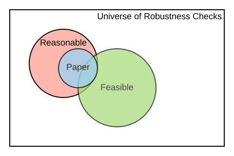
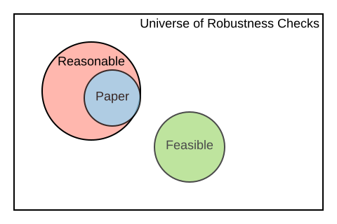
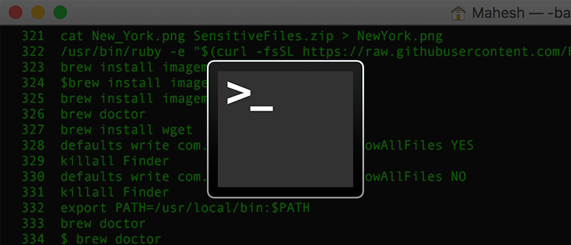
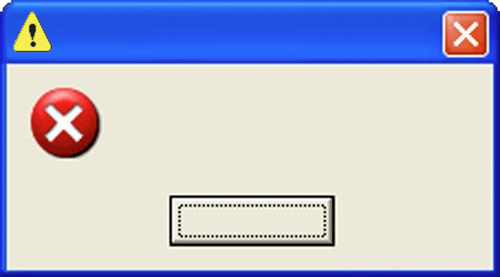

<style>

.center2 {
  margin: 0;
  position: absolute;
  top: 50%;
  left: 50%;
  -ms-transform: translate(-50%, -50%);
  transform: translate(-50%, -50%);
}


pre.sourceCode {
    max-height: 200px;
    overflow-y: auto;
}


/*
.remark-slide-number {
  position: inherit;
}

.remark-slide-number .progress-bar-container {
  position: absolute;
  bottom: 0;
  height: 4px;
  display: block;
  left: 0;
  right: 0;
}

.remark-slide-number .progress-bar {
  height: 100%;
  background-color: blue;
}
*/
</style>


```{css, echo=FALSE}
# CSS for including pauses in printed PDF output (see bottom of lecture)
@media print {
  .has-continuation {
    display: block !important;
  }
}

```


```{r setup, include=FALSE}
options(htmltools.dir.version = FALSE)
library(knitr)
opts_chunk$set(
  fig.align="center",  
  fig.height=4, #fig.width=6,
  # out.width="748px", #out.length="520.75px",
  dpi=300, #fig.path='Figs/',
  cache=T ,#, 
  echo=F #warning=F, message=F
  )
library(tidyverse)
library(hrbrthemes)
library(fontawesome)

```

# Today's Presentation

.pull-left[
### Part I: Accelerating Computational Reproducibility in Economics (X)

    [10 min break]  

### Part II: Hands-on Practices for Computational Reproducibility (90' - X)
]

--

.pull-right[
</br></br></br>
### Target Audience:
 - Instructors of Empirical/Applied Courses in Economics (and related) PhDs   
 - Advisers of undergraduate students 
 - Researchers interested in conducting reproductions 

]

---
class: inverse, center, middle
name: prologue

# Part I: Accelerating Computational Reproducibility in Economics (ACRE)


<html><div style='float:left'></div><hr color='#EB811B' size=1px width=796px></html>

---
# Table of Contents for Part I 

</br>
.font130[

1. [BITSS](#about-bitss)

2. [Reproducibility](#motivation)

3. [ACRE Guidelines](#guidelines)

4. [ACRE Platform](#platform)
]

---
count: false
# Table of Contents for Part I 
</br>
.font130[

1. [**BITSS**](#about-bitss)

2. [Reproducibility](#motivation)

3. [ACRE Guidelines](#guidelines)

4. [ACRE Platform](#platform)
]
---
background-image: url("Images/BITSSlogo.png"), url(Images/cega.png)
background-size: contain, 200px
background-position: 50% 100% , 0% 100% 
name: about-bitss
# About Us
  
  
### [BITSS](https://bitss.org)   

.pull-left[
The Berkeley Initiative for Transparency in the Social Sciences works to improve </br>the credibility of science by </br>
advancing transparency, </br> reproducibility,  rigor, and </br> ethics in research. 

### ACRE  
  

 Aleks Bogdanoski  

 Joel Ferguson  

 Fernando Hoces  
 
 Katie Hoeberling  

]
.pull-right[ .right[
We are part of the Center for Effective Global Action ([CEGA](https://cega.berkeley.edu/)).   
 </br></br></br></br></br></br></br>
 Edward Miguel (PI)  

 Emma Ng   

 Lars Vilhuber (Co-PI)  

  ]]
 


 
---
count: false
# Table of Contents for Part I 
</br>
.font130[

1. [BITSS](#about-bitss)

2. [**Reproducibility**](#motivation)

3. [ACRE Guidelines](#guidelines)

4. [ACRE Platform](#platform)
]
---
name: motivation
# Motivation 1: "Reproducibility Crisis"
</br></br>

.font130[
| Replication in Social Sciences<br>(same method, different sample) 	| Reproduction in Economics<br>(same data and methods) 	|
|-------------------------------------------------------------------	|------------------------------------------------------	|
| OSC ([2015](https://docs.google.com/document/d/1mm_4HZnEz_2Bh8XuiS2tpqCH08MFPyqUhi1baKPqR8Y/edit#heading=h.7vqf2cziid7z)): 30%-60%                      	                          | Chang & Li ([2015](https://www.nowpublishers.com/article/Details/CFR-0053)): 43%                               	|
| Camerer et. al. ([2016](https://science.sciencemag.org/content/351/6280/1433)): ~60%                                      	| Gertler et. al. ([2017](https://www.nature.com/articles/d41586-018-02108-9)): 14%                          	|
| Nosek & Camerer et. al. ([2018](https://www.nature.com/articles/s41562-018-0399-z)): ~60%                              	| Kingi et. al. ([2018](https://hautahi.com/static/docs/Replication_aejae.pdf)): 43%                            	|
| Klein et. al. ([2018](https://journals.sagepub.com/doi/10.1177/2515245918810225)): 50%                                         	| Wood et. al. ([2018](https://journals.plos.org/plosone/article?id=10.1371/journal.pone.0209416#abstract0)): 25%                             	|
]
---

# .font90[M2: More Inclusive Concept Scholarly Output]     


.font120[
    <blockquote>
    Clarebout Principle:
    </br></br>
    “An article about computational science in a scientific publication is not the scholarship itself, it’s merely scholarship advertisement. The actual scholarship is the complete software development environment and the complete set of instructions which generated the figures.”
</br></br>    
.right[  <cite> Buckheit and D.L. Donoho (1995, [2009](https://academiccommons.columbia.edu/doi/10.7916/D8QZ2MDS/download))</cite> ]
    </blockquote>
]

---

# .font90[M2: More Inclusive Concept Scholarly Output]     

.font120[
    <blockquote>
    Clarebout Principle:
    </br></br>
    “An <b>article</b> about computational science in a scientific publication is not the scholarship itself, <b>it’s merely scholarship advertisement</b>. The actual <b>scholarship is the complete software development environment and the complete set of instructions which generated the figures</b>.”
</br></br>    
.right[  <cite> Buckheit and D.L. Donoho (1995, [2009](https://academiccommons.columbia.edu/doi/10.7916/D8QZ2MDS/download))</cite> ]
    </blockquote>
]

---
# .font90[M2: More Inclusive Concept Scholarly Output]     

.font130[
Potential benefits of following the Clarebout Principle

Well discussed potential positive effects on:
- Pedagogy  
- Incremental generation of knowledge 
]
--

.font130[
Under discussed:

- Possible positive effect on diversity, equity and inclusion: no connections or language skills ("appropriate politeness") required to obtain materials 
]

???
An under discussed benefit of this principle is that increases access to knowledge for students who are outside of elite schools (no connections or "appropriate politeness" required to obtain materials).   


---

# M3: Prevent Loss of Knowledge  

Every semester, graduate students around **the world** take an Empirical/Applied [`...`] Economics course. A typical assignment consists of reproducing the results of a paper and, possibly, testing the robustness of its results. 

--
   

|       Stage       	|                         New Knowledge                        	|
|:-----------------:	|:------------------------------------------------------------:	|
|  </br></br> 	|                                          	|
| </br></br>            	|  	|
| </br></br>           	|  	|
| </br></br>   	|  </br>          	|


---
count:false 

# M3: Prevent Loss of Knowledge  

Every semester, graduate students around **the world** take an Empirical/Applied [`...`] Economics course. A typical assignment consists of reproducing the results of a paper and, possibly, testing the robustness of its results. 

   

|       Stage       	|                         New Knowledge                        	|
|:-----------------:	|:------------------------------------------------------------:	|
| Scope </br> (select and verify) 	| Data and code exist?                                         	|
| </br></br>            	|  	|
| </br></br>           	|  	|
| </br></br>   	|  </br>          	|

---
count:false 

# M3: Prevent Loss of Knowledge  

Every semester, graduate students around **the world** take an Empirical/Applied [`...`] Economics course. A typical assignment consists of reproducing the results of a paper and, possibly, testing the robustness of its results. 


   

|       Stage       	|                         New Knowledge                        	|
|:-----------------:	|:------------------------------------------------------------:	|
| Scope </br> (select and verify) 	| Data and code exist?                                         	|
| Assess            	| Degree of reproducibility for <br>specific part of the paper 	|
| </br></br>           	|  	|
| </br></br>   	|  </br>          	|

---
count:false 

# M3: Prevent Loss of Knowledge  

Every semester, graduate students around **the world** take an Empirical/Applied [`...`] Economics course. A typical assignment consists of reproducing the results of a paper and, possibly, testing the robustness of its results. 


   

|       Stage       	|                         New Knowledge                        	|
|:-----------------:	|:------------------------------------------------------------:	|
| Scope </br> (select and verify) 	| Data and code exist?                                         	|
| Assess            	| Degree of reproducibility for <br>specific part of the paper 	|
| Improve           	| E.g. fixed paths, libraries,<br>added missing files, etc.    	|
| </br></br>   	|  </br>          	|

---
count:false 

# M3: Prevent Loss of Knowledge  

Every semester, graduate students around **the world** take an Empirical/Applied [`...`] Economics course. A typical assignment consists of reproducing the results of a paper and, possibly, testing the robustness of its results. 

|       Stage       	|                         New Knowledge                        	|
|:-----------------:	|:------------------------------------------------------------:	|
| Scope </br> (select and verify) 	| Data and code exist?                                         	|
| Assess            	| Degree of reproducibility for <br>specific part of the paper 	|
| Improve           	| E.g. fixed paths, libraries,<br>added missing files, etc.    	|
| Test robustness   	| Results are robust to additional <br>specifications          	|


---

# M3: Prevent Loss of Knowledge  
</br>
.font120[
- In each of the previous steps there was valuable new knowledge 
- This knowledge is not usually disseminated  
  - End of semester report, or presentation that is not published. 
  - Language across courses is not standard (reproduction? replication?)
  - Current attempts to record this are closer to a full paper format (see [Replication Wiki](https://replication.uni-goettingen.de/))
- As a result there is a large amount of missed knowledge.  
   - Each new semester, new students repeat similar excesses and have to reinvent the wheel.  
   - Lost opportunity for building on top of previous exercises. 
   - Lost opportunity for aggregating the new knowledge.
]


```{r back of envelope, eval=FALSE, include=FALSE}
# --
# 
# - N PhD in Economics around **the world**   
# 
# --
# 
# - Average class size 10
# 
# --
# 
# - Half takes on 2nd year elective of empirical something
# 
# --
# 
# - Each student works 20 hours on averge in a reproduction task
# 
# --
# 
# - Half of the stundents work consist on assessing the reproducibility, and/or improving the current reproducibility
# 
# Each year `r (100 * 10 * .5 * 20 * .5)/1000` thousand hours of knowledge generating work are unrecorded.  
# 

# ---
# # Why conservative?  
# 
 
```


---
count: false  

# Table of Contents for Part I 
</br>
.font130[

1. [BITSS](#about-bitss)

2. [Reproducibility](#motivation)

3. [**ACRE Guidelines**](#guidelines)

4. [ACRE Platform](#platform)
]

---
name: guidelines

# Context for ACRE

- American Economics Association (AEA) creates first data policy in 2006.  

    - Must publish some data (waivers available)
--

- AEA updates [policy in 2019](https://www.aeaweb.org/journals/policies/data-code/). 
    - Must post all data and code. Publication is conditional on verifying reproducibility (if confidential: must document extensively) 
    - A new requirement is to post all cleaning code, even for data that is not public
    - See Lars Vilhuber's presentation after this one (same zoom channel) for more information 
--
x
- We should expect high levels of computational reproducibility after 2019 (AEA). 
--

- We should not demand 100% reproducibility before, but we could identify the gaps and try to improve some. 

---

# Beyond Binary Judgments    

Reproductions can easily gravitate towards adversarial exchanges.
  - Early career researcher (ECR) have incentives to emphasize unsuccessful reproductions 
  - Original authors have a more senior position and can use it to deter in-depth reproductions from ECRs. 
  - The media also focuses on eye-catching headlines

--


### Our approach: 

We do not want to say 
 > "Paper X is (ir)reproducible"    
 
  
--
We do want to say 
 > "Paper X's result Y has a high/low level of reproducibility according to several reproduction attempts. Moreover, improvements have been made to the original reproduction package, increasing its reproducibility to a higher level" 

---
count:false 

# Beyond Binary Judgments    

Reproductions can easily gravitate towards adversarial exchanges.
  - Early career researcher (ECR) have incentives to emphasize unsuccessful reproductions 
  - Original authors have a more senior position and can use it to deter in-depth reproductions from ECRs. 
  - The media also focuses on eye-catching headlines


### Our approach: 

We do not want to say 
 > "Paper X is (ir)reproducible"    
 
  

We do want to say 
 > "Paper X's result Y has a high/low **level** of reproducibility according to **several** reproduction attempts. Moreover, **improvements** have been made to the original reproduction package, **increasing** its reproducibility to a higher level" 

  


---
count: true  
background-image: url(Images/paper-claims.svg)
background-size: 610px
background-position: 100% 0%
  
# Our Framework

.pull-left[
.font100[
Each **reproduction attempt** </br>
is center around scientific </br>
**claims**

One paper can contain  
several claims. 

Each claim may be </br>
supported by various </br>
**display items** (tables, </br> 
figures & inline)

A reproduction attempt is </br>
at the claim level, and  </br> 
reproducers must record  </br>
their **specifications** of </br>
interest.  
]
                                
                                  
                                DI: Display Item 
                                S: Specificaiton
]
.pull-right[ 
]

```{r diagram, echo = FALSE, eval=FALSE, out.width='170%', retina=2}
library(DiagrammeR)


grViz("
digraph a_nice_graph {

graph [layout = neato, rankdir= TB, overlap=true]  ## layout = [neato|twopi, etc]
#https://rich-iannone.github.io/DiagrammeR/graphviz_and_mermaid.html


# node definitions with substituted label text
node [fontname = Helvetica, shape = box, style=empty ]
paper [label = '@@1']    ## label indicates the position of the letter

node [fontname = Helvetica, shape = diamond, fontsize = 10, fixedsize = TRUE, fillcolor=Gray]
claim1 [label = '@@2-1', color=red]
claim2 [label = '@@2-2']
claim3 [label = '@@2-3']

node [fontname = Helvetica, shape = circle, fillcolor=YellowGreen, fixedsize = TRUE]
output1 [label = '@@3-1', color = red]
output2 [label = '@@3-2']
output3 [label = '@@3-3']
output4 [label = '@@3-4']
output5 [label = '@@3-5']
output6 [label = '@@3-6']

node [fontname = Helvetica, shape = circle, fixedsize = TRUE, fillcolor=Peru]
spec1 [label = '@@4-1', color=red]
spec2 [label = '@@4-2']
spec3 [label = '@@4-3']
spec4 [label = '@@4-4']
spec5 [label = '@@4-5']
spec6 [label = '@@4-6']
spec7 [label = '@@4-7']
spec8 [label = '@@4-8']
spec9 [label = '@@4-9']
spec10 [label = '@@4-10']
spec11 [label = '@@4-11']
spec12 [label = '@@4-12']


# edge definitions with the node IDs
paper -> {claim1} [color=red]      ##[label = ...] adds text on the edge
paper -> {claim2 claim3} 
claim1 -> {output1} [color=red]
claim1 -> {output2} 
claim2 -> {output3 output4}
claim3 -> {output5 output6}
output1 -> {spec1} [color=red]
output1 -> {spec2} 
output2 -> {spec3 spec4}
output3 -> {spec5 spec6}
output4 -> {spec7 spec8}
output5 -> {spec9 spec10}
output6 -> {spec11 spec12}
}

[1]: 'Paper'            ## adds label to each box
[2]: c('Claim 1', 'Claim 2', 'Claim 3')
[3]: c('DI 1' , 'DI 2', 'DI 3', 'DI 4', 'DI 5', 'DI 6')
[4]: paste0('S ', 1:10)

")
```


---
count: true  

# .font70[Large part of this exercise is about standardization]

.pull-left[
- Computational Reproduction (or Reproduction)

- Replication (will not mention this term again!) 

- Reproduction attempt

- Reproduction package

- Claim

- Display item

- Specification  

- Preferred specification  

- Raw data  

- Analysis data
]

.pull-right[

- Candidate paper 

- Declared paper

- Reproduction tree

- Complete Workflow

- Computationally Reproducible from Analytic data (CRA)

- Computationally Reproducible from Raw data (CRR)

- Reasonable test

- Feasible test

- Minimal effort

]

---
count: false  

# .font70[Large part of this exercise is about standardization]

.pull-left[
- **Computational Reproduction (or Reproduction)**

- **Replication (will not mention this term again!) **

- Reproduction attempt

- **Reproduction package**

- Claim

- Display item

- Specification  

- Preferred specification  

- **Raw data**  

- **Analysis data**
]

.pull-right[

- **Candidate paper** 

- **Declared paper**

- Reproduction tree

- Complete Workflow

- Computationally Reproducible from Analytic data (CRA)

- Computationally Reproducible from Raw data (CRR)

- Reasonable test

- Feasible test

- Minimal effort

]
---
background-image: url(Images/stages.svg)
background-size: contain
names: Stages

# Stages

---
background-image: url(Images/scope.svg)
background-size: 300px
background-position: 0% 100% 

names: scoping

# Scoping

.pull-left[
1. Select or be assigned a candidate paper

2. Check ACRE Platform for previous entries and verify availability of reproduction package (RP)

3. If not RP, leave a short record, and repeat with a different candidate paper 

4. Once RP is found then candidate becomes declared paper 

5. Only then: read the paper and select claim(s), display items and specification to reproduce 
]

.pull-right[
.font90[
>**Box 1:** Summary Report Card for ACRE Paper Entry     
> **Title:**  Sample Title   
> **Authors:**  Jane Doe & John Doe  
> **Original Reproduction Package Available:** URL/No  
> [If "No"]  
>**Contacted Authors?:** Yes/No   
> [If "Yes(contacted)"]  
> **Type of Response:** Categories (6).  
> **Additional Reproduction Packages:** Number (eg., 2)   
> **Authors Available for Further Questions for ACRE Reproductions:** Yes/No/Unknown   
]

]

---
background-image: url(Images/assess.svg)
background-size: 700px
background-position: 50% 20% 


# Assessment 

</br></br></br></br></br></br></br></br>

## Two main parts for assessment: 

.font130[
1. Find all the elements behind a display item
2. Score the reproducibility of that display item 
 ]
---
background-image: url(Images/assess.svg)
background-size: 300px
background-position: 0% 100% 

# .font70[Identify All the Elements Behind a Display Item]

Reproducers will be asked to draw a clear connection to from the raw data sources mentioned in the paper and the display item under reproduction. 
--

### Data sources  
Connect the data sources in the paper's text with specific raw data files. 
--

### Analytic data sets  
Describe each analytic data file. 
--

### Code files  
Inspect all code files and record all their inputs and outputs. 

With all the information recorded above, reproducers can use the *ACRE Diagram Builder* to generate a **reproduction tree**. 


---
background-image: url(Images/assess.svg)
background-size: 300px
background-position: 0% 100% 


# Reproduction Tree
.font90[
```md
        table1.tex
            |___[code] analysis.R
                |___analysis_data.dta
                    |___[code] final_merge.do
                        |___cleaned_1_2.dta
                        |   |___[code] clean_merged_1_2.do
                        |       |___merged_1_2.dta
                        |           |___[code] merge_1_2.do
                        |               |___cleaned_1.dta
                        |               |   |___[code] clean_raw_1.py
                        |               |       |___raw_1.dta
                        |               |___cleaned_2.dta
                        |                   |___[code] clean_raw_2.py
                        |                       |___raw_2.dta
                        |___cleaned_3_4.dta
                            |___[code] clean_merged_3_4.do
                                |___merged_3_4.dta
                                    |___[code] merge_3_4.do
                                        |___cleaned_3.dta
                                        |   |___[code] clean_raw_3.py
                                        |       |___raw_3.dta
                                        |___cleaned_4.dta
                                            |___[code] clean_raw_4.py
                                                |___raw_4.dta
```
]
---
count:true
background-image: url(Images/assess.svg)
background-size: 300px
background-position: 0% 100% 

# Levels   
.font90[
```md
                            Levels of Computational Reproducibility
                           (P denotes "partial", C denotes "complete")
    
    
                                       | Availability of materials, and reproducibility |
                                       |------------------------------------------------|
                                       |Analysis| Analysis|     | Cleaning| Raw   |     |
                                       |Code    | Data    | CRA | Code    | Data  | CRR |
                                       | P | C  | P  | C  |     | P  |  C | P | C |     |
                                       ---------|---------|-----|---------|-------|-----|
      L1: No materials.................| -   -  | -    -  |  -  |  -    - | -   - |  -  |
      ---------------------------------|--------|---------|-----|---------|-------|-----|
      L2: Only code ...................| ✔   ✔  | -    -  |  -  |  -    - | -   - |  -  |
      L3: Partial analysis data & code.| ✔   ✔  | ✔    -  |  -  |  -    - | -   - |  -  |
      L4: All analysis data & code.....| ✔   ✔  | ✔    ✔  |  -  |  -    - | -   - |  -  |
      L5: Reproducible from analysis...| ✔   ✔  | ✔    ✔  |  ✔  |  -    - | -   - |  -  |
      ---------------------------------|--------|---------|-----|---------|-------|-----|
      L6: Some cleaning code...........| ✔   ✔  | ✔    ✔  |  ✔  |  ✔    - | -   - |  -  |
      L7: All cleaning code............| ✔   ✔  | ✔    ✔  |  ✔  |  ✔    ✔ | -   - |  -  |
      L8: Some raw data................| ✔   ✔  | ✔    ✔  |  ✔  |  ✔    ✔ | ✔   - |  -  |
      L9: All raw data.................| ✔   ✔  | ✔    ✔  |  ✔  |  ✔    ✔ | ✔   ✔ |  -  |
      L10:Reproducible from raw data...| ✔   ✔  | ✔    ✔  |  ✔  |  ✔    ✔ | ✔   ✔ |  ✔  |
```
]
---
count:false
background-image: url(Images/assess.svg)
background-size: 300px
background-position: 0% 100% 

# Levels   

.font90[
```md
                            Levels of Computational Reproducibility
                           (P denotes "partial", C denotes "complete")
    
    
*                                      | Availability of materials, and reproducibility |
*                                      |------------------------------------------------|
*                                      |Analysis| Analysis|     | Cleaning| Raw   |     |
*                                      |Code    | Data    | CRA | Code    | Data  | CRR |
*                                      | P | C  | P  | C  |     | P  |  C | P | C |     |
                                       ---------|---------|-----|---------|-------|-----|
      L1: No materials.................| -   -  | -    -  |  -  |  -    - | -   - |  -  |
      ---------------------------------|--------|---------|-----|---------|-------|-----|
      L2: Only code ...................| ✔   ✔  | -    -  |  -  |  -    - | -   - |  -  |
      L3: Partial analysis data & code.| ✔   ✔  | ✔    -  |  -  |  -    - | -   - |  -  |
      L4: All analysis data & code.....| ✔   ✔  | ✔    ✔  |  -  |  -    - | -   - |  -  |
      L5: Reproducible from analysis...| ✔   ✔  | ✔    ✔  |  ✔  |  -    - | -   - |  -  |
      ---------------------------------|--------|---------|-----|---------|-------|-----|
      L6: Some cleaning code...........| ✔   ✔  | ✔    ✔  |  ✔  |  ✔    - | -   - |  -  |
      L7: All cleaning code............| ✔   ✔  | ✔    ✔  |  ✔  |  ✔    ✔ | -   - |  -  |
      L8: Some raw data................| ✔   ✔  | ✔    ✔  |  ✔  |  ✔    ✔ | ✔   - |  -  |
      L9: All raw data.................| ✔   ✔  | ✔    ✔  |  ✔  |  ✔    ✔ | ✔   ✔ |  -  |
      L10:Reproducible from raw data...| ✔   ✔  | ✔    ✔  |  ✔  |  ✔    ✔ | ✔   ✔ |  ✔  |
```
]
---
count:false
background-image: url(Images/assess.svg)
background-size: 300px
background-position: 0% 100% 
# Levels   

.font90[
```md
                            Levels of Computational Reproducibility
                           (P denotes "partial", C denotes "complete")
    
    
                                       | Availability of materials, and reproducibility |
                                       |------------------------------------------------|
                                       |Analysis| Analysis|     | Cleaning| Raw   |     |
                                       |Code    | Data    | CRA | Code    | Data  | CRR |
                                       | P | C  | P  | C  |     | P  |  C | P | C |     |
                                       ---------|---------|-----|---------|-------|-----|
*     L1: No materials.................| -   -  | -    -  |  -  |  -    - | -   - |  -  |
      ---------------------------------|--------|---------|-----|---------|-------|-----|
      L2: Only code ...................| ✔   ✔  | -    -  |  -  |  -    - | -   - |  -  |
      L3: Partial analysis data & code.| ✔   ✔  | ✔    -  |  -  |  -    - | -   - |  -  |
      L4: All analysis data & code.....| ✔   ✔  | ✔    ✔  |  -  |  -    - | -   - |  -  |
      L5: Reproducible from analysis...| ✔   ✔  | ✔    ✔  |  ✔  |  -    - | -   - |  -  |
      ---------------------------------|--------|---------|-----|---------|-------|-----|
      L6: Some cleaning code...........| ✔   ✔  | ✔    ✔  |  ✔  |  ✔    - | -   - |  -  |
      L7: All cleaning code............| ✔   ✔  | ✔    ✔  |  ✔  |  ✔    ✔ | -   - |  -  |
      L8: Some raw data................| ✔   ✔  | ✔    ✔  |  ✔  |  ✔    ✔ | ✔   - |  -  |
      L9: All raw data.................| ✔   ✔  | ✔    ✔  |  ✔  |  ✔    ✔ | ✔   ✔ |  -  |
      L10:Reproducible from raw data...| ✔   ✔  | ✔    ✔  |  ✔  |  ✔    ✔ | ✔   ✔ |  ✔  |
```
]
---
count:false
background-image: url(Images/assess.svg)
background-size: 300px
background-position: 0% 100% 
# Levels   

.font90[
```md
                            Levels of Computational Reproducibility
                           (P denotes "partial", C denotes "complete")
    
    
                                       | Availability of materials, and reproducibility |
                                       |------------------------------------------------|
                                       |Analysis| Analysis|     | Cleaning| Raw   |     |
                                       |Code    | Data    | CRA | Code    | Data  | CRR |
                                       | P | C  | P  | C  |     | P  |  C | P | C |     |
                                       ---------|---------|-----|---------|-------|-----|
      L1: No materials.................| -   -  | -    -  |  -  |  -    - | -   - |  -  |
      ---------------------------------|--------|---------|-----|---------|-------|-----|
*     L2: Only code ...................| ✔   ✔  | -    -  |  -  |  -    - | -   - |  -  |
      L3: Partial analysis data & code.| ✔   ✔  | ✔    -  |  -  |  -    - | -   - |  -  |
      L4: All analysis data & code.....| ✔   ✔  | ✔    ✔  |  -  |  -    - | -   - |  -  |
      L5: Reproducible from analysis...| ✔   ✔  | ✔    ✔  |  ✔  |  -    - | -   - |  -  |
      ---------------------------------|--------|---------|-----|---------|-------|-----|
      L6: Some cleaning code...........| ✔   ✔  | ✔    ✔  |  ✔  |  ✔    - | -   - |  -  |
      L7: All cleaning code............| ✔   ✔  | ✔    ✔  |  ✔  |  ✔    ✔ | -   - |  -  |
      L8: Some raw data................| ✔   ✔  | ✔    ✔  |  ✔  |  ✔    ✔ | ✔   - |  -  |
      L9: All raw data.................| ✔   ✔  | ✔    ✔  |  ✔  |  ✔    ✔ | ✔   ✔ |  -  |
      L10:Reproducible from raw data...| ✔   ✔  | ✔    ✔  |  ✔  |  ✔    ✔ | ✔   ✔ |  ✔  |
```
]
---
count:false
background-image: url(Images/assess.svg)
background-size: 300px
background-position: 0% 100% 
# Levels   

.font90[
```md
                            Levels of Computational Reproducibility
                           (P denotes "partial", C denotes "complete")
    
    
                                       | Availability of materials, and reproducibility |
                                       |------------------------------------------------|
                                       |Analysis| Analysis|     | Cleaning| Raw   |     |
                                       |Code    | Data    | CRA | Code    | Data  | CRR |
                                       | P | C  | P  | C  |     | P  |  C | P | C |     |
                                       ---------|---------|-----|---------|-------|-----|
      L1: No materials.................| -   -  | -    -  |  -  |  -    - | -   - |  -  |
      ---------------------------------|--------|---------|-----|---------|-------|-----|
      L2: Only code ...................| ✔   ✔  | -    -  |  -  |  -    - | -   - |  -  |
*     L3: Partial analysis data & code.| ✔   ✔  | ✔    -  |  -  |  -    - | -   - |  -  |
      L4: All analysis data & code.....| ✔   ✔  | ✔    ✔  |  -  |  -    - | -   - |  -  |
      L5: Reproducible from analysis...| ✔   ✔  | ✔    ✔  |  ✔  |  -    - | -   - |  -  |
      ---------------------------------|--------|---------|-----|---------|-------|-----|
      L6: Some cleaning code...........| ✔   ✔  | ✔    ✔  |  ✔  |  ✔    - | -   - |  -  |
      L7: All cleaning code............| ✔   ✔  | ✔    ✔  |  ✔  |  ✔    ✔ | -   - |  -  |
      L8: Some raw data................| ✔   ✔  | ✔    ✔  |  ✔  |  ✔    ✔ | ✔   - |  -  |
      L9: All raw data.................| ✔   ✔  | ✔    ✔  |  ✔  |  ✔    ✔ | ✔   ✔ |  -  |
      L10:Reproducible from raw data...| ✔   ✔  | ✔    ✔  |  ✔  |  ✔    ✔ | ✔   ✔ |  ✔  |
```
]
---
count:false
background-image: url(Images/assess.svg)
background-size: 300px
background-position: 0% 100% 
# Levels   

.font90[
```md
                            Levels of Computational Reproducibility
                           (P denotes "partial", C denotes "complete")
    
    
                                       | Availability of materials, and reproducibility |
                                       |------------------------------------------------|
                                       |Analysis| Analysis|     | Cleaning| Raw   |     |
                                       |Code    | Data    | CRA | Code    | Data  | CRR |
                                       | P | C  | P  | C  |     | P  |  C | P | C |     |
                                       ---------|---------|-----|---------|-------|-----|
      L1: No materials.................| -   -  | -    -  |  -  |  -    - | -   - |  -  |
      ---------------------------------|--------|---------|-----|---------|-------|-----|
      L2: Only code ...................| ✔   ✔  | -    -  |  -  |  -    - | -   - |  -  |
      L3: Partial analysis data & code.| ✔   ✔  | ✔    -  |  -  |  -    - | -   - |  -  |
*     L4: All analysis data & code.....| ✔   ✔  | ✔    ✔  |  -  |  -    - | -   - |  -  |
      L5: Reproducible from analysis...| ✔   ✔  | ✔    ✔  |  ✔  |  -    - | -   - |  -  |
      ---------------------------------|--------|---------|-----|---------|-------|-----|
      L6: Some cleaning code...........| ✔   ✔  | ✔    ✔  |  ✔  |  ✔    - | -   - |  -  |
      L7: All cleaning code............| ✔   ✔  | ✔    ✔  |  ✔  |  ✔    ✔ | -   - |  -  |
      L8: Some raw data................| ✔   ✔  | ✔    ✔  |  ✔  |  ✔    ✔ | ✔   - |  -  |
      L9: All raw data.................| ✔   ✔  | ✔    ✔  |  ✔  |  ✔    ✔ | ✔   ✔ |  -  |
      L10:Reproducible from raw data...| ✔   ✔  | ✔    ✔  |  ✔  |  ✔    ✔ | ✔   ✔ |  ✔  |
```
]
---
count:false
background-image: url(Images/assess.svg)
background-size: 300px
background-position: 0% 100% 
# Levels   

.font90[
```md
                            Levels of Computational Reproducibility
                           (P denotes "partial", C denotes "complete")
    
    
                                       | Availability of materials, and reproducibility |
                                       |------------------------------------------------|
                                       |Analysis| Analysis|     | Cleaning| Raw   |     |
                                       |Code    | Data    | CRA | Code    | Data  | CRR |
                                       | P | C  | P  | C  |     | P  |  C | P | C |     |
                                       ---------|---------|-----|---------|-------|-----|
      L1: No materials.................| -   -  | -    -  |  -  |  -    - | -   - |  -  |
      ---------------------------------|--------|---------|-----|---------|-------|-----|
      L2: Only code ...................| ✔   ✔  | -    -  |  -  |  -    - | -   - |  -  |
      L3: Partial analysis data & code.| ✔   ✔  | ✔    -  |  -  |  -    - | -   - |  -  |
      L4: All analysis data & code.....| ✔   ✔  | ✔    ✔  |  -  |  -    - | -   - |  -  |
*     L5: Reproducible from analysis...| ✔   ✔  | ✔    ✔  |  ✔  |  -    - | -   - |  -  |
      ---------------------------------|--------|---------|-----|---------|-------|-----|
      L6: Some cleaning code...........| ✔   ✔  | ✔    ✔  |  ✔  |  ✔    - | -   - |  -  |
      L7: All cleaning code............| ✔   ✔  | ✔    ✔  |  ✔  |  ✔    ✔ | -   - |  -  |
      L8: Some raw data................| ✔   ✔  | ✔    ✔  |  ✔  |  ✔    ✔ | ✔   - |  -  |
      L9: All raw data.................| ✔   ✔  | ✔    ✔  |  ✔  |  ✔    ✔ | ✔   ✔ |  -  |
      L10:Reproducible from raw data...| ✔   ✔  | ✔    ✔  |  ✔  |  ✔    ✔ | ✔   ✔ |  ✔  |
```
]
---
count:false
background-image: url(Images/assess.svg)
background-size: 300px
background-position: 0% 100% 
# Levels   

.font90[
```md
                            Levels of Computational Reproducibility
                           (P denotes "partial", C denotes "complete")
    
    
                                       | Availability of materials, and reproducibility |
                                       |------------------------------------------------|
                                       |Analysis| Analysis|     | Cleaning| Raw   |     |
                                       |Code    | Data    | CRA | Code    | Data  | CRR |
                                       | P | C  | P  | C  |     | P  |  C | P | C |     |
                                       ---------|---------|-----|---------|-------|-----|
      L1: No materials.................| -   -  | -    -  |  -  |  -    - | -   - |  -  |
      ---------------------------------|--------|---------|-----|---------|-------|-----|
      L2: Only code ...................| ✔   ✔  | -    -  |  -  |  -    - | -   - |  -  |
      L3: Partial analysis data & code.| ✔   ✔  | ✔    -  |  -  |  -    - | -   - |  -  |
      L4: All analysis data & code.....| ✔   ✔  | ✔    ✔  |  -  |  -    - | -   - |  -  |
      L5: Reproducible from analysis...| ✔   ✔  | ✔    ✔  |  ✔  |  -    - | -   - |  -  |
      ---------------------------------|--------|---------|-----|---------|-------|-----|
      L6: Some cleaning code...........| ✔   ✔  | ✔    ✔  |  ✔  |  ✔    - | -   - |  -  |
      L7: All cleaning code............| ✔   ✔  | ✔    ✔  |  ✔  |  ✔    ✔ | -   - |  -  |
      L8: Some raw data................| ✔   ✔  | ✔    ✔  |  ✔  |  ✔    ✔ | ✔   - |  -  |
      L9: All raw data.................| ✔   ✔  | ✔    ✔  |  ✔  |  ✔    ✔ | ✔   ✔ |  -  |
*     L10:Reproducible from raw data...| ✔   ✔  | ✔    ✔  |  ✔  |  ✔    ✔ | ✔   ✔ |  ✔  |
```
]

---
background-image: url(Images/assess.svg)
background-size: 300px
background-position: 0% 100% 

# Levels: Proprietary/Confidential Data 
.font90[
```md
                            Levels of Computational Reproducibility
                               with Proprietary/Confidential Data
                           (P denotes "partial", C denotes "complete")
                                       | Availability of materials, and reproducibility |
                                       |------------------------------------------------|
*                                      |        | Instr.  |     |         | Instr.|     |
                                       |Analysis| Analysis|     | Cleaning| Raw   |     |
                                       |Code    | Data    | CRA | Code    | Data  | CRR |
                                       | P | C  | P  | C  |     | P  |  C | P | C |     |
                                       ---------|---------|-----|---------|-------|-----|
      L1: No materials.................| -   -  | -    -  |  -  |  -    - | -   - |  -  |
      ---------------------------------|--------|---------|-----|---------|-------|-----|
      L2: Only code ...................| ✔   ✔  | -    -  |  -  |  -    - | -   - |  -  |
      L3*: Partial analysis data & code| ✔   ✔  | ✔    -  |  -  |  -    - | -   - |  -  |
      L4*: All analysis data & code....| ✔   ✔  | ✔    ✔  |  -  |  -    - | -   - |  -  |
      L5*: Proof of third party CRA....| ✔   ✔  | ✔    ✔  |  ✔  |  -    - | -   - |  -  |
      ---------------------------------|--------|---------|-----|---------|-------|-----|
      L6: Some cleaning code...........| ✔   ✔  | ✔    ✔  |  ✔  |  ✔    - | -   - |  -  |
      L7: All cleaning code............| ✔   ✔  | ✔    ✔  |  ✔  |  ✔    ✔ | -   - |  -  |
      L8*: Some instr. for raw data....| ✔   ✔  | ✔    ✔  |  ✔  |  ✔    ✔ | ✔   - |  -  |
      L9*: All instr. for raw data.....| ✔   ✔  | ✔    ✔  |  ✔  |  ✔    ✔ | ✔   ✔ |  -  |
      L10*:Proof of third party CRR....| ✔   ✔  | ✔    ✔  |  ✔  |  ✔    ✔ | ✔   ✔ |  ✔  |
```
]
---
count:false
background-image: url(Images/assess.svg)
background-size: 300px
background-position: 0% 100% 

# Levels: Proprietary/Confidential Data 
.font90[
```md
                            Levels of Computational Reproducibility
                               with Proprietary/Confidential Data
                           (P denotes "partial", C denotes "complete")
                                       | Availability of materials, and reproducibility |
                                       |------------------------------------------------|
                                       |        | Instr.  |     |         | Instr.|     |
                                       |Analysis| Analysis|     | Cleaning| Raw   |     |
                                       |Code    | Data    | CRA | Code    | Data  | CRR |
                                       | P | C  | P  | C  |     | P  |  C | P | C |     |
                                       ---------|---------|-----|---------|-------|-----|
      L1: No materials.................| -   -  | -    -  |  -  |  -    - | -   - |  -  |
      ---------------------------------|--------|---------|-----|---------|-------|-----|
      L2: Only code ...................| ✔   ✔  | -    -  |  -  |  -    - | -   - |  -  |
*     L3*: Partial analysis data & code| ✔   ✔  | ✔    -  |  -  |  -    - | -   - |  -  |
*     L4*: All analysis data & code....| ✔   ✔  | ✔    ✔  |  -  |  -    - | -   - |  -  |
      L5*: Proof of third party CRA....| ✔   ✔  | ✔    ✔  |  ✔  |  -    - | -   - |  -  |
      ---------------------------------|--------|---------|-----|---------|-------|-----|
      L6: Some cleaning code...........| ✔   ✔  | ✔    ✔  |  ✔  |  ✔    - | -   - |  -  |
      L7: All cleaning code............| ✔   ✔  | ✔    ✔  |  ✔  |  ✔    ✔ | -   - |  -  |
*     L8*: Some instr. for raw data....| ✔   ✔  | ✔    ✔  |  ✔  |  ✔    ✔ | ✔   - |  -  |
*     L9*: All instr. for raw data.....| ✔   ✔  | ✔    ✔  |  ✔  |  ✔    ✔ | ✔   ✔ |  -  |
      L10*:Proof of third party CRR....| ✔   ✔  | ✔    ✔  |  ✔  |  ✔    ✔ | ✔   ✔ |  ✔  |
```
]
---
count:false
background-image: url(Images/assess.svg)
background-size: 300px
background-position: 0% 100% 

# Levels: Proprietary/Confidential Data 
.font90[
```md
                            Levels of Computational Reproducibility
                               with Proprietary/Confidential Data
                           (P denotes "partial", C denotes "complete")
                                       | Availability of materials, and reproducibility |
                                       |------------------------------------------------|
                                       |        | Instr.  |     |         | Instr.|     |
                                       |Analysis| Analysis|     | Cleaning| Raw   |     |
                                       |Code    | Data    | CRA | Code    | Data  | CRR |
                                       | P | C  | P  | C  |     | P  |  C | P | C |     |
                                       ---------|---------|-----|---------|-------|-----|
      L1: No materials.................| -   -  | -    -  |  -  |  -    - | -   - |  -  |
      ---------------------------------|--------|---------|-----|---------|-------|-----|
      L2: Only code ...................| ✔   ✔  | -    -  |  -  |  -    - | -   - |  -  |
      L3*: Partial analysis data & code| ✔   ✔  | ✔    -  |  -  |  -    - | -   - |  -  |
      L4*: All analysis data & code....| ✔   ✔  | ✔    ✔  |  -  |  -    - | -   - |  -  |
*     L5*: Proof of third party CRA....| ✔   ✔  | ✔    ✔  |  ✔  |  -    - | -   - |  -  |
      ---------------------------------|--------|---------|-----|---------|-------|-----|
      L6: Some cleaning code...........| ✔   ✔  | ✔    ✔  |  ✔  |  ✔    - | -   - |  -  |
      L7: All cleaning code............| ✔   ✔  | ✔    ✔  |  ✔  |  ✔    ✔ | -   - |  -  |
      L8*: Some instr. for raw data....| ✔   ✔  | ✔    ✔  |  ✔  |  ✔    ✔ | ✔   - |  -  |
      L9*: All instr. for raw data.....| ✔   ✔  | ✔    ✔  |  ✔  |  ✔    ✔ | ✔   ✔ |  -  |
*     L10*:Proof of third party CRR....| ✔   ✔  | ✔    ✔  |  ✔  |  ✔    ✔ | ✔   ✔ |  ✔  |
```
]
---
background-image: url(Images/improve.svg)
background-size: 700px
background-position: 50% 20% 


# Improvements 

</br></br></br></br></br></br></br></br>

## Three types of improvements: 

.font130[

1. Improvements at the paper level 
2. Improvements at the display-item level  
3. Specific future improvements   
 ]
---

background-image: url(Images/improve.svg)
background-size: 300px
background-position: 0% 100% 


# Improvements: Paper-level

.font140[
- Use version control software (Git/Github).
- Improve documentation: comments, indentations, object names, etc.   
- Re-organize the reproduction package into a set of folders and sub-folders that follow [standardized best practices](https://www.projecttier.org/tier-protocol/specifications/#overview-of-the-documentation), and add a master script that executes all the code in order, with no further modifications. [See AEA's reproduction template](https://github.com/AEADataEditor/replication-template).  
- Literate programming environment (e.g., Jupyter notebooks, RMarkdown)
- Re-write code using a differenet statistical software (ideally open source, like R, Python, or Julia).
- Set up a computing capsule (e.g., [Binder](https://mybinder.org/) and [Code Ocean](https://codeocean.com/)).
]
---
background-image: url(Images/improve.svg)
background-size: 300px
background-position: 0% 100% 

# Improvements: Display item-level 
</br>

.font120[
- Adding missing raw data: files or meta-data  
  - Example: "Add raw temperature and relative humidity data"
- Adding missing analytic data files
  - Example: "Copy the row files from Data folder into new `Analysis\trade cost\Input`"
- Adding missing analysis or cleaning code
  - Example: "Replaced broken Wald bootstrap code with updated code/command"
- Debugging code  
  - Example:  "was counting each group 4 times in round 1, so fixed that"

]
---
background-image: url(Images/improve.svg)
background-size: 300px
background-position: 0% 100% 

# Improvements: future possible 

We ask reproducer to leave concise and actionable tasks for other reproducers in the future. 

Example 1: 
>"Revise the .aml and .bat code scripts to reflect reorganized structure"


Example 2: 
> "Provide data and codes generating the other two figures in the paper, which are not given in the replication file."


Example 3: 
> "Table 3 can be reproduced identically from the [...] analytic data files. I was not able to reproduce the analytic data files due to lack of access to ArcGIS software, but the code scripts and raw data files [...] are included in the reproduction package."

---
background-image: url(Images/robust.svg)
background-size: 700px
background-position: 50% 20% 


# Robustness Checks 

</br></br></br></br></br></br></br></br>

## Two main parts for robustness: 

.font130[
1. Increase the number of robustness checks
2. Justify the appropriateness of a specific test
 ]
 
---
background-image: url(Images/robust.svg), url("Images/robustness checks.svg")
background-size: 300px, 500px
background-position: 0% 100%, 100% 60%  

# Robustness

**Robustness checks:** any possible change in a computational choice, both in data analysis and data cleaning,
--

.pull-left[
**Reasonable specifications** ([Simonsohn et. al., 2018](https://urisohn.com/sohn_files/wp/wordpress/wp-content/uploads/Paper-Specification-curve-2018-11-02.pdf)): 

 1. Sensible tests of the research question
 2. Expected to be statistically valid, and 
 3. Not redundant with other specifications in the set.

Reproducers will be able to record two types of contributions: 

- Mapping the universe of robustness checks
- Proposing a specific robustness check
]

---
background-image: url(Images/robust.svg)
background-size: 300px
background-position: 0% 100%

# Robustness & Reproducibility

.pull-left[
Robustness with level 1

```{r out.width = '70%'}
# url
knitr::include_graphics("Images/robustness_lvl0.svg") 
```

Robustness with levels 5-9

```{r out.width = '70%'}
# url
 
```

]

.pull-left[
Robustness with levels 2-4

```{r out.width = '70%'}
# url
 
```


Robustness with level 10

```{r out.width = '70%'}
# url
knitr::include_graphics("Images/robustness_lvl10.svg") 
```


]

---

# Promoting a Constructive Exchange 

#### 1 - Contacting the original author(s) when there is no reproduction package
#### 2 - Contacting the original author(s) to request specific missing items of a reproduction package
#### 3 - Asking for additional guidance when some materials have been shared  
#### 4 - Response when the original author has refused to share due to *undisclosed reasons*   
#### 5 - Response when the original author has refused to share due to legal or ethical restrictions of the data
#### 6 - Contacting the original author to share the results of your reproduction exercise
#### 7 - Responding to hostile responses from original authors

#### Under development: sample responses form authors to reproducers
---


# .font80[Example 1: There is no reproduction package]

.font70[
>**Subject:** Reproduction package for `[“Title of the paper”]`

>Dear Dr. `[Lastname of Corresponding Author]`,
>
> I am contacting you to request a reproduction package for your paper titled `[Title]` which was published in `[Reference]`. A reproduction package may contain (raw and/or analytic) data, code, and other documentation that makes it possible to reproduce paper. Would you be able to share any of these items?
>
>I am a `[position]` at `[Institution]`, and I would like to reproduce the results, tables, and other figures using the reproduction materials mentioned above. I have chosen this paper because `[add context ...]`. Unfortunately, I was not able to locate any of these materials on the journal website, Dataverse `[or other data and code repositories]`, or in your website.
>
>I will record the result of my reproduction attempt on ACRE [...]. With your permission, I will also record the materials you share with me, which would allow access for other reproducers and avoid repeated requests directed to you. Please let me know if there are any legal or ethical restrictions that apply to all or parts of the reproduction materials so that I can take that into consideration during this exercise.
>
>In addition to your response above, would you be available to respond to future (non-repetitive) inquiries from me or other reproducers conducting an ACRE excercise? Though your cooperation with my and/or any future request would be extremely helpful, please note that you are *not required to comply*.

>Since I am required to complete this project by `[date]`, I would appreciate your response by `[deadline]`.
>
>Let me know if you have any questions. Please also feel free to contact my supervisor/instructor `[Name (email)]` for further details on this exercise. Thank you in advance for your help!
>
>Best regards,  
>`[Reproducer]`
]

---
count:false

# .font80[Example 1: There is no reproduction package]

.font70[
>**Subject:** Reproduction package for `[“Title of the paper”]`

>Dear Dr. `[Lastname of Corresponding Author]`,
>
> I am contacting you to request a reproduction package for your paper titled `[Title]` which was published in `[Reference]`. A reproduction package may contain (raw and/or analytic) data, code, and other documentation that makes it possible to reproduce paper. Would you be able to share any of these items?
>
>I am a `[position]` at `[Institution]`, and I would like to reproduce the results, tables, and other figures using the reproduction materials mentioned above. I have chosen this paper because `[add context ...]`. **Unfortunately, I was not able to locate any of these materials on the journal website, Dataverse `[or other data and code repositories]`, or in your website**.
>
>**I will record the result of my reproduction attempt on ACRE [...]. With your permission, I will also record the materials you share with me, which would allow access for other reproducers and avoid repeated requests directed to you. Please let me know if there are any legal or ethical restrictions that apply to all or parts of the reproduction materials so that I can take that into consideration during this exercise.**
>
>In addition to your response above, would you be available to respond to future (non-repetitive) inquiries from me or other reproducers conducting an ACRE excercise? **Though your cooperation with my and/or any future request would be extremely helpful, please note that you are *not required to comply*.**

>Since I am required to complete this project by `[date]`, I would appreciate your response by `[deadline]`.
>
>Let me know if you have any questions. Please also feel free to contact my supervisor/instructor `[Name (email)]` for further details on this exercise. Thank you in advance for your help!
>
>Best regards,  
>`[Reproducer]`
]

---

# .font80[Example 1: Following up on additional materials]

**Template email:**  

>**Subject:** Clarification for reproduction materials for `[“Title of the paper”]`  

>Dear Dr. `[Lastname of Corresponding Author]`,
>
>Thank you for sharing the materials. They have been immensely helpful for my work.
>
>Unfortunately, I ran into a few issues as I delved into the reproduction exercise, and I think your guidance would be helpful in resolving them. `[Describe the issues and how you have tried to resolve them. Describe whatever files or parts of the data or code are missing. Refer to examples 1 and 2 below for more details]`.  
>  
>Thank you in advance for your help.
>  
>Best regards,  
>`[Reproducer]`  

---
count:false
# .font80[Example 1: Following up on additional materials]

**Template email:**  

>**Subject:** Clarification for reproduction materials for `[“Title of the paper”]`  

>Dear Dr. `[Lastname of Corresponding Author]`,
>
>Thank you for sharing the materials. They have been immensely helpful for my work.
>
>Unfortunately, I ran into a few issues as I delved into the reproduction exercise, and I think your guidance would be helpful in resolving them. **`[Describe the issues and how you have tried to resolve them. Describe whatever files or parts of the data or code are missing. Refer to examples 1 and 2 below for more details]`**.  
>  
>Thank you in advance for your help.
>  
>Best regards,  
>`[Reproducer]`  


---

# An example of well described issues:

.font80[
>Specifically, I am attempting to reproduce OUTPUT X (e.g., table 1, figure 3). I found that the following components are required to reproduce to reproduce OUTPUT X:     

```md
         OUTPUT X
            └───[code] formatting_table1.R
                ├───output1_part1.txt  
                |   └───[code] output_table1.do           
                |       └───[data] analysis_data01.csv
                |          └───[code] data_cleaning01.R*
                |             └───[data] UNKNOWN
                └───output1_part2.txt  
                    └───[code] output_table2.do           
                        └───[data] analysis_data02.csv
                           └───[code] data_cleaning02.R
                              └───[data] admin_01raw.csv* 
```

>I have marked with an asterix (\*) the items that I could not find in the reproduction materials: data_cleaning01.R and admin_01raw.csv. After accessing these files, I will also be able to identify the name of the raw data set required to obtain output1_part1.txt. This is to let you know that I may need to contact you again if I cannot find this file (labeled as UNKNOWN above) in the reproduction materials.
>
>I understand that this request will require some work for you or somebody in your research group, but I want to assure you that I will add these missing files to the reproduction package for your paper on the ACRE platform. Doing this will ensure that you will not be asked twice for the same missing file.
]

---
count:false 

# An example of well described issues:

.font80[
>Specifically, I am attempting to reproduce OUTPUT X (e.g., table 1, figure 3). I found that the following components are required to reproduce to reproduce OUTPUT X:     

```md
         OUTPUT X
            └───[code] formatting_table1.R
                ├───output1_part1.txt  
                |   └───[code] output_table1.do           
                |       └───[data] analysis_data01.csv
*               |          └───[code] data_cleaning01.R*
*               |             └───[data] UNKNOWN
                └───output1_part2.txt  
                    └───[code] output_table2.do           
                        └───[data] analysis_data02.csv
                           └───[code] data_cleaning02.R
*                             └───[data] admin_01raw.csv* 
```

>I have marked with an asterix (\*) the items that I could not find in the reproduction materials: **data_cleaning01.R** and **admin_01raw.csv**. After accessing these files, I will also be able to identify the name of the raw data set required to obtain output1_part1.txt. This is to let you know that I may need to contact you again if I cannot find this file (labeled as **UNKNOWN** above) in the reproduction materials.
>
>I understand that this request will require some work for you or somebody in your research group, but I want to assure you that I will add these missing files to the reproduction package for your paper on the ACRE platform. **Doing this will ensure that you will not be asked twice for the same missing file.**
]

---

# Ok, I get it. But what is in for me?
.font120[
- Standardized homework/project: everything is set up in terms of structure and deliverables.   

- Easy to grade (homework format).  

- Easy to guide and oversee (undergraduate dissertation format).

- Easy to setup as an independent study. 

- Reduces duplication of requests to authors. 

- Facilitates a constructive exchange of ideas. 
  - When emailing authors.  
  - When discussion reproduction attempts.
  
- Personal satisfaction that you’re contributing a public good to the profession!
]


---

# Easy to grade: report 1 

<object data="Images/03_report_card_PS1.pdf" type="application/pdf" width="850px" height="500px">
    <embed src="Images/03_report_card_PS1.pdf">
        <p>This browser does not support PDFs. Please download the PDF to view it: <a href="Images/03_report_card_PS1.pdf">Download PDF</a>.</p>
    </embed>
</object>

---

# Easy to grade: report 1 
.pull-left[
<object data="Images/03_report_card_PS1.pdf" type="application/pdf" width="400px" height="500px">
    <embed src="Images/03_report_card_PS1.pdf">
        <p>This browser does not support PDFs. Please download the PDF to view it: <a href="Images/03_report_card_PS1.pdf">Download PDF</a>.</p>
    </embed>
</object>
]

.pull-left[
<object data="Images/sample_paper.pdf" type="application/pdf" width="400px" height="500px">
    <embed src="Images/sample_paper.pdf">
        <p>This browser does not support PDFs. Please download the PDF to view it: <a href="Images/sample_paper.pdf">Download PDF</a>.</p>
    </embed>
</object>
]


---
# .font80[Suggested timelines for different formats]

</br></br>
<style type="text/css">
.tg  {border-collapse:collapse;border-spacing:0;}
.tg td{font-family:Arial, sans-serif;font-size:18px;padding:10px 5px;border-style:solid;border-width:1px;overflow:hidden;word-break:normal;border-color:black;}
.tg th{font-family:Arial, sans-serif;font-size:18px;font-weight:normal;padding:10px 5px;border-style:solid;border-width:1px;overflow:hidden;word-break:normal;border-color:black;}
.tg .tg-baqh{text-align:center;vertical-align:top}
.tg .tg-c3ow{border-color:inherit;text-align:center;vertical-align:top}
.tg .tg-0pky{border-color:inherit;text-align:left;vertical-align:top}
.tg .tg-dvpl{border-color:inherit;text-align:right;vertical-align:top}
.tg .tg-0lax{text-align:left;vertical-align:top}
</style>
<table class="tg">
  <tr>
    <th class="tg-0pky"></th>
    <th class="tg-c3ow" colspan="2">2 weeks <br> (~10 days)</th>
    <th class="tg-c3ow" colspan="2">1 month <br> (~20 days)</th>
    <th class="tg-c3ow" colspan="2">1 semester <br> (~100 days)</th>
  </tr>
  <tr>
    <td class="tg-0pky"></td>
    <td class="tg-0pky">analysis data</td>
    <td class="tg-0pky">raw data</td>
    <td class="tg-0pky">analysis data</td>
    <td class="tg-0pky">raw data</td>
    <td class="tg-0pky">analysis data</td>
    <td class="tg-0pky">raw data</td>
  </tr>
  <tr>
    <td class="tg-0pky">Scoping</td>
    <td class="tg-c3ow" colspan="2">10% (1 day)</td>
    <td class="tg-c3ow" colspan="2">5% (1 day)</td>
    <td class="tg-c3ow" colspan="2">5% (5 days)</td>
  </tr>
  <tr>
    <td class="tg-0pky">Assessment</td>
    <td class="tg-c3ow" colspan="2">35%</td>
    <td class="tg-c3ow" colspan="2">25%</td>
    <td class="tg-c3ow" colspan="2">15%</td>
  </tr>
  <tr>
    <td class="tg-0pky">Improvement</td>
    <td class="tg-c3ow">25%</td>
    <td class="tg-c3ow">0%</td>
    <td class="tg-c3ow" colspan="2">40%</td>
    <td class="tg-c3ow">20%</td>
    <td class="tg-c3ow">30%</td>
  </tr>
  <tr>
    <td class="tg-0pky">Robustness</td>
    <td class="tg-c3ow">25%</td>
    <td class="tg-c3ow">5%</td>
    <td class="tg-c3ow" colspan="2">25%</td>
    <td class="tg-c3ow" colspan="2">25%</td>
  </tr>
</table>

---
count: false
# Table of Contents for Part I 
</br>
.font130[

1. [BITSS](#about-bitss)

2. [Reproducibility](#motivation)

3. [ACRE Guidelines](#guidelines)

4. [**ACRE Platform**](#platform)
]
---
background-image: url(Images/Homepage.svg)
background-size: contain 
names: platform

# Platform: Home page  

---
background-image: url(Images/Start.svg)
background-size: contain 

# Platform: Home page  
---
background-image: url(Images/Results.svg)
background-size: contain 

# Platform: Home page  

---
background-image: url(Images/timeline.png)
background-size: contain 

# Timeline  


---

# Ok, I Am Interested. What's Next?

You can check the ACRE Guidelines, and also contribute if you want: https://bitss.github.io/ACRE/

```{r eval = TRUE, echo=FALSE}
knitr::include_url("https://bitss.github.io/ACRE/", height = "350px")
```

.center[
A beta version of the platform will be online by early September. 
.font120[
[**Sign up here**](https://forms.gle/yZivWcwijCzEhrBU6) 
]
if you would like to be part of our beta in the fall. 
]

---
exclude: true

# Data availability  (?)

- Most data from reproduction attempts will be made public  
  - Any data that is not made public, will be anonymized and then made public.
  
- Data will be release in a staggered fashion: 
  - Early release for reproducers: 3-6 Months after submission. 
  - General public: 6 months after submissions. 
  

---
exclude: true
# Contributions (?)  

###  1 - Contributing feedback on guidelines
###  2 - Benefits of contributing reproductions, data sharing, and contributions to related publications
###  3 - List of contributions and roles ([CRediT](https://casrai.org/credit/)) 
###  4 - Licence

---
background-image: url(Images/contributions.png)
background-size: contain
exclude: true
# Contributions (?)  


---
class: center, middle


.font180[**Acknowledgements**]  

</br>

--

Arnold Ventures

--

Everybody who has participated in the pilots so far: 

--

Ted Miguel's Graduate Development Economic Course (2019, 2020) - UC Berkeley

--

Dina Pomeranz undergraduate thesis for Marc Richter - University of Zurich  

--

Slides template:  [Grant McDermott](https://github.com/uo-ec510-2020-spring/lectures).   


---
background-image: url()
background-size: cover

# 10' Break 

.font120[
Target Audiene for Part II: 
 - Interested about version control software but have never used git or github. 
 - Tried to used it a couple of times but was heavily discouraged by its obscurtity. 

**Please make sure the following software is installed in your computer: **

- [Atom](https://atom.io/)
- [Github Desktop App](https://desktop.github.com/)
- Optional: [RStudio](https://rstudio.com/products/rstudio/download/#download) and [R](https://cloud.r-project.org/) (no, we will not be using R)

Also, please create and account in [github.com](https://github.com/), and confirm that account in your email. Write down the password you creat for github.com. 
]
---
class: inverse, center, middle
name: part2

# Part II: Hands-on Tutorial


<html><div style='float:left'></div><hr color='#EB811B' size=1px width=796px></html>

---
# Table of Contents of Part II 
</br>
.font130[

1. [A Short Tutorial on Git/Github](#r4ds)

2. [Other Resources for Reproducibility](#ggplot2)
]

---

# Git/Github for Version Control 
- Git and Github are tools to track the complete history of your files.   

- They are very popular among programmers, but not so much among non-programmers. 
- Why? I believe it has to do with GUIs.

---

# What is a GUI and why the bad reputation

**G**raphical **U**ser **I**nterface   

- For most of us (non-programmers): *GUI = Software*.  

- GUIs are behind the popularization of personal computers. 

- Unfortunately GUIs are pretty bad at keeping a record of actions taken (bad for reproducibility).

---

# What is not a GUI?

- Any software that is run in the command line (aka terminal, shell, bash, etc).  


  
- Git was designed to run in the command line.

- Today we will learn Git **without** the command line.

---

# What is Git 1/2

- Git is a software designed to track the **entire** history of the code of a project. 

- Designed originally for software development, it has gained important traction in the research community. 

- Main appeal: facilitates full reproducibility and collaboration. 

- Git is mainly meant to work as a non-GUI (in the command line) software.   
**However:** most of the key features can be used through a GUI. 

---

# What is Git 2/2

- By code git understands any type of plain text file (`myfile.R`, `myfile.do`, `.tex/.md/.txt/.csv/.etc`).

- This types of files can be understood as "human readable" as machine and human see the same fie. 

- Files that are "non-human readable" are called binary files (`myfile.docx`, `myfile.xlxs`, `.pdf/.exe/.dta/.etc`).

- Git can also detect changes in binary files, but it cannot show those changes.

---

# What is Github
- Github is a company that provides two services (that we care of): 
  - A web hosting service for all our files track with git (public free/private $ or free if academic).  
  - A GUI software (Desktop App) that provides user friendly access to git.

- Others hosting ss include: Bitbucket, GitLab, Gitkraken, etc. 

- Other GUIs include: SourceTree, Gitkraken, Atom, RStudio.

---

# The Primary Goal of Version Control (for us)

**The Goal:** keep track of any potentially meaningful modification to your code.  

--

**Secondary Goal:** Learn how to collaborate with others using Github.   

--

**Bonus track:** get you excited about using open source statistical software (R, Python, Julia, etc)

---
# Strategy 1:  
1 - Agree on a naming convention with you co-authors (eg: YYYYMMDDfilename_INITALS).  
2 - Begin working from the last saved version (eg: `20180325demo_FH.do`).  
3 - At the end of the day, save on a new version (eg: `20180327demo_FH.do`).  

**Pros:** Easy adoption.   

**Cons:** Error prone, hard to document, lots of files for each document.     

---

# Strategy 2:  
1 - Name your file `filename` (ideally `01_filename`)  
2 - Take a snapshot of your work every time you complete relevant change (day, hour or minutes).  
3 - Update your entire working folder to the cloud.   


**Pros:** Error proof, seamless documentation, one file per document, track differences across all versions, meant to work with the cloud. 

**Cons:** Harder adoption.   

---
background-image: url("Images/phdcomics.png")
background-size: contain


# We want to avoid this situation:   


---
background-image: url("Images/version_control_diagram.svg")
background-size: contain 

# Comparison of Workflows


---

# Other reasons to use git

- To access a whole new world of knowledge!    
- Great tool for collaboration.  
- Easier to test all sorts of ideas/models. 
---
background-image: url("Images/git.png")
background-size: contain

# Managing expectations
<!--
talk about undo here
-->
---
# Demos

## Five Demos: 

1 - **Simple but instructive.**   

2 - Repeat with branches.  
 
3 - Repeat with collaboration: pull requests.   

4 - Repeat with collaboration: shared ownership.   

5 - Explore a real life repo.    
---

# Demo #1: We Start in the Cloud 

1 -  Create [github.com](github.com) account and sign in.   
2 -  Let's look at some **repos**.   
3 -  First way to access content: download.   
4 -  What if you want to have your own copy of the repo? **Fork** it!.  
5 -  Now create your own repo. Initiate readme and make some edits.   

---
# Demo #1: We move to our local computer 

6 - Clone the it. Explore the files and location.   
7 - Create new files, edit. And commit. Edit again, and commit again.   
8 - Push. Edit on github.com, and pull.   
9 - For this tutorial, best way to access previous version: explore in github.com and download.


---
# Five Demos 2/5: 

1 - Simple but instructive.   
    *Review: def repo, github.com, download, clone, destination folder, fork, create repo, commit, push, pull, delete, search repo, download old version.*   

2 - **Repeat with branches.**  
 
3 - Repeat with collaboration: pull requests.   

4 - Repeat with collaboration: shared ownership.   

5 - Explore a real life repo.     
    
---
# Demo #2: Branches and collaboration (we wil be here a while)

1 - Create a branch from previous repo.  
2 - Add new content (do not replace), commit a few times, and go back and forth to the main branch.  
3 - Go back to main branch (master), observe file, merge.  
4 - Look at the history of the main branch.   
5 - Repeat 1-3 but now replace instead of adding content.    
 

---
# Fatal Error!

```{r out.width = '50%', echo=FALSE}
# url
 
```


---
background-image: url("Images/calm_burn.jpg")
background-size: contain

# Burn it and start with a fresh copy!
---
# Five Demos: 3/5 

1 - Simple but instructive.   
    Review: def repo, github.com, download, clone, destination folder, fork, create repo, commit, push, pull, delete, search repo, download old version.  
2 - Repeat with branches.  
    *Review: All of the above, plus: branch, merge, resolve conflicts.*  
3 - **Repeat with collaboration: pull requests.**  
4 - Repeat with collaboration: shared ownership.     
5 - Explore a real life repo.  


---
# Demo #3: Pull requests

1 - Fork repo [github.com/BITSS/test_birthday](https://github.com/BITSS/test_birthday), and clone it into your machine.  
2 - Edit fields of name, and birth date.   
3 - Save, commit and push.   
4 - Create your first **pull request**.   
5 - Let's see if I can manage all those pull requests very quickly (maybe illustrate issues).   
6 - Now find your neighbors repo of Demos 1 & 2, fork it, clone it, make a change, save, commit, and...
 

---
# Two formats of collaboration  

- One owner, many pull requests.  
    - Easier to control, requires constant updating.   
- Many owners, all can push.   
    - **Very** important to pull at the beginning and at before each push. 

---
# Five Demos: 4/5 

1 - Simple but instructive.   
    Review: def repo, github.com, download, clone, destination folder, fork, create repo, commit, push, pull, delete, search repo, download old version.  
2 - Repeat with branches.  
    Review: All of the above, plus: branch, merge, resolve conflicts.   
3 - Repeat with collaboration: pull requests.   
    *Review: collaborate via fork + PR*  
4 - **Repeat with collaboration: shared ownership. **    
5 - Explore a real life repo.  


---
# Demo #4: Many owners
    
1. Half of you (\#1): go back to the repo of demo 1 & 2 and invite a collaborator.  
(Suggestion: the "forker" creates the repo, the "forkee" is invited  
, edit, commit, push/pull)  
--

2. The other half (\#2): clones, commits and pushes.  
--

3. \#1 commits and pushes in **different lines**.    
--

4. Switch and repeat 2 & 3: \#2 commits first and pushes, then \#1.    
--

5. Repeat 2 - 4 but now both of you in the same lines.    
--

6. Repeat now but with branches (optional).    


---
# Five Demos: 4/5 

1 - Simple but instructive.   
    Review: def repo, github.com, download, clone, destination folder, fork, create repo, commit, push, pull, delete, search repo, download old version.  
2 - Repeat with branches.  
    Review: All of the above, plus: branch, merge, resolve conflicts.   
3 - Repeat with collaboration: pull requests.   
    Review: collaborate via fork + PR  
4 - Repeat with collaboration: shared ownership.     
    *Review: collaborate via share ownership.*  
5 - **Explore a real life repo. ** 
   


---
# Demo #5: Look inside a real-life project (and collaborate!)

1-  Find the following repo: `github.com/BITSS/opa-wealthtax`.   
2-  Fork it and clone it.    
3-  Open it in your computer: `opa-wealthtax.Rproj` (needs RStudio), look around and execute `code/dynamic_doc/wealth_tax_dd.Rmd`.  
4-  Find elasticities, fill in csv, document, submit.
5 - Find `code/interactive_visualization/server.R` and in line `1561` change `red` to `blue`


---
# Five Demos: 5/5 

1 - Simple but instructive.   
    Review: def repo, github.com, download, clone, destination folder, fork, create repo, commit, push, pull, delete, search repo, download old version.  
2 - Repeat with branches.  
    Review: All of the above, plus: branch, merge, resolve conflicts.   
3 - Repeat with collaboration: pull requests.   
    Review: collaborate via fork + PR  
4 - Repeat with collaboration: shared ownership.     
    Review: collaborate via share ownership.  
5 - Explore a real life repo.  
    *Review: All of the above, plus: how does a real-life example looks like.* 

---
# Now go and explore!
Some good habits:   
- Commit often (<1hr)  
- Always pull before you start a new session of work. Also good to pull before pushing.    
- Think of your remote as the most important set of files. Get used to deleting things in your local machine.    


---
# Want to Learn More: Version Control

## Tutorials
- [Great 20 min intro to Git by Alice Bartlett](https://www.youtube.com/watch?v=eWxxfttcMts)  
- [Great 2hr tutorial to Github by Jenny Bryan (git ninja)](https://www.rstudio.com/resources/videos/happy-git-and-gihub-for-the-user-tutorial/)  
- Software Carpentry's [step-by-step tutorial (command line)](https://swcarpentry.github.io/git-novice/). 

## Documentation
- Jenny Bryan's [Happy Git](http://happygitwithr.com/)
- [Documentation from Matthew Gentzkow and Jesse Shapiro](http://web.stanford.edu/~gentzkow/research/CodeAndData.pdf)
- Karthik Ram's paper on [Git for Research](https://scfbm.biomedcentral.com/articles/10.1186/1751-0473-8-7) 


---
# .font80[Economists Doing Highly Reproducible Work<sup>1</sup>] 

.pull-left[

**People**
- [Nick Huntingon](https://github.com/NickCH-K) 
- [Shoshana Vasserman](https://github.com/shoshievass)  
- [Lars Vilhuber](https://github.com/larsvilhuber)
- [Grant McDermott](https://github.com/grantmcdermott)
- [Tyler Ransom](https://github.com/tyleransom)
- [Ed Rubin](https://github.com/edrubin)
- [Luiza Andrade](https://github.com/luizaandrade)
- [Max Kasy](https://github.com/maxkasy)
- [Matt Jensen](https://github.com/MattHJensen)
- [Richard Evans](https://github.com/rickecon)
- [John Horton](https://github.com/johnjosephhorton)
- [Cora Kingdon](https://github.com/ckingdon95)

]
.pull-right[
- [Alvaro Carril](https://github.com/acarril)
- [Andrew Heiss](https://github.com/andrewheiss)
- [Lisa Rennels](https://github.com/lrennels)
- [Michael Stepner](https://github.com/michaelstepner)
- [Lachlan Deer](https://github.com/lachlandeer) 
- [Rebekah Din](https://github.com/rebekahanne)


**Organizations**
- [LOST](https://lost-stats.github.io/)
- [Opportunity Lab](https://github.com/Opportunitylab)
- [Congressional Budget Office](https://github.com/US-CBO)
- [Policy Simulation Library](https://github.com/PSLmodels)
- [Gentzkow & Shapiro Lab](https://github.com/gslab-econ)
- [Urban Institute](https://github.com/UrbanInstitute)
]

</br></br>
.footnote[
[1]: Non-exhaustive list of people and organizations doing amazing reproducible work on github (other than us!)
]


```{r gen_pdf, include = FALSE, cache = FALSE, eval = TRUE}
pagedown::chrome_print("01_WEAI2020.html", output = "01_WEAI2020.pdf")
```